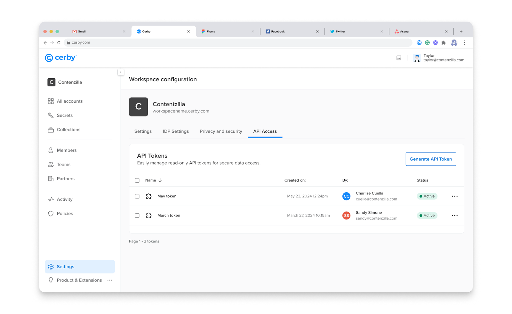
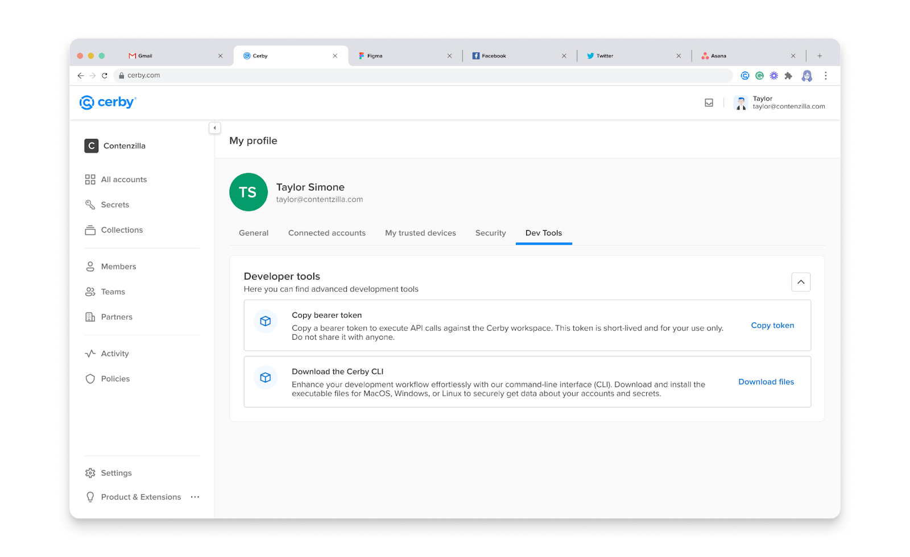

# Explore API keys and bearer tokens

Cerby uses API keys and bearer tokens to authenticate and authorize requests to its API, aiming to prevent unauthorized access attempts when external organizations and partners develop integrations with the Cerby platform.

You can only generate an API key or retrieve a bearer token through the Cerby web app after authenticating to your corporate identity provider (IdP), such as Okta or Entra ID. You must also have the workspace **Admin** , **Super Admin** , or **Owner** role.

Based on Cerby’s role-based access control (RBAC) system, these keys and tokens determine the endpoints and data you can access depending on your workspace and item role. For example, only integration **Owners** can use the endpoints to trigger the automated jobs to invite or remove users.

The following sections describe each key and token type.

* * *

## API keys

API keys are customized keys with specific permissions or scopes associated with your Cerby user account.

The only time you can access an API key in plain text is right after generating it, and you can either copy it to the clipboard or store it as a secret in Cerby.



**IMPORTANT:** Cerby recommends storing your API keys in a safe place. They are sensitive resources because they grant access to the data you have saved in your workspace. Avoid sharing them in public repositories or client-side code.



Cerby hashes API keys before storing them in the database, encrypted with the workspace’s KMS key. Following Cerby’s role-based access control (RBAC) system, the user who generates an API key becomes its **Owner** , and they are the only ones who can access its details, update its scopes, or delete it.

To enhance security and control access, you can configure the following characteristics for your API keys:

  * [Expiration time](explore-api-keys-and-bearer-tokens.md#expiration-time)
  * [Scopes](explore-api-keys-and-bearer-tokens.md#scopes)

The following sections describe each characteristic.

### Expiration time

When generating an API key, you can set an expiration time to limit their usage, minimize the risk of unauthorized access to your user and account data, and comply with your security standards and regulations.

The following are the expiration time options:

  * 1 hour
  * 12 hours
  * 1 day
  * 5 days
  * 1 year
  * Custom

### Scopes

You can set up scopes for your API key to control exactly what information you can access through an API request under the principle of least privilege. With scopes, you can grant read or write permission to your API key.

The following are the available scopes:

  * **Read activities:** Enables reading activity data.
  * **Read items:** Enables reading account, secret, and collection data.
  * **Read accounts:** Enables reading account data.
  * **Read secrets:** Enables reading secret data.
  * **Read users:** Enables reading user and team data.
  * **Read integrations:** Enables reading integration and entitlement data.
  * **Write integrations:** Enables writing integration and entitlement data.
  * **Read automated jobs:** Enables reading automated job data.
  * **Write automated jobs:** Enables writing automated job data.

The responses from the Cerby API to the API key are the following:

  * **200 and a successful JSON response:** The key was authenticated successfully, and the response contains the requested data.
  * **401 error:** The key does not exist, is expired, deleted, or does not contain the necessary scopes.

You can view the list of generated API keys in the **API keys** tab of the **Workspace Configuration** page using the Cerby web app, as shown in **Figure 1**.

**Figure 1.** **API keys** tab on the **Workspace Configuration** page of the Cerby web app dashboard

* * *

## Bearer tokens

Bearer tokens are tokens with a limited lifespan to minimize security risks. By default, they have an expiration time of one hour, and they are stored in your local machine’s file system following AWS’s CLI principles for storing session tokens, as shown in **Table 1**.

**Platform**| **Storage location**
---|---
Mac OS| `~/.cerby/credentials`
Linux| `~/.cerby/credentials`
Windows| `%userprofile%\.cerby\credentials`

**Table 1.** Storage location of bearer tokens according to the platform



**NOTE:** You can contact the Customer Support team by sending an email to [support@cerby.com](mailto:support@cerby.com) or a message through the help chat of the Cerby dashboard to ask for a change to the default expiration time of your bearer tokens.



Bearer tokens have no scopes, meaning that you can retrieve any item and user data as long as you have the corresponding access role (**Owner** or **Collaborator**) on the items. These tokens can be retrieved from the **Dev Tools** tab on the **My Profile** page using the Cerby web app, as shown in **Figure 2**.

**Figure 2.** **Dev Tools** tab on the **My Profile** page of the Cerby web app dashboard

* * *

## Related articles

The following articles contain more information about how to generate, retrieve, and manage API and bearer tokens:

  * [Generate an API key](https://cerby-test.gitbook.io/cerby-test/extending-cerby/public-api/generate-an-api-key)
  * [View the details of an API key](https://cerby-test.gitbook.io/cerby-test/extending-cerby/public-api/view-the-details-of-an-api-key)
  * [Update the scopes of an API key](https://cerby-test.gitbook.io/cerby-test/extending-cerby/public-api/update-the-scopes-of-an-api-key)
  * [Delete an API key](https://cerby-test.gitbook.io/cerby-test/extending-cerby/public-api/delete-an-api-key)
  * [Retrieve a bearer token](https://cerby-test.gitbook.io/cerby-test/extending-cerby/public-api/retrieve-a-bearer-token)
