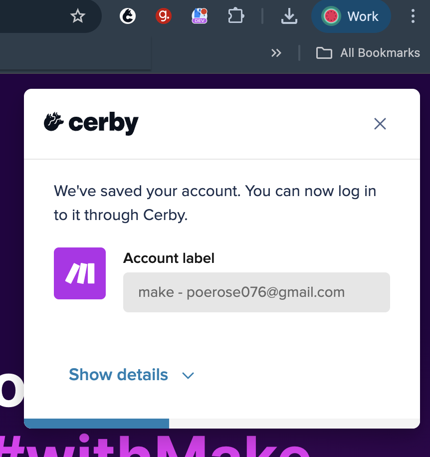
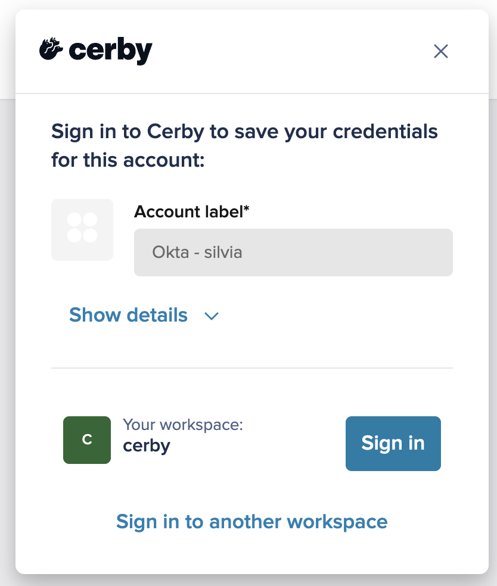

# Autosave an account at login or signup with the Cerby browser extension



**Who can use this feature?**

* Workspace**Owners** , **Super Admins** , **Admins** , and **Users**
* Only supported using the browser extension



With Cerby, you can easily save the login credentials for your apps using the account autosave feature.

When you manually access an app through its login or signup page using your web browser, the Cerby browser extension can automatically identify your login or signup attempt and prompt you to add the account to Cerby.

With just one click, you can add your account to manage, protect, and share it through Cerby.



**IMPORTANT:** This feature may be restricted by a workspace **Admin** for all workspace users with the following settings:

* **Prompted autosave:** When logging in or signing up for an account in allowed domains configured in the workspace, a prompt dialog box asks whether you want to save your credentials to Cerby. You can choose to save or skip the account autosave.
* **Enforced autosave:** When you log in or sign up for an account in a specified domain, Cerby automatically saves the credentials.

For more information, read the article [Explore account autosave](https://cerby-test.gitbook.io/cerby-test/support-and-use-cases/explore/explore-account-autosave).



The process of autosaving accounts is different depending on whether you have an active user session in the Cerby browser extension or not.

* * *

## Requirements

The following are the requirements to autosave your accounts in Cerby:

  * A Cerby account
  * The latest version of the Cerby browser extension installed. The **Account autosave** feature activated. For instructions on how to activate this feature, read the article [Activate or deactivate account autosave in the Cerby browser extension](https://cerby-test.gitbook.io/cerby-test/how-to-use-cerby/cerby-browser-extension/activate-or-deactivate-account-autosave-in-the-cerby-browser-extension)
  * The latest version of your web browser installed
* * *

## Autosave an account with an active user session

To autosave an account when you have an active user session in the Cerby browser extension, you must complete the following steps:

  1. Open the login or signup page of your application using your web browser.
  2. Log in or sign up for an account by entering your credentials and verifying your identity, when applicable. If the login or signup process is successful, the Cerby browser extension displays the **Add your account to Cerby** dialog box, as shown in **Figure 1**.

**Figure 1.** **Add your account to Cerby** dialog box in the Cerby browser extension

  1. Edit the account name in the **Account label** field if necessary.

  **NOTE:** You can click the **Show details** button to display the **Username** , **Password** , and **Email** fields that Cerby prefilled.

  2. Click the **Add account** button. The button displays a success message, the dialog box closes, and the corresponding account card is added to your dashboard.

Now you are done.

* * *

## Autosave an account without an active user session

To autosave an account when you don’t have an active user session in the Cerby browser extension, you must complete the following steps:

  1. Open the login or signup page of your application using your web browser.
  2. Log in or sign up for an account by entering your credentials and verification code, when applicable. If the login or signup process is successful, the Cerby browser extension displays the **Sign in to Cerby to save your credentials for this account** dialog box with all the required fields prefilled, as shown in **Figure 2**.

**Figure 2. Sign in to Cerby to save your credentials for this account** dialog box

  3. Click the **Sign in** button to start a user session using the Cerby browser extension. Depending on whether you have an active user session with your identity provider (IdP) or not, one of the following scenarios occurs:

     * **Active session with your IdP:** The Cerby browser extension uses this active session to log in automatically.
     * **No active session with your IdP:** The login page of your IdP is displayed, and you must log in by entering your credentials and verifying your identity when applicable.

When the browser extension is logged in, Cerby verifies if a matching account (an account for the same application and with the same username) is already added to your workspace, and one of the following scenarios occurs:

     * **Matching account found:** The **We found a matching account in Cerby** dialog box is displayed, and you must perform the following actions to ensure you have the latest login credentials:

       1. Click the **Got it** button.
       2. Contact your **Workspace Admin** to request access to the account.

     * **No matching account:** The **Add your account to Cerby** dialog box is displayed, and you must continue to step 4.

  4. Edit the account name in the **Account label** field if necessary.

  **NOTE:** You can click the **Show details** button to display the **Username** , **Password** , and **Email** fields that Cerby prefilled.

  5. Click the **Add account** button. The button displays a success message, the dialog box closes, and the corresponding account card is added to your workspace.

Now you are done.
