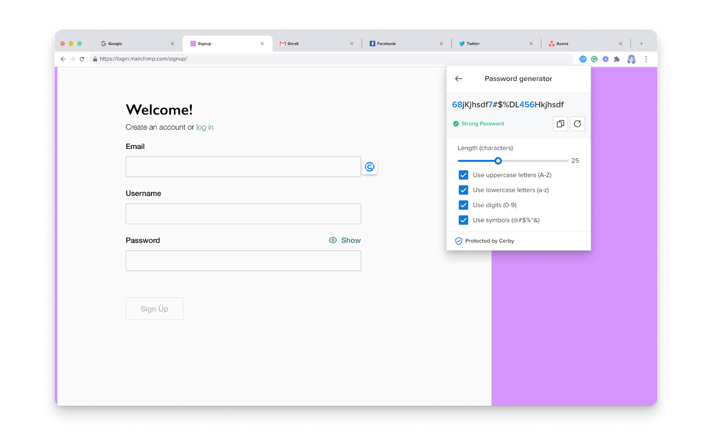

# Generate secure passwords using the Cerby browser extension

With Cerby, you have a way to generate strong and secure passwords for your accounts through the Password Generator.

This feature, available to any Cerby user via the Cerby browser extension, enables you to generate passwords anytime and select the password strength rules applicable to your application or service provider:

* Length
* Uppercase letters
* Lowercase letters
* Digits
* Symbols

Based on your selection, the Password Generator also lets you know how weak or strong the generated password is.



**IMPORTANT:** A password is stronger the more rules you select and the longer the password is. According to [Hive Systems](https://www.hivesystems.io/password), it would take 226 years to hack a 12-character password that comprises numbers, upper and lowercase letters, and symbols.



After generating a password, you can use it to create or set up your application accounts. Then, you can add these accounts to Cerby to secure your login.

Cerby uses the crypto library to generate random passwords that are unique each time. Passwords are generated locally on the user devices based on the strength rules set by the user, and Cerby implements entropy tests to make sure they are highly random; therefore, difficult to guess or predict.

* * *

## Generate a password

To generate a password using the Cerby browser extension, you must complete the following steps.

  1. Open the Cerby browser extension popup.
  2. Click the **Password generator** icon located at the top right of the popup. The **Password generator** page is displayed with a suggested password generated, as shown in **Figure 1**.

**Figure 1.** **Password generator** page

  3. Slide the **Length (characters)** bar to set the desired password length.
  4. Select the options of the password strength rules to apply to the password:

     * **Use uppercase letters (A-Z)**
     * **Use lowercase letters (a-z)**
     * **Use digits (0-9)**
     * **Use symbols (@#$%^ &)**

A new password is generated each time you select or deselect an option.

**TIP:** You can click the **Generate new** icon to regenerate the password anytime.

  5. Click the **Copy** icon to copy the generated password to the clipboard.
  6. Paste the password where you need it.
