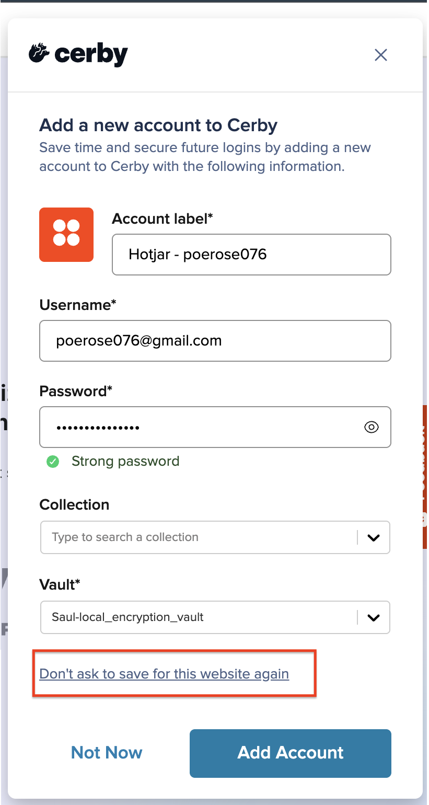

# Manage the domains where Cerby prompts you to autosave your accounts



**Who can use this feature?**

* Workspace **Owners** , **Super** **Admins** , **Admins** , and **Users**
* Supported using the Cerby web app and browser extension



As a user in Cerby with any role, except **Guest User** and **Login-Only** , you can manage the **Add a new account to Cerby** dialog box that prompts you to autosave a new account each time you enter your credentials on login and signup pages for specific domains.

By default, this dialog box offers a quick and convenient way to save your account credentials without manually filling in all the information through Cerby. However, if you prefer not to see this dialog box for specific domains, you can select the **Don't ask to save for this website again** option, preventing the dialog box from appearing on subsequent login and signup attempts.

The domains for which you select this option are added to your profile's **Do not save** list. You can access this list and remove websites to re-enable the dialog box for those domains.



**IMPORTANT:** Your workspace **Admin** can set a list of denied or allowed domains for the workspace, which could limit the settings you can configure for the autosave feature.



The following are the actions you can perform to manage the account autosave settings:

* Disable the **Add a new account to Cerby** dialog box
* View the **Do not save** list
* Remove domains from the **Do not save** list

The following sections describe each action.

* * *

## Disable the Add a new account to Cerby dialog box

When you log in or sign up for an account on a specific website, the Cerby browser extension displays the **Add a new account to Cerby** dialog box with your pre-filled login information, including the website name, username, and password. You can fill in the rest of the fields and save that information into Cerby as an account.

To disable that dialog box each time you log in or sign up for a website, you must complete the following steps:

  1. Open the login or signup page of the website you want to access.
  2. Enter your login credentials.
  3. Click the login or signup button on the page. The Cerby browser extension displays the **Add a new account to Cerby** dialog box.
  4. Click the **Don’t ask to save for this website again** option, as shown in **Figure 1**.

<figure><figcaption></figcaption></figure>

**Figure 1. Don’t ask to save for this website again** option in the **Add a new account to Cerby** dialog box

The following occurs:

* A success message appears, indicating that Cerby will not ask you to save your credentials for the domain.
* The **Add a new account to Cerby** dialog box no longer appears when you log in or sign up for an account on that website.
* The domain is added to the **Do not save** list in your profile.
* * *

## View the Do not save list

The **Do not save** list includes the domains where you have selected to prevent the **Add a new account to Cerby** dialog box from being displayed each time you log in or sign up.

You can view the **Do not save** list using the following client apps:

* Cerby web app
* Cerby browser extension

The following sections contain the instructions for each client app.

### Cerby web app

To access the **Do not save** list using the Cerby web app, you must complete the following steps:

  1. Log in to your [Cerby](https://app.cerby.com/) workspace using the Cerby web app.
  2. Click your user profile located at the top right of the page. A menu is displayed.
  3. Select the **My Profile** option. Your profile page is displayed with the **General** tab activated.
  4. Activate the **Extension settings** tab. The **Do not save** list is displayed with the domains of the websites for which the **Add a new account to Cerby** dialog box was selected.

Now you are done.

### Cerby browser extension

To access the **Do not save** list using the Cerby browser extension, you must complete the following steps:

  1. Open the Cerby browser extension popup.
  2. Log in to your workspace.
  3. Click the **Settings** (<figure><figcaption></figcaption></figure>) icon located at the top of the popup. The **Settings** page is displayed.
  4. Click the **More extension settings** link. A new browser tab is displayed with the **Extension settings** tab activated in your profile and the **Do not save** list.

Now you are done.

* * *

## Remove domains from the Do not save list

After you have disabled the **Add a new account to Cerby** dialog box for specific domains, you can re-enable it by removing domains from the **Do not save** list. Therefore, the prompt dialog box will be displayed again when you log in or sign up for an account in these domains.

To remove domains from the **Do not save** list, you must complete the following steps:

  1. Log in to your [Cerby](https://app.cerby.com/) workspace using the Cerby web app.
  2. Click your user profile located at the top right of the page. A menu is displayed.
  3. Select the **My Profile** option. The **My Profile** page is displayed with the **General** tab activated.
  4. Activate the **Extension settings** tab. The **Do not save** list is displayed with the domains for which the **Add a new account to Cerby** dialog box was disabled.
  5. (Optional) Narrow down the list by using the following alternatives:

     * Search for the domain you want to remove from the list using the **Search by domain name** (<figure><figcaption></figcaption></figure>) field. The list displays all matches as you type in the domain.
     * Sort the list by recently added, earlier added, A to Z, or Z to A using the **Sort by** (<figure><figcaption></figcaption></figure>) button next to the search field.

  6. Remove one or more domains:

     * **Individual domains**

       1. Click the **Remove from list** (<figure><figcaption></figcaption></figure>) icon located on the right side of the domain name. A success message appears, and the specific domain is removed from the list.

     * **Multiple domains**

       1. Select the domains you want to remove from the list. A menu indicating the number of domains you have selected appears at the bottom of the page.
**NOTE:**

          * You can select all the domains in the list by clicking the **Select all** option from the menu at the bottom. All the domains appear as selected.
          * You can close the menu by clicking the **Close selection** (<figure><figcaption></figcaption></figure>) button at the bottom. The menu closes, and all the previously selected domains are deselected from the list.

       2. Click the **Remove from** list option in the menu at the bottom. A success message appears, and the selected domains are removed from the list.

Now you are done.
