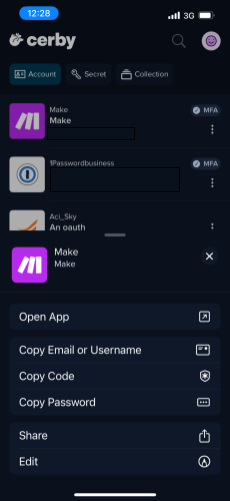

# Use the Cerby mobile app's quick actions



**Who can use this feature?**

* Workspace **Owners** , **Super** **Admins** , **Admins** , **Users** , and **Guest** **Users**
* Account **Owners** and **Collaborators**
* Supported using the Cerby mobile app



As an account **Owner** or **Collaborator** , you can quickly access the following actions for your accounts from the home screen:

* **Open App:** Launches the connected application directly from the Cerby mobile app.
* **Copy Email or Username:** Copies to the clipboard the email address or username saved in Cerby and associated with the selected account.
* **Copy Code:** Copies the verification code, such as one-time passwords (OTPs) generated by Cerby when managing multi-factor authentication (MFA), to the clipboard for the account.
* **Copy Password:** Copies the password saved in Cerby for the account.
* **Share:** Enables you to share the account with other users in Cerby.
* **Edit:** Enables you to update the account’s details, such as login credentials, app settings, or shared permissions with other users.

To access and use the quick actions for your accounts in the Cerby mobile app, you must complete the following steps:

1. Open the Cerby mobile app on your mobile phone.
2. Log in to your Cerby workspace.
3. Tap the **More options** () icon to the right of each account card. A bottom menu is displayed, as shown in **Figure 1**.

**Figure 1.** Quick actions menu for accounts in the Cerby mobile app

4. Select the quick action you want to perform.

Now you are done.
