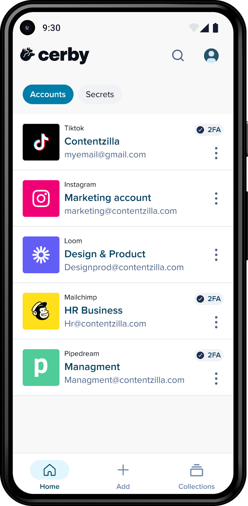
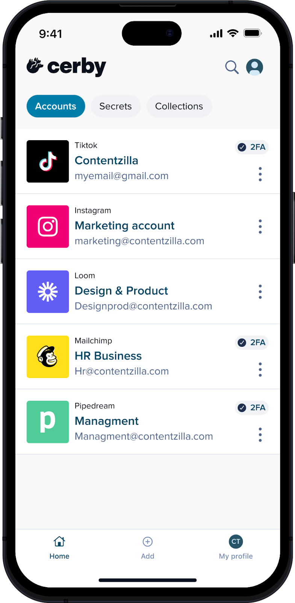
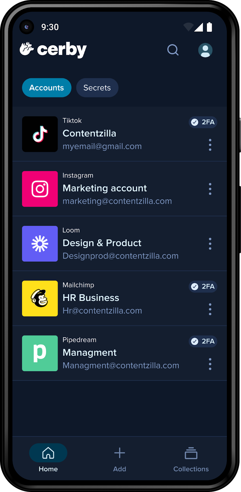
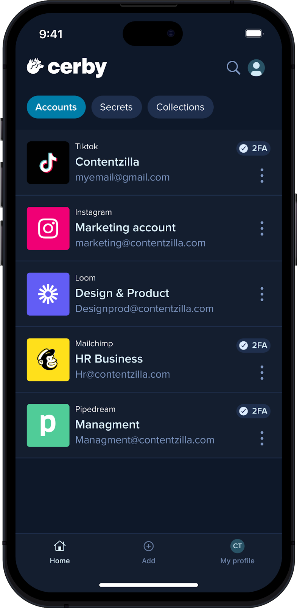

# Change the theme of the Cerby mobile app

As a user of the Cerby mobile app, you can change its theme, enabling you to customize and enhance your experience. Whether you want to have better visibility during the day or reduced eye strain in low-light environments, this feature promotes usability, accessibility, and battery efficiency.

By adjusting the theme of the Cerby mobile app, you can also align it with your individual preferences and ensure consistency across your phone, especially if you’re using dark or light mode elsewhere.

**Figure 1** shows how the light theme is displayed on iOS and Android for the Cerby mobile app.

<figure><figcaption></figcaption></figure><figure><figcaption></figcaption></figure>

**Figure 1.** The light theme applied on iOS and Android

**Figure 2** shows how the light theme is displayed on iOS and Android for the Cerby mobile app.

<figure><figcaption></figcaption></figure><figure><figcaption></figcaption></figure>

**Figure 2.** The dark theme applied on iOS and Android

This article describes how to change the theme of the Cerby mobile app depending on your operating system (OS):

* iOS
* Android

The following sections contain the instructions for each OS.

* * *

## iOS

To change the theme of your Cerby mobile app on iOS, you must complete the following steps:

  1. Open the Cerby mobile app on your phone.
  2. Log in to your Cerby workspace.
  3. Tap the profile icon. The **My profile** screen is displayed.
  4. Tap the **Theme** option. The **Theme** menu is displayed.
  5. Select the theme option you want for your Cerby mobile app:

     * **Light:** Applies the light mode to the app.
     * **Dark:** Applies the dark mode to the app
     * **System:** Matches the theme settings of your phone.

  6. Tap the **Close** (<figure><figcaption></figcaption></figure>) icon to close the modal window.

* * *

## Android

The Cerby mobile app on Android matches the theme settings of your phone. Therefore, you must turn the dark theme on or off through your phone settings. For instructions, read the official documentation [Change to dark or color mode on your Android device](https://support.google.com/android/answer/9730472?hl=en).
