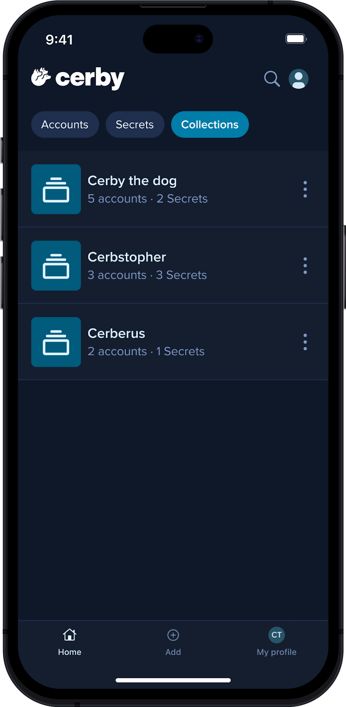
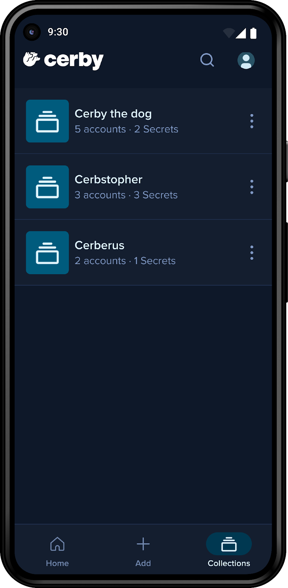

# View your collections in the Cerby mobile app



**Who can use this feature?**

* Workspace **Owners** , **Super** **Admins** , **Admins** , **Users** , and **Guest** **Users**
* Collection **Owners** and **Collaborators**
* Supported using the Cerby web app, browser extension, and mobile app

**NOTE:** Read more about Collections in Cerby in the article [Explore Collections](https://cerby-test.gitbook.io/cerby-test/support-and-use-cases/explore/explore-collections)



As a collection **Owner** or **Collaborator** , you can see how your items are organized in collections and subcollections using the Cerby mobile app, as shown in **Figure 1**.

**Figure 1. Collections** screens in the Cerby mobile app for iOS (left) and Android (right)

The **Collections** screen shows the following information:

* The names of your collections
* The number of items and subcollections within it if it’s not empty

To view your collections, you must complete the following steps:

1. Open the Cerby mobile app on your mobile phone.
2. Log in to your Cerby workspace.
3. Activate the **Collections** tab located at the top on iOS or tap the **Collections** button located at the bottom navigation bar on Android. The **Collections** screen is displayed.

**NOTES:** Consider the following when viewing your collections:

* To view the items within the collection, tap the collection card.
* Collections and subcollections are displayed at the same level; however, if a collection contains subcollections, they are displayed within the collection.

---
