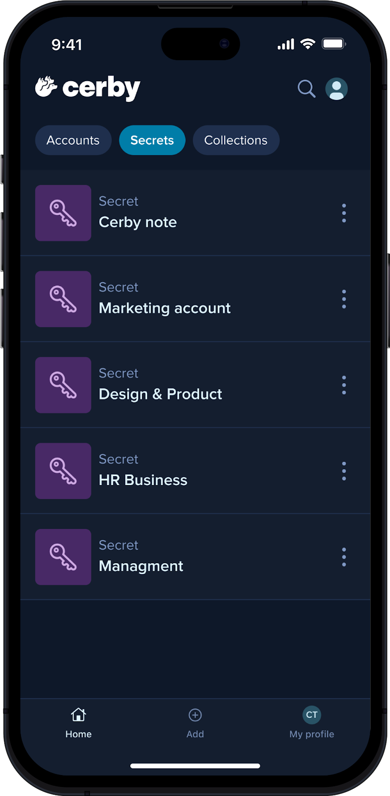
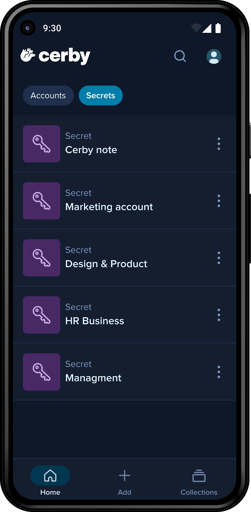

# View your secrets in the Cerby mobile app



**Who can use this feature?**

* Workspace **Owners** , **Super** **Admins** , **Admins** , **Users** , and **Guest** **Users**
* Secret **Owners** and **Collaborators**
* Supported using the Cerby web app, browser extension, and mobile app

**NOTE:** Read more about Secrets in Cerby in the article [Explore Secrets](https://cerby-test.gitbook.io/cerby-test/support-and-use-cases/explore/explore-secrets)



As a secret **Owner** or **Collaborator** , you can view your secrets using the Cerby mobile app, as shown in **Figure 1**.

**Figure 1. Secrets** screens in the Cerby mobile app for iOS (left) and Android (right)

To view your secrets, you must complete the following steps:

1. Open the Cerby mobile app on your mobile phone.
2. Log in to your Cerby workspace.
3. Activate the **Secrets** tab located at the top on iOS or Android. The **Secrets** screen is displayed.
