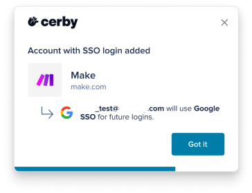

# Add an account with Google SSO as your preferred login method

With Cerby, you can use your existing Google single sign-on (SSO) to access your apps, whether you configured the login method for your account or the account was provisioned and configured by your identity provider (IdP), such as Okta.

Cerby can autosave this account and set Google SSO as your preferred login method to streamline future logins.

* * *

## Considerations

The following are important considerations about this feature:

  * This feature is available for Google Chrome only.
  * The Cerby extension version that supports this feature is 1.0.450.
  * Cerby identifies and autosaves the account when you launch the login flow from any of the following ways:
    * A chiclet in your Okta dashboard
    * A Cerby business hub
    * The app’s login page
  * Cerby does not identify or save a new account if the page’s SSO login is opened in a new tab.
  * After a Google-based login account is created, you can’t manually add another account with the same username.
  * The account is added to your Cerby workspace with the email you use for Google SSO and without a password.
  * You cannot edit the account details after created.
  * If the account corresponds to a business hub, Cerby connects it to the integration.
  * The next time you log in to the account, you are redirected to the app's login page.
* * *

## Requirements

The following are the requirements to add an account with Google SSO as your preferred login method:

  * Your workspace Admin must have added your app to the list of domains with the **Enforce account autosave** feature. For more information, read the article [Manage the account autosave settings in your workspace](https://cerby-test.gitbook.io/cerby-test/how-to-use-cerby/cerby-browser-extension/manage-the-domains-where-cerby-prompts-you-to-autosave-your-accounts).
  * The Cerby browser extension must be installed and active on your web browser.
* * *

## Add an account with Google SSO as your preferred login method

To add an account with Google SSO as your login method, you must complete the following steps:

  1. Access the app’s login page through either of the following ways:

     * A chiclet in your Okta dashboard
     * A Cerby business hub integration
     * The app’s login page

     **IMPORTANT:** If you have an active session and are logged in immediately after accessing the app, Cerby does not autosave the account, meaning steps 2 and 3 are ignored. You must log out of the account and try again.

  2. Log in to your account using the Google SSO option. The **Account with SSO login added** dialog box is displayed by the Cerby browser extension, as shown in **Figure 1**.

**Figure 1.** **SSO login preference saved** dialog box, displayed after saving Google SSO as the login method

**NOTES:** Consider the following scenarios:

     * If you have an account in Cerby with the same user email address for the app, Cerby does not save any login preferences for the account.
     * If Cerby detects more than one app or service for the domain you accessed, the **Account with SSO login added** dialog box is displayed.

       1. Select the app or service you want to save for the domain.
       2. Click the **Done** button.
       3. Skip step 3.
  3. Click the **Got it** button. A new account is added to your Cerby workspace with the **Google SSO** status next to the account name.

Now you are done.
