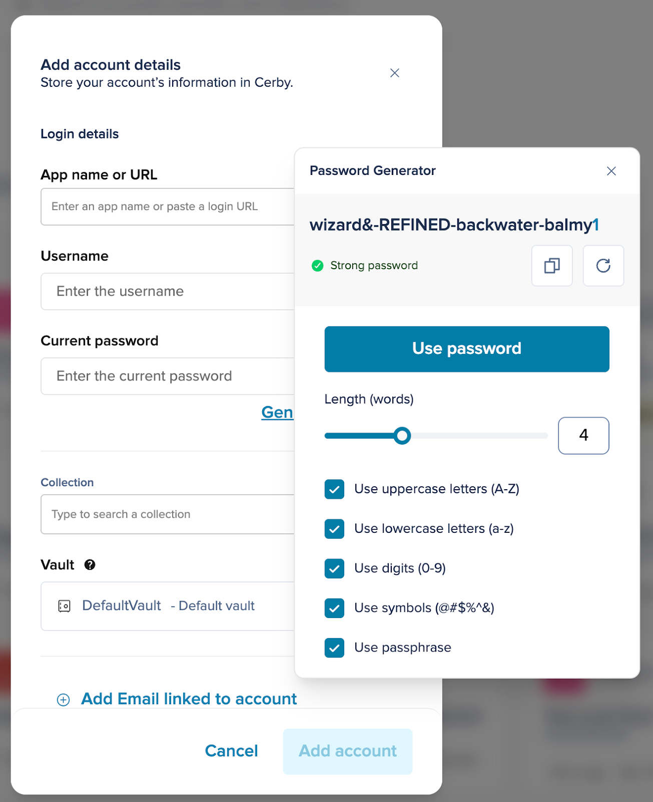

# Add an account



**Who can use this feature?**

* Workspace**Owners** , **Super Admins** , **Admins** , **Users** , and **Guest Users**
* Supported using the Cerby web app, browser extension, and mobile app. For the mobile app instructions, read the article [Add an account to Cerby in the mobile app](https://cerby-test.gitbook.io/cerby-test/how-to-use-cerby/cerby-mobile-app/accounts/add-an-account-to-cerby-in-the-mobile-app)
* **IMPORTANT:** If you use local vaults, you must have already set up at least one [trusted session](https://cerby-test.gitbook.io/cerby-test/management/workspace-configuration/trusted-devices/set-up-trusted-sessions-on-your-devices) on your devices.



You can add accounts to Cerby in the following three ways:

* [Add an account manually](add-an-account.md#add-an-account-manually)
* [Autosave an account at login or signup](add-an-account.md#autosave-an-account-at-login-or-signup)
* [Import accounts from LastPass](add-an-account.md#import-accounts-from-lastpass)

The following sections describe each way.

* * *

## Add an account manually

The process to add an account manually is different depending on the Cerby client app you use:

  * [Cerby web app](add-an-account.md#cerby-web-app)
  * [Cerby browser extension](add-an-account.md#cerby-browser-extension)
  * [Cerby mobile app](add-an-account.md#cerby-mobile-app)

The following sections describe each process.

### Cerby web app

To add an account manually using the Cerby web app, you must complete the following steps:

  1. Log in to your [Cerby](https://app.cerby.com/) workspace.
  2. Click the **Add item** button located at the top right. A drop-down list is displayed.
  3. Select the **Account** option from the drop-down list. The **Add account details** dialog box is displayed.
  4. Enter your account information in the corresponding fields:

     * **Account label in Cerby:** It is the name to assign to your account in Cerby, and it will be displayed on the account card.
     * **App name or URL:** It is the name of the app or service provider to which the account belongs or the login URL.
​**IMPORTANT:** Depending on the account type you want to add, the following happens on this input field:

       * **[Managed accounts](https://cerby-test.gitbook.io/cerby-test/support-and-use-cases/explore/explore-accounts):** The catalog of managed apps is displayed on a drop-down list when you click the field or as you type. Select the corresponding option.
       * **[Self-managed accounts](https://cerby-test.gitbook.io/cerby-test/support-and-use-cases/explore/explore-accounts):** If the app is not displayed in the list but you access it through its website, you must enter or paste the login URL. For example, **<https://www.app.com/login>**.
       * **[No URL accounts](https://cerby-test.gitbook.io/cerby-test/support-and-use-cases/explore/explore-accounts):** You can leave the field blank for the apps you access locally, not through a website (such as hardware devices or desktop apps).
     * **Username:** It is the username you use to log in to your account. Sometimes, the username is your email address.
     * **Current password:** It is the password you use to log in to your account.

     **NOTE:** You can [generate a password](add-an-account.md#generate-a-password) by clicking the **Generate password** option.

  5. Select optionally an existing collection from the **Collection** drop-down list to add the account to it.
  6. Select the corresponding vault from the **Vault** drop-down list to add the account to it.

  **NOTE:** This drop-down list is not displayed if you only have access to one vault.

  7. Click the **Add account** button. The dialog box closes, and a success message box and the account details page are displayed.

Now you are done.

### Cerby browser extension

To add an account manually using the Cerby browser extension, you must complete the following steps:

  1. Open the Cerby browser extension popup.
  2. Log in to your Cerby workspace.
  3. Click the **Add new account** button located at the bottom right of the popup. The **Add account details** dialog box is displayed in a new browser tab.
  4. Enter your account information in the corresponding fields:

     * **Account label in Cerby:** It is the name to assign to your account in Cerby, and it will be displayed on the account card.
     * **App name or URL:** It is the name of the app or service provider to which the account belongs, or the login URL.
​**IMPORTANT:** Depending on the account type you want to add, the following happens on this input field:

       * **[Managed accounts](https://cerby-test.gitbook.io/cerby-test/support-and-use-cases/explore/explore-accounts):** The catalog of managed apps is displayed on a drop-down list when you click the field or as you type. Select the corresponding option.
       * **[Self-managed accounts](https://cerby-test.gitbook.io/cerby-test/support-and-use-cases/explore/explore-accounts):** If the app is not displayed in the list but you access it through its website, you must enter or paste the login URL. For example, **<https://www.app.com/login>**.
       * **[No URL accounts](https://cerby-test.gitbook.io/cerby-test/support-and-use-cases/explore/explore-accounts):** You can leave the field blank for the apps you access locally, not through a website (such as hardware devices or desktop apps).
     * **Username:** It is the username you use to log in to your account. Sometimes, the username is your email address.
     * **Current password:** It is the password you use to log in to your account.

     **NOTE:** You can [generate a password](add-an-account.md#generate-a-password) by clicking the **Generate password** option.

  5. Select optionally an existing collection from the **Collection** drop-down list to add the account to it.
  6. Select the corresponding vault from the **Vault** drop-down list to add the account to it.

  **NOTE:** This drop-down list is not displayed if you only have access to one vault.

  7. Click the **Add account** button. The dialog box closes, and a success message box and the account details page are displayed.
The new account is now listed in the Cerby browser extension popup.

Now you are done.

### Cerby mobile app

Read the article [Add an account to Cerby from the mobile app](https://cerby-test.gitbook.io/cerby-test/how-to-use-cerby/cerby-mobile-app/accounts/add-an-account-to-cerby-in-the-mobile-app) to learn more about how to add an account in the Cerby mobile app.

* * *

### Generate a password

When you add an account manually to Cerby using the Cerby web app, you can generate a strong and secure password using the Password Generator.

This feature enables you to create passwords that meet your specific security preferences by defining the following characteristics:

  * Length (from five to 50 characters)
  * Uppercase usage
  * Lowercase usage
  * Numerical digit
  * Symbol usage
  * Passphrase

**Figure 1** displays the **Password Generator** popup within the **Add account details** dialog box. The popup indicates the strength of the generated password, whether it is weak, moderate, or strong, and provides options to copy the password or generate a new one.

**Figure 1.** The **Password Generator** popup with the **Add account details** dialog box

To generate a new password within the **Add account details** page dialog box, you must complete the following steps:

  1. Click the **Generate password** option under the **Current password** field. The **Password Generator** popup is displayed.
  2. Slide the Length (characters) bar to set the desired password length.
  3. Select the options of the password strength rules to apply to the password. A new password is generated each time you select or deselect an option.
  4. Perform the following actions optionally:

     * Click the **Copy** () button to copy the password to the clipboard.
     * Click the **Generate new** () button to generate a new password.

  5. Click the **Use password** button. The **Current password** field is automatically filled in.

Now you are done.

* * *

## Autosave an account at login or signup

To add an account at login, follow the instructions in the article [Autosave an account at login or signup with the Cerby browser extension](https://cerby-test.gitbook.io/cerby-test/how-to-use-cerby/cerby-browser-extension/autosave-an-account-at-login-or-signup-with-the-cerby-browser-extension).

After saving your accounts, you can start managing access to them securely.

* * *

## Import accounts from LastPass

To import passwords from your password manager as accounts in Cerby, follow the instructions in the article [How to use the Password Manager Importer](https://cerby-test.gitbook.io/cerby-test/management/credential-management/item-importer/migrate-from-lastpass-to-cerby).

After importing your accounts, you can start managing access to them securely.
