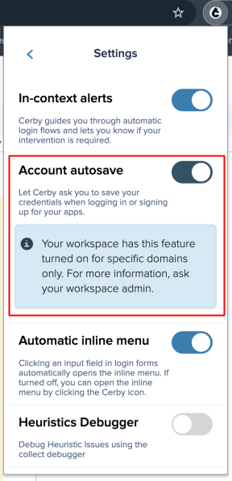

# Set RSA tokens as your account verification method



**Who can use this feature?**

* Workspace **Owners** , **Super** **Admins** , **Admins** , and **Users**
* **Account Owners**
* Only supported using the Cerby web and mobile apps



As an account **Owner** , you can set RSA tokens as a verification method for your accounts.



**NOTE:** For more information about Cerby's verification methods, refer to [Explore the Cerby-managed verification methods for your accounts](https://cerby-test.gitbook.io/cerby-test/support-and-use-cases/explore/explore-the-cerby-managed-verification-methods-for-your-accounts).



An RSA token combines a PIN (personal identification number) and a token code. This token can be either a physical device, such as a small key fob, or a software-based app on a smartphone or computer, generating a one-time passcode (OTP).

When you link your app provider's RSA token to Cerby, the Cerby platform retrieves the OTP tokens generated by your RSA token provider. When linked, Cerby automatically retrieves the necessary RSA codes for logging in to your accounts. This integration streamlines the retrieval of codes to enable you to quickly access your application.

This article explains how to manage the RSA token integration in Cerby to enhance the security of your accounts.

**IMPORTANT:** If you want to enable RSA codes in your workspace for specific app providers, contact our Customer Support team at [support@cerby.com](mailto:support@cerby.com).
---

* * *

## Requirements

The following are the requirements to set up RSA tokens as your account verification method:

* Your RSA token configured within an RSA token app provider
* An activation link to complete the RSA token setup in Cerby. This link is emailed after completing the RSA token configuration in your app provider. The link must have the following format:

        com.rsa.securid://ctkip?url={URL-address}?activationCode={activation-code}

* * *

## Manage the RSA verification method in your accounts

The following are the actions that enable you to manage RSA as your account's verification method:

* Set up RSA as your account's verification method
* Log in to an account using RSA codes
* Turn off RSA as your account's verification method

The instructions to perform each action are described in the following sections.

### Set up RSA as your account's verification method

The following are the clients that enable you to set up RSA codes as your account's verification method:

* Cerby web app
* Cerby mobile app

The next subsections explain the steps for each client.

#### Cerby web app

To set up RSA as your account's verification method, you must complete the following steps:

  1. Log in to your[ Cerby](https://app.cerby.com/) workspace.
  2. Click the corresponding account card. The account details page is displayed.
  3. Expand the **Multi-factor authentication (MFA) settings** section.
  4. Click the **Set as MFA** button in the **RSA codes** section. The **Set up MFA with RSA codes** dialog box is displayed.
  5. Enter the RSA token activation link in the **Activation link** field.
**NOTE:** See the Requirements section to learn how to obtain the activation link.

  6. Click the **Set up** button. The **You’re all set!** dialog box is displayed.

Now you are done. You can view and copy the account RSA codes from the RSA code field in the **Account details** section, as shown in **Figure 1**.

<figure><figcaption></figcaption></figure>

**Figure 1. RSA codes** included in the account details page

#### Cerby mobile app

For more information about how to turn on multi-factor authentication (MFA) with RSA codes for your account using the Cerby mobile app, read the article [Turn on MFA with RSA codes for your account using the Cerby mobile app](https://cerby-test.gitbook.io/cerby-test/how-to-use-cerby/cerby-mobile-app/accounts/protecting-your-account/turn-on-the-rsa-codes-for-your-account-using-the-cerby-mobile-app).

### Log in to an account using RSA codes

The following are the clients that support the account login process using RSA codes:

* Cerby web app
* Cerby mobile app

The next subsections explain the steps for each client.

#### Cerby web app

To log in to an account using RSA codes as your verification method in the Cerby web app, click the **Log in** button for that account, and let Cerby handle the login process and RSA code submission via automation.

If you need to retrieve the RSA code manually during the automated login process, access your account details page to copy the RSA code. To access the RSA code required to complete the login, you must complete the following steps:

  1. Log in to your[ Cerby](https://app.cerby.com/) workspace.
  2. Click the corresponding account card. The account details page is displayed.
  3. Click the **Copy** (<figure><figcaption></figcaption></figure>) icon on the right side of the **RSA code** field.
  4. Paste the RSA code on the app’s login page.

Now you are done.

#### Cerby mobile app

To log in to an account using an RSA code as MFA on your mobile phone, you can directly copy and paste it from the RSA code field in the account details screen within the Cerby mobile app. For more information, refer to the article [Log in to your accounts with the Cerby mobile app](https://cerby-test.gitbook.io/cerby-test/how-to-use-cerby/cerby-mobile-app/accounts/log-in-to-an-account-using-the-cerby-mobile-app).

### Turn off RSA as your account's verification method

To turn off RSA as your account's verification method, you must complete the following steps:

  1. Log in to your[ Cerby](https://app.cerby.com/) workspace.
  2. Click the corresponding account card. The account details page is displayed.
  3. Expand the **Multi-factor authentication (MFA) settings** section.
  4. Click the **Turn off** button in the **RSA codes** section. The **Turn off RSA codes?** dialog box is displayed.
  5. Click the **Turn off** button. A success message is displayed, and the RSA codes are no longer generated for your account.

Now you are done.
