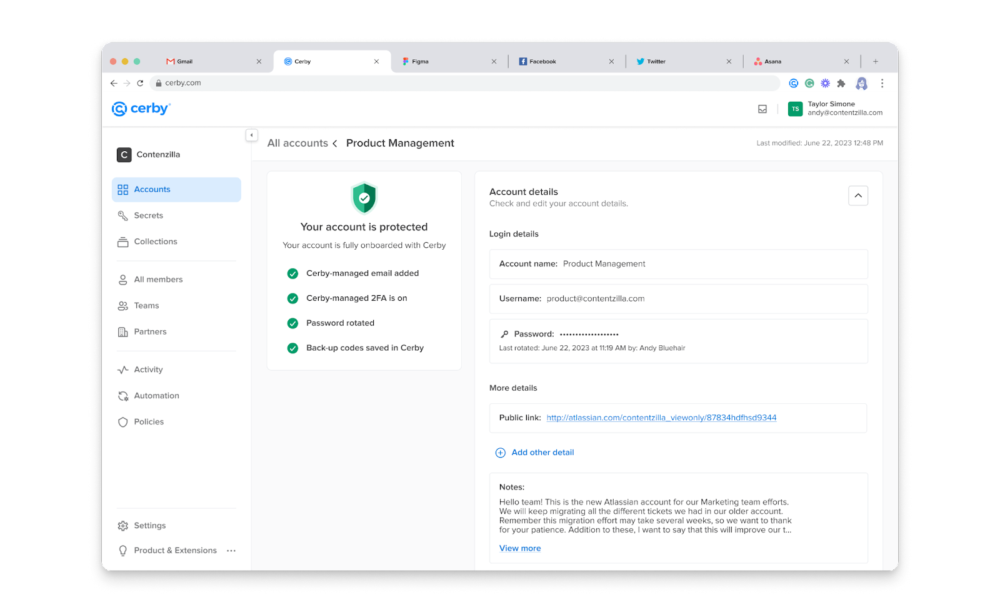

# Save and manage account notes

With Cerby, you have a secure way to save additional information about your accounts.

The Account Notes feature enables you to add information to your account data, making it visible to other users with shared access to the account. Instead of adding an individual [secret](https://cerby-test.gitbook.io/cerby-test/support-and-use-cases/explore/explore-secrets), you can use the **Notes** field to save text-based information such as the following:

* Expiration dates for your licenses
* The point of contact for more information about licenses
* The tenant to which the account or license belongs
* Reminders

Only users with the **Account Owner** role on an account can add and edit a note, and both **Account Owners** and **Account Collaborators** can view the note of a shared account.

Account notes can be imported to Cerby from your password notes in LastPass. For more information, read the [How to use the Password Manager Importer](https://cerby-test.gitbook.io/cerby-test/management/credential-management/item-importer/migrate-from-lastpass-to-cerby) article.

The Account Notes feature is available for any account and user within a Cerby workspace. The **Notes** field is accessible through the account details page using the Cerby web app.

This article describes how to save and manage account notes.

* * *

## Save and edit an account note

Only users with the **Account Owner** role on an account can save a note and edit it. To do so, you must complete the following steps using the Cerby web app:

  1. Log in to your corresponding [Cerby](https://app.cerby.com/) workspace. The **All accounts** view is displayed.
  2. Click the **Settings** icon of the corresponding account card. The account details page is displayed with the **Settings** tab activated, as shown in **Figure 1**.

**Figure 1.** Account details page

  3. Click the **Edit** icon of the **Notes** field located in the **More details** section to make it editable.
  4. Enter the information.
  5. Click the **Done** icon to save the information. A success message box is displayed.

  **NOTE:** You can discard the changes to the **Notes** field by performing the following actions:

     1. Click the **Cancel** icon. The **Discard your changes?** dialog box is displayed.
     2. Click the **Yes, discard changes** button. The dialog box closes, and the changes are discarded.

* * *

## View an account note

Users with the **Account Owner** or **Account Collaborator** role on an account can view the note. To do so, you must complete the following steps using the Cerby web app:

  1. Log in to your corresponding [Cerby](https://app.cerby.com/) workspace. The **All accounts** view is displayed.
  2. Click the **Settings** icon of the corresponding account card. The account details page is displayed with the **Settings** tab activated and the **Notes** field in the **More details** section.

  **NOTE:** If you have the **Account Collaborator** role on the account, you must perform the following actions to access the account details page:

     1. Click the **More options** icon of the corresponding account card. A drop-down list is displayed.
     2. Select the **Account details** option. The account details page is displayed with the **Notes** field in the **More details** section.

* * *

## Copy an account note

Users with the **Account Owner** or **Account Collaborator** role on an account can copy the content of a note. To do so, you must complete the following steps using the Cerby web app:

  1. Log in to your corresponding [Cerby](https://app.cerby.com/) workspace. The **All accounts** view is displayed.
  2. Click the **Settings** icon of the corresponding account card. The account details page is displayed with the **Settings** tab activated and the **Notes** field in the **More details** section.

  **NOTE:** If you have the **Account Collaborator** role on the account, you must perform the following actions to access the account details page:

     1. Click the **More options** icon of the corresponding account card. A drop-down list is displayed.
     2. Select the **Account details** option. The account details page is displayed with the **Notes** field in the **More details** section.
  3. Click the **Copy** icon of the **Notes** field. The content is copied to the clipboard.
