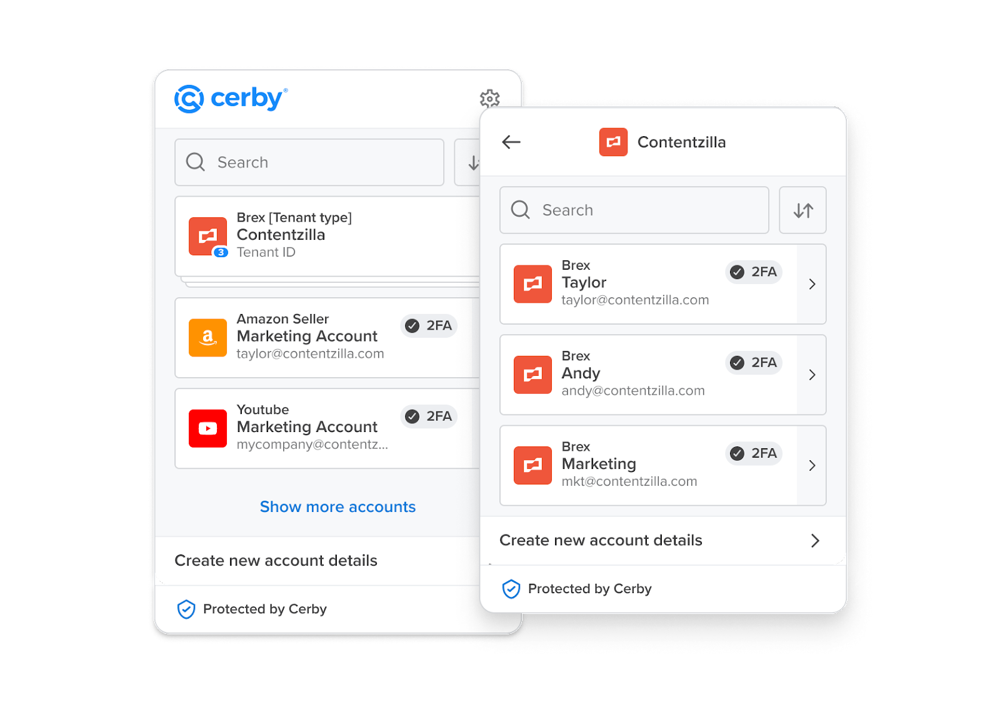

# Log in to your app



**Who can use this feature?**

* App integration**Owners** and **Collaborators**
* Available to Cerby Automate
* Supported using the Cerby web app, browser extension, and mobile app



App integration **Owners** and **Collaborators** can log in to the app through the app connected to their user account. Access is, as usual, via the corresponding account card in the **All accounts** view.

However, when users have more than one user account for the same app, they can select the account to use to log in by performing the following actions from the Cerby web app:

1. Log in to your corresponding [Cerby](https://app.cerby.com/) workspace.
2. Select the **Apps** option from the left navigation drawer. The **Apps** view is displayed.
3. Click the **Log in** icon of the corresponding app card. The **Choose an account to log in** dialog box is displayed with a list of user accounts.
4. Click the **Log in** button of the corresponding user account.

A similar login process for users with multiple user accounts for the same app is available in the Cerby browser extension. To log in, you must complete the following steps:

1. Log in to your corresponding [Cerby](https://app.cerby.com/) workspace with the browser extension.
2. Click the corresponding app card. A page with the name of your app is displayed with the account cards that correspond to each user account, as shown in **Figure 1**.

**Figure 1.** Apps page in the Cerby browser extension

3. Click the **View Details** button. A page with the details of your user account is displayed.
4. Click the **Log in** button.
