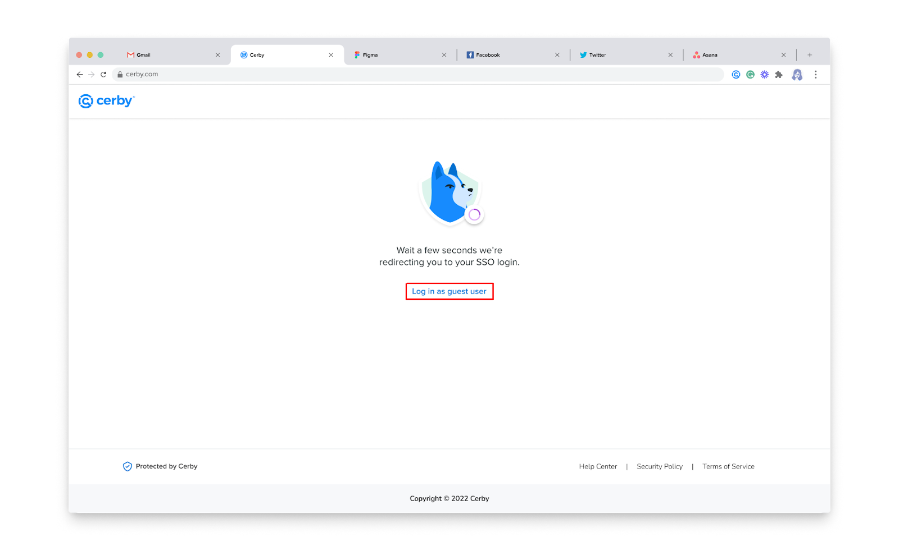
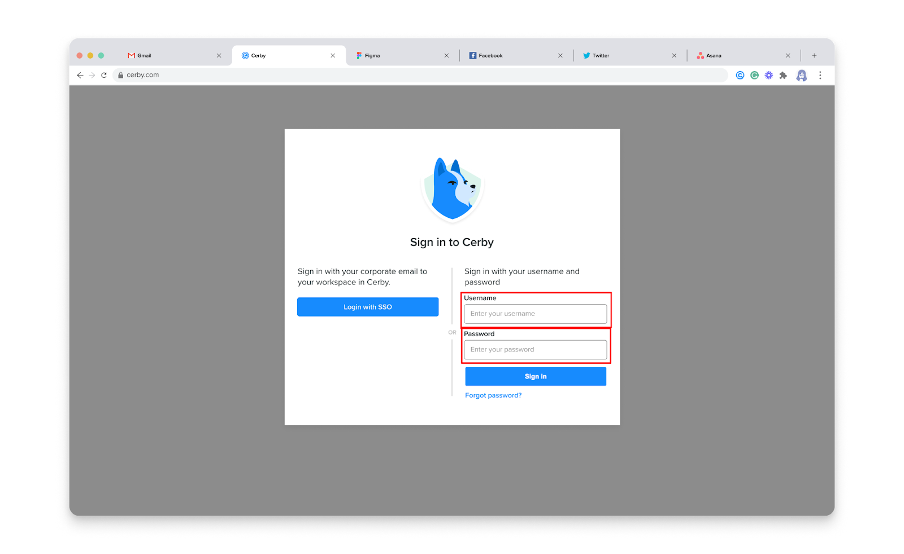
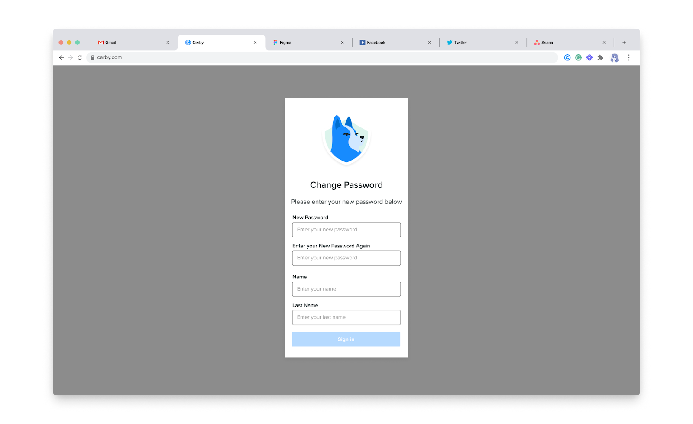

# Join Cerby from a guest user invite



**Who can use this feature?**

* Workspace**Guest Users**
* Supported using the Cerby web app



As a guest user, you receive an email to set up your Cerby account and join a workspace through the web app.

To join Cerby from a guest user invite, you must complete the following steps:

  1. Open the message Cerby sent to your email address. The message contains the following account details you need to set up your account:

     * **Workspace name**
     * **Username**
     * **Temporary password**

  2. Click the **Open Cerby** button from the message. An authentication waiting page is displayed in your web browser
**IMPORTANT:** Proceed to step 3 right away because, after a few seconds, you are redirected to the corporate identity provider’s login page. You cannot set up your account on that page; therefore, you must close the browser tab and follow step 2 again.

  3. Click the **Log in as guest user** button, as shown in **Figure 1**.

**Figure 1.** Authentication waiting page

The Cerby authentication page is displayed.

<figure><figcaption></figcaption></figure>

  4. Enter the username and temporary password emailed by Cerby in the corresponding fields, as shown in **Figure 2**.

**Figure 2.** **Username** and **Password** fields in the Cerby authentication page

<figure><figcaption></figcaption></figure>

  5. Click the **Sign in** button. The **Change Password** page is displayed, as shown in **Figure 3**.

**Figure 3.** **Change Password** page

<figure><figcaption></figcaption></figure>

  6. Enter a new password for your Cerby account and your profile information in the corresponding fields:

     * **New Password**
     * **Enter New Password Again**
     * **Name**
     * **Family name**

  7. Click the **Sign in** button. The Cerby web app dashboard is displayed.

Now you are done. For an optimized and secure experience, Cerby recommends all guest users complete the steps from the article [How to create and configure a local user workspace](https://cerby-test.gitbook.io/cerby-test/management/identity-providers-idps/local-workspace/create-and-configure-a-local-user-workspace):

  1. [Install the Cerby mobile app and browser extension](https://cerby-test.gitbook.io/cerby-test/management/identity-providers-idps/local-workspace/create-and-configure-a-local-user-workspace)
  2. [Turn on MFA for your Cerby account](https://cerby-test.gitbook.io/cerby-test/management/identity-providers-idps/local-workspace/create-and-configure-a-local-user-workspace)
