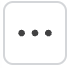

# Remove a user from a collection



**Who can use this feature?**

* Workspace**Owners** , **Super Admins** , **Admins** , **Users** , and **Guest Users**
* Collection **Owners**
* Supported using the Cerby web app and mobile app. For the mobile app instructions, read the article [Remove user from a collection using the Cerby mobile app](https://cerby-test.gitbook.io/cerby-test/how-to-use-cerby/cerby-mobile-app/collections/remove-a-user-from-a-collection-using-the-cerby-mobile-app)



As a collection **Owner** , you can remove a user from a collection. With this action, the user loses access at the collection level to all the items within the collection. However, you can choose to grant them direct access to the items.

To remove a user from a collection, you must complete the following steps using the Cerby web app:

1. Log in to your [Cerby](https://app.cerby.com/) workspace.
2. Select the **Collections** option from the left menu. The **Collections** page is displayed.
3. Click the **Settings** () icon of the corresponding collection card. The collection details page is displayed with the **General** tab activated.
4. Activate the **Members** tab. The **Members** table is displayed with a list of users who have shared access to the collection.
5. Click the **More options** () icon of the corresponding user. A drop-down menu is displayed.
6. Select the **Remove from collection** option. A confirmation dialog box is displayed.
7. Choose what to do with user access to the accounts, secrets, business hub integrations, and assets within the collection:

   * Select the **Remove account permissions shared through the collection** option to remove user access at the collection level. No direct access is granted to the items.
   * Unselect the **Remove account permissions shared through the collection** option to remove user access at the collection level but grant direct access to the items.
​**IMPORTANT:** In both scenarios, the user loses all access to the secrets within the collection.

8. Click the **Remove from Collection** button. The dialog box closes, and a success message box is displayed.



**NOTE:** When you remove a user from a collection containing business hubs and assets, Cerby also removes this user from the external apps. For more information, read the article [Manage access to business hubs and assets with collections](https://cerby-test.gitbook.io/cerby-test/management/identity-lifecycle/business-hubs/manage-integrations/manage-access-to-business-hubs-and-assets-with-collections).



Now you are done.
