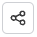

# Share a subcollection

To share a subcollection, you must complete the following steps:



**IMPORTANT:** When you share a parent collection with other teams or members, you grant access not only to the secrets and accounts inside that collection but also to all its nested subcollections and their items, inheriting all permission settings bottom-down.



1. Log in to your corresponding [Cerby](https://app.cerby.com/) workspace.
2. Select the **Collections** option from the left navigation drawer. The **Collections** view is displayed.
3. Expand the collection that contains the subcollection you want to share.

   * Alternatively, you can search for the subcollection in the search bar.

4. Hover the mouse over the subcollection you want to share. A menu of icons is displayed.
5. Click the **Share** () icon. The Share Access dialog box is displayed.
6. Enter the member’s or team’s name in the search bar. The members or teams that match the name are displayed on a list below the search bar.
7. Select the corresponding member or team from the list. The member or team is displayed in the **Members and Teams** section.

**TIP:** Repeat steps 5 and 6 to select multiple members or teams.

8. Select the corresponding role on the subcollection and its items from the **Role** drop-down list:

   * **Owner** : They can share access, edit, add attachments, and manage the collection and item settings.
   * **Collaborator:** They can only view and use the collection and items.

9. Click the **Share** button. The dialog box closes, and a success message box is displayed.



**IMPORTANT:** Subcollections inherit the highest item-level permissions in a parent collection and any explicitly set permissions on the secrets and accounts of a subcollection, depending on your role. For example, suppose you have the **Collaborator** role in a parent collection. In that case, you inherit the **Collaborator** role in the bottom-down elements. However, if you have another collection where you have the **Owner** role, then you inherit that role on the items in that collection.



For another example, consider the structure of collections, subcollections, secrets, and accounts in **Table 1**.

**Item name**| **Item type**
---|---
Global projects| Root collection
Atlassian| Account
Notion| Account
Global secret| Secret
Marketing| Subcollection
Twitter| Account
Meta| Account
Tiktok| Account
Development| Subcollection
GitHub| Account
Atlassian| Account
API key| Secret

**Table 1.** Collection and subcollection structure example

Let’s imagine user John Doe has the **Owner** role over the **Meta** account, which is shared separately by another user. However, user Rose Poe, owner of the **Global projects** collection, shares the **Marketing** subcollection with John Doe, assigning the **Collaborator** role. Because John Doe had the **Owner** role previously, he maintains the **Owner** permissions on the Meta account.
