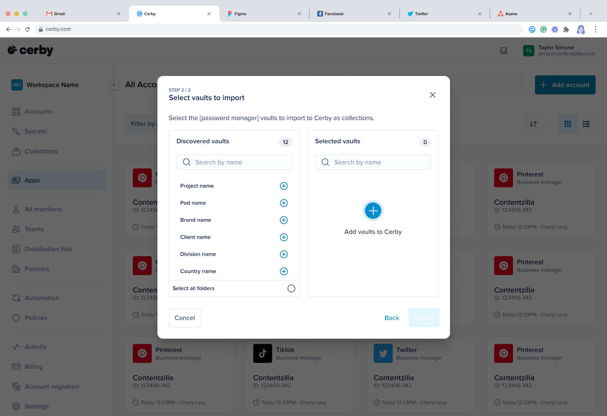

# Migrate from 1Password to Cerby



**Who can use this feature?**

* Cerby Workspace**Owners** , **Super Admins** , **Admins** , and **Users**
* Only supported using the Cerby web app



As a workspace user in Cerby, you can migrate your 1Password vaults and items using our **Password Manager Importer** as their corresponding Cerby item types:

* Vaults become collections
* Logins become accounts
* Passwords become accounts
* Secure notes become secrets
* Software licenses become Software license secrets
* Databases become Database secrets
* Servers become Server secrets
* Wireless routers become WiFi secrets
* SSH keys become SSH key secrets

**NOTE:** For a detailed mapping between 1Password and Cerby items, read the [Item and field mapping](migrate-from-1password-to-cerby.md#item-and-field-mapping) section.



**IMPORTANT:** As per our current support, the Password Manager Migrator does not migrate 1Password Groups as Teams in Cerby.



Throughout the entire import process, Cerby maintains a secure, direct connection with 1Password and facilitates a seamless import of its vaults and items. The Password Manager Importer ensures uninterrupted continuity and consistency in your data and user access to start managing your items through Cerby.

* * *

## Requirements

The following are the requirements to use the **Password Manager Importer** for 1Password:

  * A workspace in Cerby
  * A Cerby user account
  * An active 1Password business account

  **IMPORTANT:** During the migration, ensure that any single sign-on or two-factor authentication methods are temporarily disabled in your 1Password account. Currently, we only support authentication using your username and password credentials in 1Password.

  * You must have the following permissions in 1Password that let Cerby access the vaults and items you want to import:
    * For vaults (full access)
      * Manage Vault
    * For items
      * View Items
      * Create Items
      * Edit Items
      * Archive Items
      * Delete Items
    * For client settings
      * Import Items
      * Export Items
      * Copy and Share Items
      * Print Items
    * For App Access, your account must have **1Password Command-Line Tool access** enabled.
  * The secret key that corresponds to your 1Password account.

  **NOTE:** You can find your secret key as follows:

    * In your 1Password Emergency Kit. This PDF file is commonly saved on the device you used to create your 1Password account.
    * In the 1Password desktop application. To get your secret key, you must complete the following steps:

      1. Click the user profile menu located at the top-left corner. A drop-down menu is displayed.
      2. Select the **Set Up Another Device** option. The **Set Up Another Device** dialog box is displayed, and the**Account Details** tab is activated.
      3. Click the **secret key** field. Your secret key is copied to the clipboard.

    * In the 1Password web version. To get your secret key, you must complete the following steps:

      1. Click the user profile menu located at the top-left corner. A drop-down menu is displayed.
      2. Select the **My Profile** option. The **My Profile** page is displayed.
      3. Hover the mouse over the **Secret Key** field. Two buttons are displayed.
      4. Click the **Copy** button. Your secret key is copied to the clipboard.

* * *

## Import rules

The following import rules have been established for 1Password:

  * All the imported vaults, supported accounts, and secrets are automatically onboarded to Cerby. In the import report, you can see if any details are missing and enter them if necessary.
  * Items are imported to the default vault in your workspace. Workspace**Admins** must ensure that a default local vault has been created and set up.
  * Empty 1Password vaults are imported to Cerby as empty collections. If the empty vaults are shared with other users in the account, the permissions are migrated into Cerby.
  * 1Password time-based shared items are not shared after being imported in Cerby.
  * The following rules are applied to duplicate items:
    * All secrets are imported to Cerby, and they are not identified as duplicates.
    * All selected vaults are imported and identified with a number at the end of their collection name.
  * In 1Password, you can set up multiple Time-Based One-Time Password (TOTP) codes. However, during migration, the Password Manager Importer selects the first TOTP code it encounters.
  * 1Password login and password items might not be identified as managed accounts after migration in Cerby for the following reasons:
    * The application provider does not allow duplicated usernames.
    * The account was migrated without using the full URL, including the `https://` protocol, so the account is categorized as a self-managed account.
    * Multiple application providers share the same root domain.
  * 1Password access permissions are automatically granted to users with an active Cerby user account. After the import, you can invite users without a matching Cerby user account.

  **NOTE:** Read more about how 1Password roles and permissions map to Cerby roles in the [Mapping of 1Password vault permissions and client settings](migrate-from-1password-to-cerby.md#mapping-of-1password-vault-permissions-and-client-settings) section.

* * *

## Item and field mapping

The supported 1Password items and input fields within your vaults are mapped to Cerby items, as listed in **Table 1** :

**1Password item**| **Cerby item**| **1Password field**| **Cerby field**
---|---|---|---
Vault| Collection| Name| Collection name
Login*| Account| Title| Account name
|  | Website| Domain*
|  | Username| Username
|  | Password| Password
|  | Notes| Notes
|  | Email| Email
|  | Phone| Phone number linked to the account
Passwords| Account| Password| Password
|  | Username| Username
|  | Website*| Login URL
|  | Notes| Notes
Secure Notes| Secrets| Notes/text| Notes/Text
|  | Attachment| Attachment
Software Licenses| Secret - Software License| License Key| License Key
|  | Licensed to| Licensee
|  | Version| Version
|  | Registered email| Support Email
|  | Publisher website| Website
|  | Retail price| Price
|  | Purchase date| Purchase Date
|  | Order number| Order Number
|  | Order total| Order Total
|  | N/A| Number of Licenses
|  | Notes| Notes
|  | Attachment| Attachment
Database| Secret - Database| Type| Type
|  | Server| Hostname/server
|  | Port| Port
|  | Database| Database
|  | Username| Username
|  | Password| Password
|  | SID| SID
|  | Alias| Alias
|  | Notes| Notes
|  | Attachment| Attachment
Servers| Secret - Servers| Title| Name
|  | Hosting Provider - Name| Hostname
|  | Username| Username
|  | Password| Password
|  | Notes| Notes
|  | URL| N/A
Wireless Routers| Secret - WiFi| Base station name| N/A
|  | Base station password| N/A
|  | Server / IP address| N/A
|  | AirPort ID| N/A
|  | Network name| SSID
|  | Wireless security| Authentication
|  | Wireless network password| Password
|  | Attached storage password| N/A
|  | Notes| Notes
|  | N/A| Connection Type
|  | N/A| Connection Mode
|  | N/A| Encryption
|  | N/A| Use 802.1x
|  | N/A| FIPS Mode
|  | N/A| Key type
|  | N/A| Protected
|  | N/A| Key Index
|  | N/A| Encryption
SSH Keys| Secret| Title| SSH key label
|  | Public key| Public key
|  | Fingerprint| N/A
|  | Private key| Private key
|  | Key type| Format
|  | Attachment| Attachment
|  | Notes| Notes
|  | N/A| Date
|  | N/A| Bit strength
|  | N/A| Hostname

**Table 1.** Corresponding 1Password item and field mapping in Cerby



**IMPORTANT:** Consider the following for the items with an asterisk (*) in **Table 1** :

  * Cerby’s Password Manager Importer supports only one domain per 1Password login item.
  * Domain and website fields in login and password 1Password items must have the `https:// `or `http://` protocols. Items without these protocols are imported but recognized as self-managed accounts.
  * Cerby does not support or migrate any 1Password item fields not listed in**Table 1** ; therefore, you have to manually add them as custom items or secrets after the import.



* * *

## Mapping of 1Password vault permissions and client settings

Cerby’s Password Manager Importer replicates the 1Password sharing permissions, mapping them to Cerby roles to ensure seamless transition, consistent access control, and integrity of user permissions and access levels.

**Table 2** shows how 1Password sharing permissions are mapped to Cerby roles.

**1Password vault permissions**| **Cerby role**| **Description**
---|---|---
View Items (Only)| **Collaborator**|  Can only view items
View Items + Create/Edit| **Owner**|  Can view, create, and edit items
Create Items| **Owner**|  Can create items
Edit Items| **Owner**|  Can edit items
Archive Items| **Owner**|  An **Owner** can archive items
Delete Items| **Owner**|  Can delete items
Manage Vault| **Owner**|  Has full management of the vault, including settings and permissions
Remove from Vault| **Owner**|  Can remove items from the vault

**Table 2.** Corresponding access permissions in 1Password and Cerby

**Table 3** shows how the 1Password client settings are mapped to Cerby roles.

**1Password client settings**| **Cerby role**| **Description**
---|---|---
View and copy passwords| **Collaborator**|  An **Owner** can specify if a **Collaborator** can view or copy passwords
View history| **Collaborator**|  Can view item history
Import items| **Owner**|  Can import items into the vault
Export items| **Owner**|  This functionality is not implemented in Cerby
Copy and share items| **Owner**|  Can copy and share items
Move items| **Owner**|  Can move items within the vault
Print items| **Collaborator**|  This functionality is not implemented in Cerby

**Table 3.** Corresponding client settings in 1Password and Cerby

* * *

## Import 1Password vaults and items to Cerby

To import 1Password vaults and items to Cerby, you must complete the following main steps:

  1. [Import your 1Password vaults to Cerby](migrate-from-1password-to-cerby.md#id-1.-import-your-1password-vaults-to-cerby)
  2. [Review the import report](migrate-from-1password-to-cerby.md#id-2.-review-the-import-report)
  3. [Take action on onboarded items](migrate-from-1password-to-cerby.md#id-3.-take-action-on-onboarded-items)

The following sections describe each main step.

### 1\. Import your 1Password vaults to Cerby

To import your 1Password vaults to Cerby, you must complete the following steps:

  1. Log in to your corresponding [Cerby](https://app.cerby.com/) workspace.
  2. Click the **Add item** button from the **All accounts** view. A drop-down list is displayed.
  3. Select the **Import from password manager** option. The **Import from your password manager** dialog box is displayed.
  4. Click the **Get started** button. A wizard is displayed with the **Enter your login credentials** page.
  5. Select **1Password** from the **Password manager** field. The fields to connect to 1Password are displayed below.
  6. Enter the corresponding information in the following fields:

     * **Sign-in address**

       1. Enter the URL of your 1Password account with the following format: `{1password-account-name}.1password.com`

       **IMPORTANT:** If you include the protocol part of the URL (`http://)`, the import will fail.

     * **Email**

       1. Enter the email address you use to log in to your 1Password account.

     * **Password**

       1. Enter the master password you use to log in to your 1Password account.

     * **Secret key**

       1. Enter your 1Password secret key.
​**NOTE:** For instructions on how to find your secret key, read the [Requirements](migrate-from-1password-to-cerby.md#requirements) section.

  7. Click the **Next** button. The **Select vaults to import** page is displayed with the **Loading your vaults** icon, meaning that Cerby is retrieving the list of your 1Password vaults. After the sync is complete, the list is displayed, as shown in **Figure 1**.

**Figure 1.** **Select vaults to import** page of the Password Manager Importer wizard

**NOTE:** You also receive an email from 1Password indicating that they have detected a new sign-in to your account. This email is triggered by Cerby’s connection to 1Password to retrieve the vault information.

  8. Click the **Add** icon from the **Discovered vaults** section that corresponds to the vault you want to import. The vault is added to a list in the **Selected vaults** section.
  9. Repeat step 8 as necessary.

  **TIP:** You can also use the search boxes in the **Discovered vaults** and **Selected vaults** sections to look for vaults by name.

  10. Click the **Import** button. The dialog box closes, and the **Import Report** view is displayed with the “We’re importing your items from your password manager to Cerby” message.

  **NOTE:** The process may take a few minutes, depending on the number of vaults and items to import. When the import is complete, a success message box is displayed, and an email is sent.

The next step is [2. Review the import](migrate-from-1password-to-cerby.md#id-2.-review-the-import-report) report, which you must complete from the **Import Report** view.

### 2\. Review the import report

The **Password Manager Importer** transfers to Cerby all the login, password, secure note, software license, database, server, SSH key, and wireless router items saved inside your 1Password vaults.

After an import, all of the transferred items are displayed on the **Import report** view.

The **Import report** view contains the following sections:

  * **Collections:** It displays the number of 1Password vaults imported as collections to Cerby.
  * **Accounts and Secrets:** It displays the number of 1Password items imported to Cerby. All accounts and secrets are **onboarded** to Cerby, even if they are duplicates or have details missing.
  * **Users:** It displays the number of users whose Cerby user accounts were **matched** or**unmatched** to 1Password access permissions. You can download a CSV file with a table of unmatched users by clicking the **Download unmatched users report** button.
  * **Imported items:** It displays a table with the imported items in the following four tabs:
    * **Pending review: It displays the items with import issues.**
    * **Onboarded items: It displays the items onboarded to Cerby.**
    * **Unmatched users:** It displays the users who were not automatically matched and the items to which they still have access in 1Password.
    * **Matched users:** It displays the users matched to their Cerby user account and the items to which they have access through Cerby.

You can download a full import report in a CSV file by clicking the **Download latest report** button located at the top right of the **Import report** view. This report contains a table with all the imported items (collections, accounts, and secrets) and permissions to help you verify that your items were successfully transferred from 1Password.

If you see items with the skipped or failed status, the report provides information about why Cerby did not import them, and you can take action to solve the issues.

For more information about this report, read the [How to interpret the downloadable import report](migrate-from-1password-to-cerby.md#how-to-interpret-the-downloadable-import-report) section.

The next step is [3. Take action on onboarded items](migrate-from-1password-to-cerby.md#id-3.-take-action-on-onboarded-items).

### 3\. Take action on onboarded items

The following are the actions you can take on onboarded items:

  * [Edit collection name](migrate-from-1password-to-cerby.md#edit-collection-name)
  * [Edit account label](migrate-from-1password-to-cerby.md#edit-account-label)
  * [Edit secret title](migrate-from-1password-to-cerby.md#edit-secret-title)
  * [Share access to a collection](migrate-from-1password-to-cerby.md#share-access-to-a-collection)
  * [Share access to a secret](migrate-from-1password-to-cerby.md#share-access-to-a-secret)
  * [View item settings](migrate-from-1password-to-cerby.md#view-item-settings)

The following sections describe each action.

#### Edit collection name

After importing a collection to Cerby, you can change its name from the **Import report** view. This name is displayed on the cards of the dashboard, and it helps you and other users easily identify it.

To edit the collection name, you must complete the following steps from the **Import report** view:

  1. Click the **Take action** button of the corresponding account. A drop-down list is displayed.
  2. Select the **Edit collection name** option. The **Edit collection name** dialog box is displayed.
  3. Enter a new name in the **Collection name** field.
  4. Click the **Save** button. The dialog box closes, and a success message box is displayed.

#### Edit account label

After importing an account to Cerby, you can change its label from the **Import report** view. The account label is the name displayed on the account cards of the dashboard that helps you and other users easily identify it.

To edit the account label, you must complete the following steps from the **Import report** view:

  1. Click the **Take action** button of the corresponding account. A drop-down list is displayed.
  2. Select the **Edit account label** option. The **Edit account label** dialog box is displayed.
  3. Enter a new label in the **Account name** field.
  4. Click the **Save** button. The dialog box closes, and a success message box is displayed.

#### Edit secret title

After importing a secret to Cerby, you can change its title from the **Import report** view. The title is the name displayed on the secret cards of the dashboard that helps you and other users easily identify it.

To edit the secret title, you must complete the following steps from the **Import report** view:

  1. Click the **Take action** button of the corresponding secret item. A drop-down list is displayed.
  2. Select the **Edit secret title** option. The **Edit secret title** dialog box is displayed.
  3. Enter a new title in the **Secret name** field.
  4. Click the **Save** button. The dialog box closes, and a success message box is displayed.

#### Share access to a collection

After importing a collection to Cerby, you can share access right away from the **Import report** view. To do so, you must complete the following steps:

  1. Click the **Take action** button of the corresponding collection. A drop-down list is displayed.
  2. Select the **Share access** option. The **Share secret** dialog box is displayed.
  3. Enter the name of the user or team in the search bar. The users or teams that match the name are displayed in a list below the search bar.
  4. Select the corresponding user or team from the list. The user or team is displayed in the **Members and Teams** section.
  5. Repeat steps 3 and 4 as necessary to select multiple users or teams.
  6. Select the corresponding Cerby role from the **Role** drop-down list:

     * **Owner:** They can share access, edit, and manage the collection, account, and secret settings.
     * **Collaborator:** They can only view the collection, account, and secret details and log in to accounts.

  7. Click the **Share** button. The dialog box closes, a success message box is displayed, and an email is sent to the user.

#### Share access to a secret

After importing a secret to Cerby, you can share access right away from the **Import report** view. To do so, you must complete the following steps:

  1. Click the **Take action** button of the corresponding secret item. A drop-down list is displayed.
  2. Select the **Share access** option. The **Share secret** dialog box is displayed.
  3. Enter the name of the user or team in the search bar. The users or teams that match the name are displayed in a list below the search bar.
  4. Select the corresponding user or team from the list. The user or team is displayed in the **Members and Teams** section.
  5. Repeat steps 3 and 4 as necessary to select multiple users or teams.
  6. Select the corresponding Cerby role from the **Role** drop-down list:

     * **Owner:** They can share access, edit, add attachments, and manage the secret settings.
     * **Collaborator:** They can only view the secret and download the attachments.

  7. Click the **Share** button. The dialog box closes, a success message box is displayed, and an email is sent to the user.

#### View item settings

After importing a collection, account, or secret to Cerby, you can view their settings from the **Import report** view. To do so, you must complete the following steps:

  1. Click the **Take action** button of the corresponding collection, account, or secret. A drop-down list is displayed.
  2. Select the **Collection settings** , **Account settings** , or**Secret settings** option. The corresponding item details page is displayed with the **Settings** tab activated.

* * *

## Invite unmatched users to Cerby

After an import from 1Password, unmatched users in the **Import report** view need a direct share or an invite to access the imported collections, accounts, or secrets. The invite process is different depending on the type of user:

  * [Users with a Cerby account](migrate-from-1password-to-cerby.md#users-with-a-cerby-account)
  * [Guest users](migrate-from-1password-to-cerby.md#guest-users)

### Users with a Cerby account

Users who are part of your organization and have a Cerby account but are unmatched need a direct share of the imported collections, accounts, and secrets. Follow the corresponding instructions to share the items:

  * Collection

    1. Watch the video [How to create and share a collection](https://cerby-test.gitbook.io/cerby-test/management/credential-management/collections/video-how-to-create-and-share-a-collection).

  * Account

    1. Watch the video [How to share access to accounts with teammates](https://cerby-test.gitbook.io/cerby-test/how-to-use-cerby/cerby-web-app/accounts/video-how-to-share-access-to-accounts-with-teammates).

  * Secret

    1. Watch the video [How to add and share a secret](https://cerby-test.gitbook.io/cerby-test/how-to-use-cerby/cerby-web-app/secrets/video-how-to-add-and-share-a-secret).

### Guest users

External collaborators who are not part of your organization and don’t have a Cerby account are identified as unmatched. To grant them the imported access permissions, you can invite them to join your workspace as guest users.

Guest users have identities and authentication managed by Cerby. After receiving the invite and joining Cerby, they are visible through the **All Members** view and searchable through the item-sharing dialog boxes. For more information about this feature, read the [How to invite a guest user to your workspace](https://cerby-test.gitbook.io/cerby-test/support-and-use-cases/explore/explore-guest-users) article.

To invite a guest user as part of the import process, you must complete the following steps from the **Import report** view:

  1. Activate the **Unmatched users** tab.
  2. Click the **Invite as guest** button of the corresponding user. The **Invite guest user** dialog box is displayed.
  3. Click the **Send invite** button. The dialog box closes, a success message box is displayed, and the invite is sent to the guest user’s email.

The guest user must open the invite and set up their account to join your Cerby workspace. For instructions, read the section [Join Cerby from a guest user invite](https://cerby-test.gitbook.io/cerby-test/support-and-use-cases/explore/explore-guest-users) from the article [How to invite a guest user to your workspace](https://cerby-test.gitbook.io/cerby-test/support-and-use-cases/explore/explore-guest-users).

When they join Cerby, the corresponding shared items are displayed in the **All Accounts** , **Secrets** , and **Collections** views.

* * *

## How to interpret the downloadable import report

When you download a full import report in CSV format after transferring your items to Cerby, you can verify if all of your individual items were successfully transferred from 1Password.

The table contains detailed information about the import status of every item and permission. If an item is identified with the skipped or failed status, the import report also describes why it was not imported so you can solve the issue and try again.

The following glossary describes the terms used in the table:

  * **`Item type`:** It is a column header indicating the type of imported item: account, secret, collection, or permission.
  * **`Import status`:** It is a column header indicating the import status of an individual item: successful, skipped, or failed.
  * **`Status details`:** It is a column header indicating more information for interpreting the import status.
  * **`Item path`:** It is a column header indicating the vault name in 1Password.
  * **`Item name`:** It is a column header indicating the item name as it was saved in 1Password.
  * **`Item username`:** It is a column header indicating the username associated with the imported account. The permission item type indicates the role assigned to an imported collection.
  * **`Item URL`:** It is a column header indicating the URL associated with the imported account.
  * **`Username`:** It is a column header indicating the user’s associated username to whom a collection was assigned. It only applies to the permission item type.
  * **`Successful` (import status):** It is a status indicating the item was successfully imported from 1Password to Cerby.
  * **`Skipped` (import status):** It is a status indicating the item was intentionally omitted from the import. For more details, see the **Status** details column.
  * **`Failed` (import status):** It is a status indicating Cerby attempted to import the item but encountered issues. For more details, see the **Status** details column.
  * **`Empty_collection` (status details)**: It is a value indicating the collection was skipped during the import because the 1Password vault was empty.
  * **`Successful` (status details):** It is a value indicating the item was imported without issues.
  * **`Unknown_permission_error` (status details):** It is a value indicating the item import failed because of an unidentified error related to permissions, suggesting a potential issue with access rights.
  * **`User_not_found` (status details):** It is a value indicating the item import failed because Cerby could not find its associated user account, possibly due to a nonexisting account or identification mismatch.

The import report displays two sets of statuses and values that help you determine a successful import for collections.

When you see a `collection` as the item type in the corresponding column and the `successful` status and value, which means the 1Password vault was imported to Cerby without any issues.

When you see `permission` as item type in the corresponding column and the `successful` status and value, it means that the original user access permission was assigned to the corresponding imported collection. You can obtain additional information from the following columns:

  * The `Item path` column helps you identify the collection name.
  * The `Item name` column helps you identify the role (**Owner** or **Collaborator**) assigned to the imported collection.
  * The `Username` column helps you identify the user who received the access grant in Cerby to the collection.
