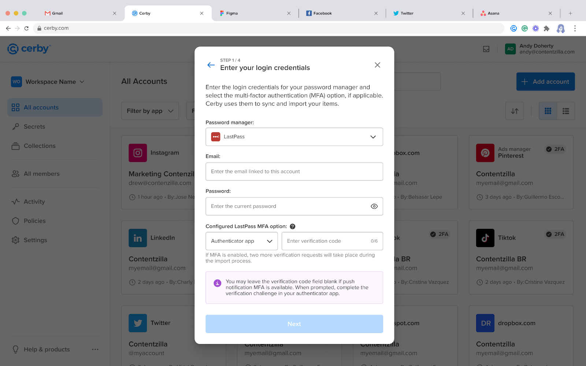
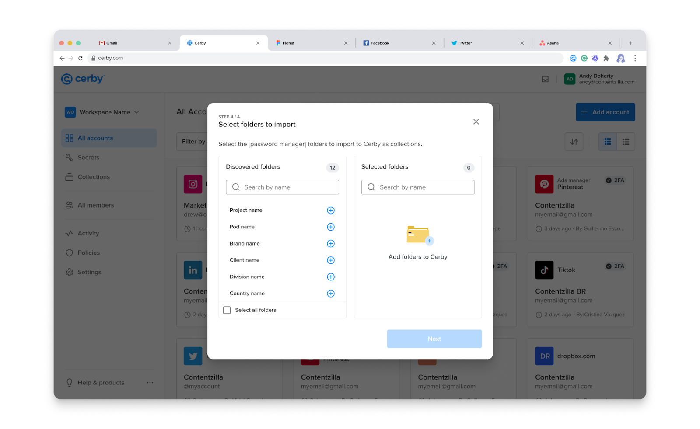
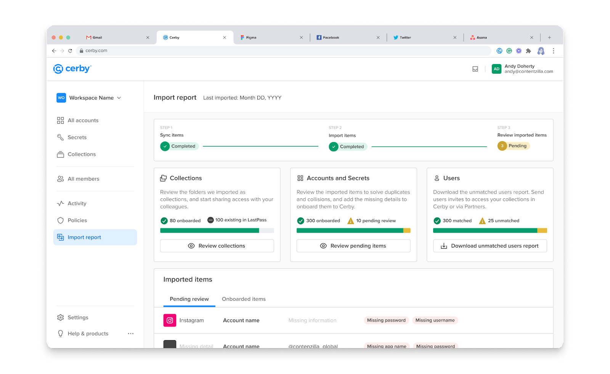
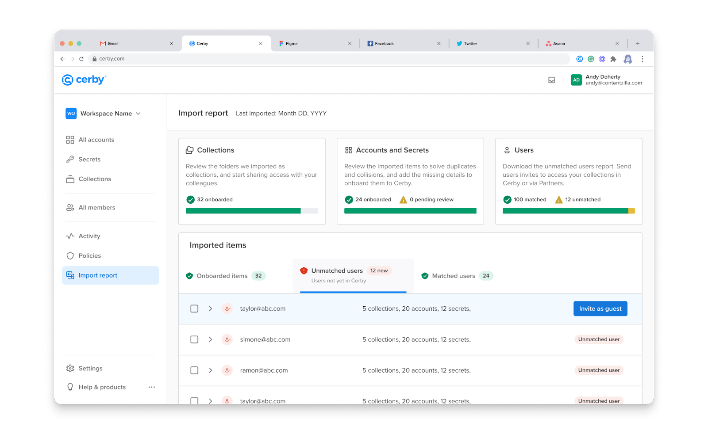

# Migrate from LastPass to Cerby



**Who can use this feature?**

* Workspace**Owners** , **Super Admins** , **Admins** , and **Users**
* Only supported using the Cerby web app



With Cerby, you have a secure and efficient way to migrate your items from LastPass to Cerby.

The Password Manager Importer feature helps you transfer your corporate items and the user access permissions to them in one go. After the import, you can start managing and protecting your accounts and secrets through Cerby.

The following are the item and feature correspondences between LastPass and Cerby:

* Folders and subfolders become collections and subcollections with the same nested items and shared user permissions
* Passwords become accounts
* Secure notes and their attachments become secrets
* The following items become the corresponding secret items in Cerby:
    * WiFi
    * Database
    * SSH keys
    * Server
    * Software license
    * Custom item
* Groups become teams with only one member: the user who performs the import. For instructions on how to add the missing team members, read the Add the missing team members section

This article describes how to migrate your LastPass items to Cerby.

* * *

## Requirements

The following are the requirements to use the Password Manager Importer for LastPass:

* A Cerby workspace
* A Cerby user account with any workspace role, except **Guest Users** and **Login-Only**
* An active LastPass business account with **Administrator** access permissions on the shared folders to import
**IMPORTANT:** Due to LastPass requirements, ensure that your master password is at least 12 characters long.

* One or multiple private and shared folders with accounts, secure notes, and attachments
* If you log in to LastPass with single sign-on (SSO) authentication managed by Okta as your corporate identity provider (IdP), you or your workspace **Admin** must configure the IdP settings. For instructions and more information, read the article [Set up your IdP to support imports from LastPass with SSO authentication](https://cerby-test.gitbook.io/cerby-test/management/credential-management/item-importer/set-up-your-idp-to-support-imports-from-lastpass-with-sso-authentication)
**IMPORTANT:** With this login method, you must have installed the Cerby browser extension

* * *

## Import rules

Due to LastPass constraints, the following import rules have been established:

* Only users with a LastPass account and **Administrator** permissions on shared folders can transfer items via the Password Manager Importer. You cannot import shared folders if you have the **Read Only** or **Hide Passwords** permissions.
* All the imported collections, accounts, and secrets are automatically onboarded to Cerby. In the import report, you can see if these items have any details missing and enter such details.
* Items are imported to the default vault. For workspaces with local encryption support, **Workspace Admins** must ensure to have created and set up a default local vault.
* Private and shared folders have different import rules:
    * To prevent duplicate shared items, you can only import shared folders one time. In subsequent import attempts, you cannot select them.
    * Private folders can be imported multiple times to Cerby, and existing items get duplicated.
    * Empty folders and subfolders are not imported to Cerby.
* The following rules are applied to duplicate items:
    * Accounts are identified as duplicates in the import report when an existing account in Cerby has the same username and login URL or domain as an imported account.
    * All secrets are imported to Cerby, and they are not identified as duplicates.
    * All selected folders and groups are imported; duplicates are identified with a number at the end of their name.
* User access permissions for folders, subfolders, passwords, and secure notes propagate to the corresponding Cerby collections, subcollections, accounts, and secrets as follows:
    * Permissions on folders propagate to collections and the nested subcollections in Cerby. Therefore, access to accounts and secrets inside a collection and nested subcollections is granted at the parent collection level.
    * Users with access to a LastPass folder but no role assigned are granted the **Collaborator** role on the Cerby collection. Additionally, if a user is invited to a folder, password, or secure note in LastPass but hasn't accepted the invite, they are not granted permission in Cerby.
    * Individual permissions on passwords and secure notes propagate to Cerby accounts and secrets.
    * The unavailability access rules that you set in LastPass for specific recipients are applied to the imported items. In addition to the collection that Cerby creates for you as the collection **Owner** , new collections and sub-collections are created for specific users who have different availability rules for items and subfolders.
    * Permissions on LastPass items shared with external collaborators are not imported to Cerby if such collaborators have not accepted the item share.
    * Users are identified as unmatched because they use an email address that couldn’t be identified or they are not in the corporate directory. They need a manual invite to join Cerby. For instructions on how to invite users, read the section Invite unmatched users to Cerby.



**IMPORTANT:** LastPass access permissions are granted automatically to users with a matching Cerby account that’s active, whether provisioned by an identity provider or via a guest user invite. After the import, you can invite users who do not have a matching Cerby account.



**Table 1** shows how user access permissions for LastPass Business folders transition to Cerby roles on collections.

**LastPass access permissions**| **Cerby role**
---|---
Read Only| **Collaborator**
Administrator| **Owner**
Hide Passwords| **Collaborator**

**Table 1.** Corresponding access permissions in LastPass and Cerby

Cerby cannot import the following permissions because LastPass doesn’t have the corresponding features implemented:

* Account-level permissions for teams
* Secret-level permissions for teams

For more information about frequently asked questions and common issues before, during, and after an import, read the article [Password Manager Importer troubleshooting and FAQs](https://cerby-test.gitbook.io/cerby-test/support-and-use-cases/troubleshooting/password-manager-importer-troubleshooting-and-faqs).

* * *

## Import LastPass folders and items to Cerby

To import LastPass folders and items to Cerby, you must complete the following main steps:

  1. Select your login method for LastPass
  2. Import folders, subfolders, and items to Cerby
  3. Review the import report
  4. Take action on onboarded items

The following sections describe each main step.

### 1\. Select your login method for LastPass

The import process is different depending on the login method for your LastPass account. Cerby supports the following methods:

* SSO authentication
* Standard login

The following sections describe how to select your login method.

#### SSO authentication

The Password Manager Importer supports SSO as your LastPass login method. When you use this authentication method managed by your IdP, Cerby detects your login via the browser extension and saves a LastPass SSO account. This account streamlines access to your folders and items for current and future imports.

The new LastPass SSO account is hidden automatically and contains a key that enables Cerby to decrypt your folders, subfolders, and items for the migration. After the import, you can delete this account if you no longer need to use it.



**IMPORTANT:** You must have installed the Cerby browser extension before the import. Currently, only the Chrome and Edge extensions are supported. Make sure you have an active session with the extension by logging in to it.



To select SSO authentication as your login method and start the import, you must complete the following steps:

  1. Log in to your corresponding [Cerby](https://app.cerby.com/) workspace.
  2. Click the **Add item** button in the **Accounts** view. A drop-down list is displayed.
  3. Select the **Import from password manager** option. The **Import from your password manager** dialog box is displayed.
  4. Click the **Get started** button. A wizard is displayed with the **Enter your login credentials** page.
  5. Select the **LastPass** option from the **Password manager** drop-down list. The **Email** field and a checkbox are displayed below.
  6. Select the **I use SSO authentication to log in to LastPass and have installed the Cerby browser extension** option.
  7. Click the **Review** button. One of the following scenarios occur depending on whether you have an active session in your IdP instance or not:

     * **Active session:** The Cerby browser extension identifies your login information and saves a hidden LastPass SSO account in your Cerby workspace. The **Verify Cerby’s location** page of the wizard is displayed.

       1. Continue to step 2\. Import folders, subfolders, and items to Cerby.

     * **Inactive session:** Your IdP’s login page is displayed.

       1. Enter your login credentials to authenticate with SSO. The Cerby browser extension identifies your login information and saves a hidden LastPass SSO account in your Cerby workspace. The **Verify Cerby’s location** page of the wizard is displayed.
       2. Continue to step 2\. Import folders, subfolders, and items to Cerby.

#### Standard login

A standard login means that you enter your username and password to access LastPass through its [login page](https://lastpass.com/?ac=1).

To select standard login as your login method, you must complete the following steps:

  1. Log in to your corresponding [Cerby](https://app.cerby.com/) workspace.
  2. Click the **Add item** button in the **Accounts** view. A drop-down list is displayed.
  3. Select the **Import from password manager** option. The **Import from your password manager** dialog box is displayed.
  4. Click the **Get started** button. A wizard is displayed with the **Enter your login credentials** page.
  5. Select the **LastPass** option from the **Password manager** drop-down list. The **Email** field and a checkbox are displayed below.
  6. Enter the email address you use to log in to LastPass in the **Email** field.
  7. Click the **Review** button. More input fields are displayed below, as shown in **Figure 1**.

**Figure 1.** **Enter your login credentials** page of the Password Manager Importer wizard

<figure><figcaption></figcaption></figure>

  8. Enter the remaining login credentials and select the corresponding option in the following fields:

     * Enter your LastPass master password in the **Password** field.
     * Select the corresponding option from the **Configured LastPass multi-factor (MFA) option** drop-down list, if applicable.
**IMPORTANT:** Go to **Account Settings** in LastPass to identify the MFA option. If multiple options are enabled, select the one with the highest precedence as follows:

       * Default MFA option
       * Yubikey
       * Authenticator app
     * Open your authenticator app to retrieve and enter the verification code, if applicable.\
       **NOTE:** Leave the verification code field blank under the following scenarios:

       * The MFA option is not configured
       * The push notification MFA is available with the LastPass Authenticator app on your mobile phone
       * The Yubikey is set up as tap-and-go
     * For the second and third scenarios, complete the verification challenge in your authenticator app or tap the Yubikey when prompted.

  9. Click the **Next** button. The **Verify Cerby’s location** page is displayed.
  10. Continue to step 2\. Import folders, subfolders, and items to Cerby.

### 2\. Import folders, subfolders, and items to Cerby

Before syncing your folders, subfolders, and items to import them to Cerby, LastPass may send an email indicating that the login attempt from Cerby was blocked, particularly the first time you use the Password Manager Importer.

To import your folders, subfolders, and items to Cerby, you must complete the following steps:

  1. Verify Cerby’s location by completing the following steps:
     1. Open the inbox of the email address registered in LastPass.
     2. Open the email that LastPass sent you. The email subject indicates a blocked login attempt, and the body displays an unrecognized location.
**IMPORTANT:** If you didn’t receive an email, continue to step 2.

     3. Click the verification link or button in the email.
**IMPORTANT:** The login attempts from Cerby only come from Ohio (OH) or Oregon (OR), in the United States. For more information on this security verification, read the Why verify the login attempt section.

  2. Select the **I have already verified Cerby's location or did not receive an email** option. The **Next** button is enabled.
  3. Click the **Next** button. The **Syncing items** page is displayed. One of the following scenarios occur depending on your selected login method:
**NOTE:** The **Confirm import to Cerby** dialog box may be displayed before the **Syncing items** page if the verification code you entered previously, when selecting the standard login, expires. Perform the following actions to continue:

     * **SSO authentication:** The **Get LastPass folders** button is displayed.

       1. Click the **Get LastPass folders** button. The folders are synced, and the **Select folders to import** button is displayed.

     * **Standard login:** The folders are synced, and the **Select folders to import** button is displayed.

     1. Enter the new verification code in the **2FA verification code** field.
     2. Click the **Confirm** button. The **Syncing items** page is displayed.
  4. Click the **Select folders to import** button. The **Select folders to import** page is displayed, as shown in **Figure 2**.

**Figure 2.** **Select folders to import** page of the Password Manager Importer wizar

**IMPORTANT:** While the **Select folders to import** page displays all folders and their subfolders, Cerby currently doesn't automatically import nested folders. To ensure a complete import, please select both the main folders and subfolders.

<figure><figcaption></figcaption></figure>

  5. Click the **Add** icon of the folder or subfolder you want to import. The folder or subfolder is added to a list in the **Selected folders** section.
  6. Repeat step 5 as necessary.
**TIP:** Click the **Add** icon of the **Select all folders** option to select all of the synced folders and subfolders. You can also use the search boxes in the **Discovered folders** and **Selected folders** sections to look for folders by name.

  7. Click the **Next** button. The **Confirm import to Cerby** dialog box is displayed.
  8. Enter a new verification code in the **2FA verification code** field.
**IMPORTANT:** You must enter a valid and unused verification code. If push notification MFA is available for your account, enter **000000** as the verification code and continue to step 9; complete the verification challenge when prompted.

  9. Click the **Confirm** button. The dialog box closes, and the **Import Report** view is displayed with the “We’re importing your items from your password manager to Cerby” message.
The process may take a few minutes, depending on the number of folders, subfolders, and items to import. When the import is complete, a success message box is displayed, and a message is sent to your email address.



**IMPORTANT:** With SSO authentication, we save your login credentials in a hidden LastPass SSO account. You can delete it or keep it to streamline access for future imports.



The next step is 3\. Review the import report, which you must complete from the **Import Report** view.

* * *

### 3\. Review the import report

The Password Manager Importer transfers to Cerby all the passwords and secure notes that are saved inside private and shared LastPass folders.

Each password becomes an individual account in Cerby and is automatically added to a collection or subcollection that corresponds to the native folder or subfolder, with the same name. Secure notes and their file attachments become secrets in Cerby, and they are also automatically added to a collection or subcollection.

After an import, all of the transferred items are displayed on the **Import report** view, as shown in **Figure 3**.

<figure><figcaption></figcaption></figure>

**Figure 3. Import report** view of the Cerby web app dashboard

The **Import report** view contains the following sections:

* **Collections:** It displays the number of LastPass folders imported as collections to Cerby. Collections are **onboarded** when all of their accounts and secrets are also onboarded to Cerby.
* **Accounts and Secrets:** It displays the number of items imported to Cerby. All accounts and secrets are **onboarded** to Cerby, even if they are duplicates or have missing details.
* **Users:** It displays the number of users whose Cerby user accounts were **matched** or**unmatched** to LastPass access permissions. You can download a CSV file with a table of unmatched users by clicking the **Download unmatched users report** button.
* **Imported items:** It displays a table with the imported items in the following tabs:
    * **Pending review: It displays the items with import issues.**
    * **Onboarded items: It displays the items onboarded to Cerby.**
    * **Unmatched users:** It displays the users who were not automatically matched and the items to which they still have access in LastPass.
    * **Matched users:** It displays the users matched to their Cerby user accounts and the items to which they have access through Cerby.

You can download a full import report in a CSV file by clicking the **Download latest report** button located at the top right of the **Import report** view. This report contains a table with all the imported items (collections, sub-collections, accounts, and secrets) and permissions to help you verify that your items were successfully transferred.

If you see items with a `skipped` or `fail` status, the report provides information about why Cerby did not import them, and you can take action to solve the issues.

For more information about this report, read the section How to interpret the downloadable import report.

The next step is 4\. Take action on onboarded items.

* * *

### 4\. Take action on onboarded items

The following are the actions you can take on onboarded items:

* Add missing account details
* Request access to an account
* Edit collection name
* Edit account label
* Edit secret title
* Share access to a collection
* Share access to a secret
* View item settings

The following sections describe each action.

#### Add missing account details

Due to LastPass rules, passwords can be saved with information only in the **Name** field. Therefore, when imported to Cerby, these accounts are displayed with the “Missing detail” or “Missing app name” status in the **Onboarded items** tab of the **Import report** view.

Cerby recommends adding the missing account details because this is the information the Cerby browser extension uses to log you in automatically to your accounts.

To add the missing account details, you must complete the following steps:

  1. Click the **Take action** button of the corresponding account. A drop-down list is displayed.
  2. Select the **Account settings** option from the list. The account details page is displayed with the **Settings** tab activated.
  3. Click the **Edit** (<figure><figcaption></figcaption></figure>) icon of the corresponding field to make it editable.
  4. Enter the information in the field.
  5. Click the **Done** (<figure><figcaption></figcaption></figure>) icon to save the changes.
  6. Repeat steps 3 to 5 as necessary.

#### Request access to an account

When you import an account that already exists in Cerby but another user has the **Owner** role on it, you can send them an access request.

To request access to an existing account, you must complete the following steps from the **Import report** view:

  1. Click the **Take action** button of the corresponding account. A drop-down list is displayed.
**NOTE:** If you only have one action to perform, the **Take action** button is not displayed; instead, the specific action is displayed in the button. Click the **Request access** button and continue in step 3.

  2. Select the **Request access** option from the list. The **Request access** dialog box is displayed.
  3. Enter a message to request access to the account in the **Message** field.
  4. Click the **Request access** button. The dialog box closes, and a success message box is displayed.
You must wait until the **Account Owner** shares access with you.

#### Edit collection name

After importing a collection to Cerby, you can change its name from the **Import report** view. This name is displayed on the secret cards of the dashboard that helps you and other users easily identify it.

To edit the collection name, you must complete the following steps from the **Import report** view:

  1. Click the **Take action** button of the corresponding account. A drop-down list is displayed.
  2. Select the **Edit collection name** option. The **Edit collection name** dialog box is displayed.
  3. Enter a new name in the **Collection name** field.
  4. Click the **Save** button. The dialog box closes, and a success message box is displayed.

#### Edit account label

After importing an account to Cerby, you can change its label from the **Import report** view. The account label is the name displayed on the account cards of the dashboard that helps you and other users easily identify it.

To edit the account label, you must complete the following steps from the **Import report** view:

  1. Click the **Take action** button of the corresponding account. A drop-down list is displayed.
  2. Select the **Edit account label** option. The **Edit account label** dialog box is displayed.
  3. Enter a new label in the **Account name** field.
  4. Click the **Save** button. The dialog box closes, and a success message box is displayed.

#### Edit secret title

After importing a secret to Cerby, you can change its title from the **Import report** view. The title is the name displayed on the secret cards of the dashboard that helps you and other users easily identify it.

To edit the secret title, you must complete the following steps from the **Import report** view:

  1. Click the **Take action** button of the corresponding account. A drop-down list is displayed.
  2. Select the **Edit secret title** option. The **Edit secret title** dialog box is displayed.
  3. Enter a new title in the **Secret name** field.
  4. Click the **Save** button. The dialog box closes, and a success message box is displayed.

#### Share access to a collection

After importing a collection to Cerby, you can share access right away from the **Import report** view. To do so, you must complete the following steps:

  1. Click the **Take action** button of the corresponding account. A drop-down list is displayed.
  2. Select the **Share access** option. The **Share secret** dialog box is displayed.
  3. Enter the name of the user or team in the search bar. The users or teams that match the name are displayed on a list below the search bar.
  4. Select the corresponding user or team from the list. The user or team is displayed in the **Members and Teams** section.
  5. Repeat steps 3 and 4 as necessary to select multiple users or teams.
  6. Select the corresponding Cerby role from the **Role** drop-down list:

     * **Owner:** They can share access, edit, and manage the collection, account, and secret settings.
     * **Collaborator:** They can only view the collection, account, and secret details, and log in to accounts.

  7. Click the **Share** button. The dialog box closes, a success message box is displayed, and an email is sent to the user.

#### Share access to a secret

After importing a secret to Cerby, you can share access right away from the **Import report** view. To do so, you must complete the following steps:

  1. Click the **Take action** button of the corresponding account. A drop-down list is displayed.
  2. Select the **Share access** option. The **Share secret** dialog box is displayed.
  3. Enter the name of the user or team in the search bar. The users or teams that match the name are displayed on a list below the search bar.
  4. Select the corresponding user or team from the list. The user or team is displayed on the **Members and Teams** section.
  5. Repeat steps 3 and 4 as necessary to select multiple users or teams.
  6. Select the corresponding Cerby role from the **Role** drop-down list:

     * **Owner:** They can share access, edit, add attachments, and manage the secret settings.
     * **Collaborator:** They can only view the secret and download the attachments.

  7. Click the **Share** button. The dialog box closes, a success message box is displayed, and an email is sent to the user.

#### View item settings

After importing a collection, account, or secret to Cerby, you can view their settings from the **Import report** view. To do so, you must complete the following steps:

  1. Click the **Take action** button of the corresponding collection, account, or secret. A drop-down list is displayed.
  2. Select the **Collection settings** , **Account settings** , or**Secret settings** option. The corresponding item details page is displayed with the **Settings** tab activated.

* * *

## Invite unmatched users to Cerby

After an import from your password manager, unmatched users in the **Import report** view need a direct share or an invite to access the imported collections, accounts, or secrets. The invite process is different depending on the type of user:

* Users with a Cerby account
* Guest users

### Users with a Cerby account

Users who are part of your organization and have a Cerby account but are unmatched need a direct share of the imported collections, accounts, and secrets. Follow the corresponding instructions to share the items:

* Collection

    1. Watch the [How to create and share a collection](https://cerby-test.gitbook.io/cerby-test/management/credential-management/collections/video-how-to-create-and-share-a-collection) video.

* Account

    1. Watch the [How to share access to accounts with teammates](https://cerby-test.gitbook.io/cerby-test/how-to-use-cerby/cerby-web-app/accounts/video-how-to-share-access-to-accounts-with-teammates) video.

* Secret

    1. Watch the [How to add and share a secret](https://cerby-test.gitbook.io/cerby-test/how-to-use-cerby/cerby-web-app/secrets/video-how-to-add-and-share-a-secret) video.

### Guest users

External collaborators who are not part of your organization and don’t have a Cerby account are identified as unmatched. To grant them the imported access permissions, you can send them an invite to join your workspace as guest users.

Guest users have identities and authentication managed by Cerby. After receiving the invite and joining Cerby, they are visible through the **All Members** view and searchable through the item sharing dialog boxes. For more information about this feature, read the [How to invite a guest user to your workspace](https://cerby-test.gitbook.io/cerby-test/support-and-use-cases/explore/explore-guest-users) article.

To invite a guest user as part of the import process, you must complete the following steps from the **Import report** view:

  1. Activate the **Unmatched users** tab, as shown in **Figure 4**.

**Figure 4.** **Unmatched users** tab in the **Import report** view

<figure><figcaption></figcaption></figure>

  2. Click the **Invite as guest** button of the corresponding user. The **Invite guest user** dialog box is displayed.
  3. Click the **Send invite** button. The dialog box closes, a success message box is displayed, and the invite is sent to the guest user’s email.

The guest user must open the invite and set up their account to join your Cerby workspace. For instructions, read the article [Join Cerby from a guest user invite](https://cerby-test.gitbook.io/cerby-test/how-to-use-cerby/cerby-web-app/partners/guest-users/join-cerby-from-a-guest-user-invite).

When they join Cerby, the corresponding shared items are displayed in the **All Accounts** , **Secrets** , and **Collections** views.

* * *

## Add the missing team members

When imported, LastPass groups become Cerby teams with only one member: the user who performed the migration. Cerby offers the following two options to add the missing team members:

* Add team members manually (recommended for technical and non-technical users)
* Import team members in bulk (recommended only for technical users)

The following sections describe each option.

### Add team members manually

For instructions on how to add one or multiple team members manually, read the [Add or remove members from teams manually](https://cerby-test.gitbook.io/cerby-test/management/workspace-configuration/user-management/teams/how-to-use-teams) section from the [How to use Teams](https://cerby-test.gitbook.io/cerby-test/management/workspace-configuration/user-management/teams/how-to-use-teams) article.

### Import team members in bulk

To import the missing team members in bulk from LastPass to their corresponding teams, you must complete the following main steps:

  1. Generate a CSV file
  2. Import team members with a CSV file



**NOTE:** Cerby recommends that IT admins or users with a technical profile perform these steps.



The following sections describe each main step.

#### 1\. Generate a CSV file

You can generate a CSV file on your own or use a script that we built to gather all of the information about your LastPass groups. The corresponding Cerby team must exist.



**IMPORTANT:** If you choose to generate the CSV file on your own, you must include the following columns in the table for a successful import:

* **`user_id`**
* **`username`**
* **`group`**
* **`role`**

The **`role`** column only accepts the following two values, which become the corresponding Cerby role on the items:

* LastPass **Admin** = Cerby item **Owner**
* LastPass **Member** = Cerby item **Collaborator**



To generate the CSV file with the script we provide, you must complete the following steps:

  1. Ask the Cerby Customer Support team for the script.
  2. Run the script locally on your computer with a Python interpreter. Two CSV files are generated: one with the list of groups and another with the table of team members.

#### 2\. Import team members with a CSV file

To import team members with a CSV file, you must complete the following steps from the Cerby dashboard:

  1. Select the **Teams** option from the left navigation drawer. The **Teams** view is displayed.
  2. Click the **Create team** button. The **Create team** wizard is displayed with the **Name your team** page.
  3. Click the **Import team members from password manager** button. A dialog box is displayed.
  4. Click the **Get started** button. The **Upload your file** dialog box is displayed.
  5. Drag and drop the CSV file with the table of team members that you generated previously. The file is added in the **Upload your file** section.
  6. Click the **Upload** button. The **Import in progress** dialog box is displayed.
The process may take a few minutes depending on the number of team members to import.

  7. Click the **Got it!** button. The dialog box closes.
When the import is complete, a success message box is displayed, an email is sent, and a report is generated.

  8. Review the report for accuracy and the status of the imported team members by performing the following actions:
     1. Click the **Export report** button located at the top right of the **Teams** view. The report in CSV format is downloaded.
     2. Open the report.

* * *

## Why verify the login attempt

When Cerby syncs with your password manager to retrieve the information of your folders, passwords, secure notes, attachments, and user access permissions, your password manager may block or flag Cerby’s login attempt for security reasons.

This situation occurs particularly the first time you perform an import because the login attempt comes from a location unrecognized by your password manager. To verify this is a legitimate login attempt, your password manager sends an email with a verification link or button to the email address configured for the account.

You must verify Cerby’s location to continue with the import. For more information about the security of your password manager account, you can read the [Why is my device not recognized when I log in to LastPass?](https://support.lastpass.com/help/why-is-my-device-not-recognized-when-i-log-in-to-lastpass-lp010154) official documentation from LastPass.



**IMPORTANT:** The login attempts from Cerby only come from Ohio (OH) or Oregon (OR), in the United States.



* * *

## How to interpret the downloadable import report

When you download a full import report in CSV format after transferring your items to Cerby, you can verify if all of your individual items were successfully transferred from LastPass.

The table contains detailed information about the import status of every item and permission. If an item is identified with the skipped or failed status, the import report also describes why it was not imported so you can solve the issue and try again.

The following glossary describes the terms used in the table:

* **`Item type`: **It is a column header indicating the type of imported item: `account`, `secret`, `collection`, `subcollection`, or `permission`.
* **`Import status`: **It is a column header indicating the import status of an individual item: `successful`, `skipped`, or `failed`.
* **`Status details`: **It is a column header indicating more information to interpret the import status.
* **`Item path`: **It is a column header indicating the item path within the folder structure in LastPass, such as the collection or subcollection name or hierarchical path. The identifier "`+<username>`" means the item had an unavailability access rule.
* **`Item name`: **It is a column header indicating the item name as it was saved in LastPass.
* **`Item username`: **It is a column header indicating the username associated with the imported account. For the `permission` item type, it indicates the role assigned to an imported collection or subcollection.
* **`Item URL`: **It is a column header indicating the URL associated with the imported account.
* **`Username`: **It is a column header indicating the user’s associated username to whom a collection was assigned. It only applies to the `permission` item type.
* **`Successful`(import status):** It is a status indicating the item was successfully imported from LastPass to Cerby.
* **`Skipped` (import status): **It is a status indicating the item was intentionally omitted from the import. For more details, see the **`Status details`** column.
* **`Failed` (import status): **It is a status indicating Cerby attempted to import the item but encountered issues. For more details, see the **`Status details`** column.
* **`Empty_collection` (status details): **It is a value indicating the collection was skipped during the import because the LastPass folder was empty.
* **`Successful` (status details): **It is a value indicating the item was imported without issues.
* **`Unknown_permission_error` (status details): **It is a value indicating the item import failed because of an unidentified error related to permissions, suggesting a potential issue with access rights.
* **`User_not_found` (status details): **It is a value indicating the item import failed because Cerby could not find its associated user account, possibly due to a nonexisting account or identification mismatch.

The import report displays two sets of statuses and values that help you determine a successful import for collections and subcollections.

When you see `collection` or `subcollection` as the item type in the corresponding column and the `successful` status and value, it means the LastPass folder or subfolder was imported to Cerby without any issues.

When you see `permission` as the item type in the corresponding column and the `successful` status and value, it means that the original user access permission was assigned to the corresponding imported collection or subcollection. You can obtain additional information from the following columns:

* The `Item path` column helps you identify the collection or subcollection name.
* The `Item name` column helps you identify the role (**Owner** or **Collaborator**) assigned to the imported collection or subcollection.
* The `Username` column helps you identify the user who received the access grant in Cerby to the collection or subcollection.
