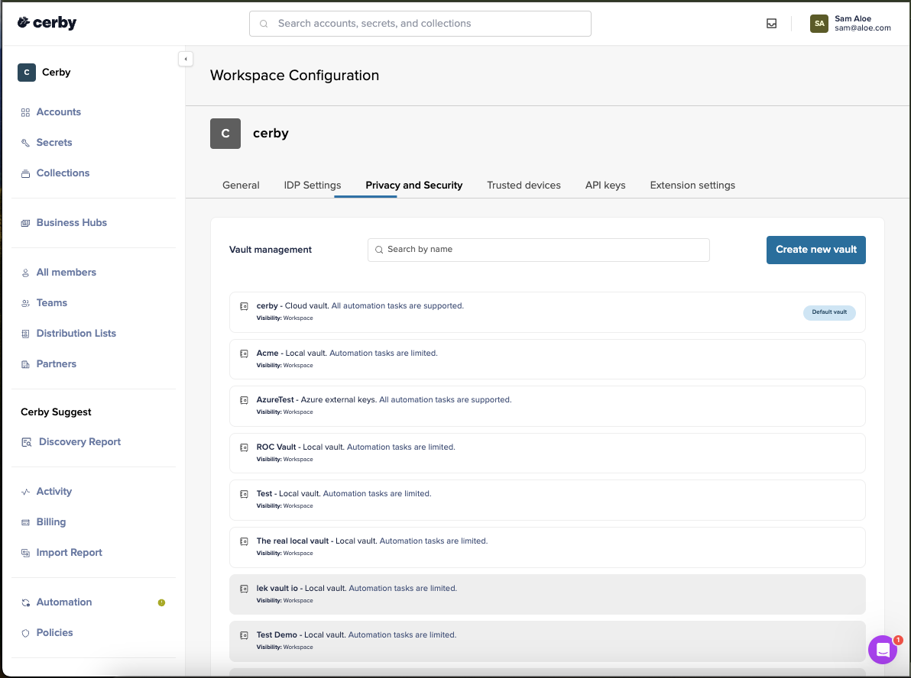

# Create a vault


**Who can use this feature?**

* Workspace **Owners** , **Super Admins** , and **Admins**
* Only supported using the Cerby web app
* If you are interested in this feature but don't see it available in your workspace, contact our Sales team via email at [sales@cerby.com](mailto:sales@cerby.com)

**IMPORTANT:** If you use local vaults, you must have already set up at least one trusted session on your devices. For instructions, read the article [Set up trusted sessions on your devices](https://cerby-test.gitbook.io/cerby-test/management/workspace-configuration/trusted-devices/set-up-trusted-sessions-on-your-devices)


As a workspace **Owner** , **Super Admin,** or **Admin** , you can create local or cloud vaults for your workspace.

To create a new vault, you must complete the following steps:

1. Log in to your [Cerby](https://app.cerby.com/) workspace using the Cerby web app.
2. Select the **Settings** option from the left navigation drawer. The **Workspace** **Configuration** page is displayed.
3. Activate the **Privacy and Security** tab. A table with a list of vaults is displayed in the **Vault management** section, as shown in **Figure 1**.

**Figure 1.** Table with a list of vaults in the **Vault management** section of the **Privacy and security** tab

4. Click the **Create new vault** button. The **Create new vault** dialog box is displayed.
5. Enter the vault name in the **Vault name** field.
6. Select the corresponding vault strategy option from the **Strategy** drop-down list:
   * **Cloud vault:** By default, the following options are displayed:
     * Additional cloud vaults are shown as**Cloud vault**.
     * An Azure Key vault integration is shown as **Azure vault.**
     * An AWS KMS vault integration is shown as **AWS KMS**.
   * **Local vault:** All local vaults are shown as **Local vault**.
7. Select the **Set as default vault** option if you want to set the new vault as the default when adding an item to Cerby.
8. Click the **Create** button. The dialog box closes, a success message box is displayed, and an email message is sent.

Now you are done. You can start using your new vault for your accounts and secrets.
