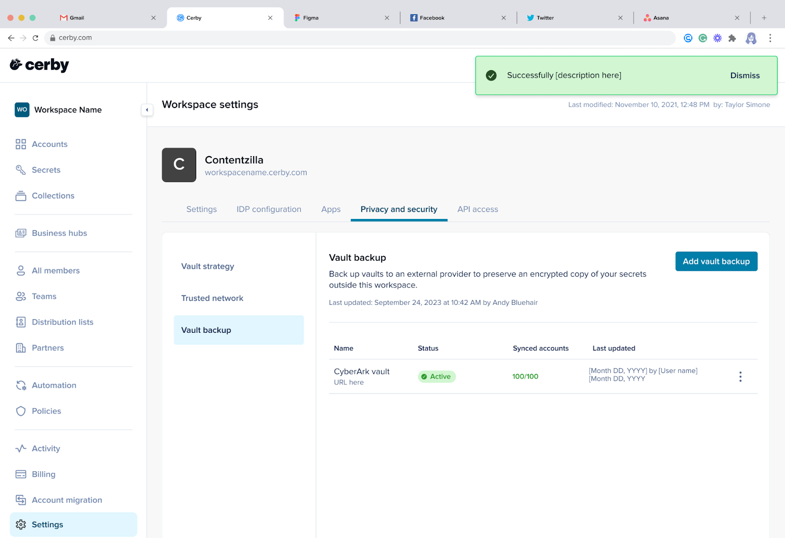

# View the details of a vault backup



**Who can use this capability?**

* Workspace**Owners** , **Super Admins** , and **Admins**
* Only supported using the Cerby web app.



As a workspace **Owner** , **Super** **Admin** , or **Admin** , you can view the details of your vault backup for your Cerby workspace.

To view the vault backups in your workspace, you must complete the following steps:

  1. Log in to your [Cerby](https://app.cerby.com/) workspace.
  2. Select the **Settings** option from the left navigation drawer. The **Workspace Configuration** page is displayed with the **General** tab activated.
  3. Activate the **Privacy and security** tab.
  4. Activate the **Vault backup** left tab. The **Vault backup** section is displayed, as shown in **Figure 1**.

<figure><figcaption></figcaption></figure>

**Figure 1.** Details about the vault backup in your workspace

Now you are done.

The **Vault backup** page displays the following information:

* **Name:** The name and URL of the connection to CyberArk.
* **Status:** The status of the connection to CyberArk. The following are the possible connection statuses:
    * **Active:** The connection is complete and working correctly, meaning new and updated accounts are being backed up in CyberArk.
    * **Wrong credentials:** The connection with CyberArk is not working because the CyberArk configuration credentials are incorrect.
    * **Configuration error:** The configuration between Cerby and CyberArk is incorrect.
    * **Not syncing:** The backup process is not working correctly. In this case, you can contact our Customer Support team at [support@cerby.com](mailto:support@cerby.com).
    * **Disabled:** The connection with CyberArk has been disabled. Accounts in Cerby are no longer backed up in CyberArk; however, you can still access the account previously backed up in CyberArk.
* **Last updated:** The last date and time when the Cerby vault data was backed up to CyberArk.
