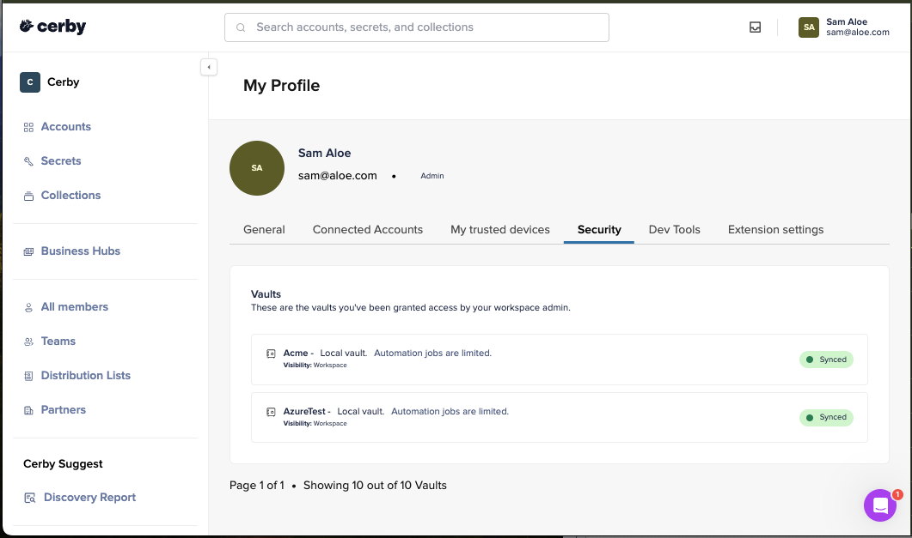

# View the vaults to which you have shared access



**Who can use this feature?**

* Workspace **Owners** , **Super Admins** , **Admins** , and **Users**
* Only supported using the Cerby web app

**IMPORTANT:** If you use local vaults, you must have already set up at least one trusted session on your devices. For instructions, read the article [Set up trusted sessions on your devices](https://cerby-test.gitbook.io/cerby-test/management/workspace-configuration/trusted-devices/set-up-trusted-sessions-on-your-devices)



All users in a workspace can view the vaults to which they have shared access, no matter their workspace role. This article describes how to view the vaults to which you have shared access.

To view the vaults to which you have shared access, you must complete the following steps:

1. Log in to your [Cerby](https://app.cerby.com/) workspace using the Cerby web app.
2. Click your user profile located at the top right of the Cerby dashboard. A drop-down list is displayed.
3. Select the **My Profile** option. The **My Profile** page is displayed.
4. Activate the **Security** tab. A table with a list of vaults to which you have access is displayed in the **Vaults** section, as shown in **Figure 1**.

**Figure 1. Vaults** section in the **Security** tab of the **My profile** page
