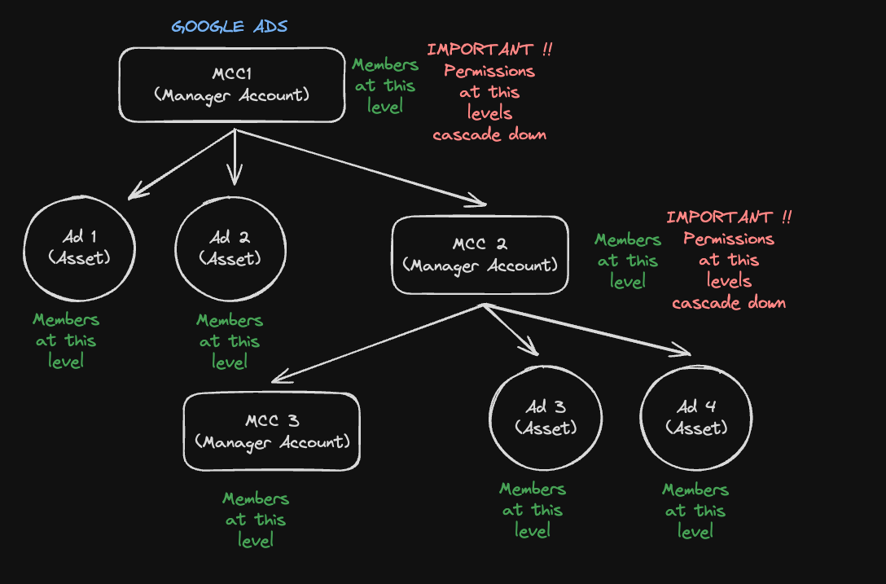
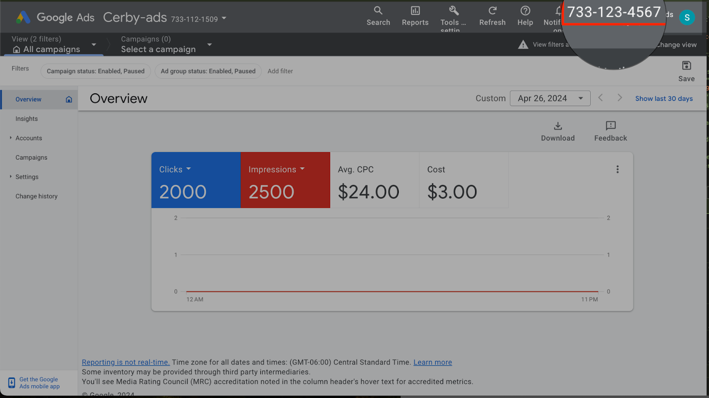

# Connect a business hub for a Google Ads Manager account



Who can use this feature?

* Workspace **Owners** , **Super Admins** , **Admins** , and **Users**
* Only supported using the Cerby web app



As a user with any workspace role in Cerby, except **Guest User** and **Login-Only** , you can connect a business hub integration to centrally manage the users and assets of a Google Ads Manager account.

Google Ads is a platform that enables companies and agencies to tailor their online advertising strategies to suit their objectives. For example, companies can go beyond search-based advertising and reach platforms like YouTube through Google Ads, offering advertisers the opportunity to connect with audiences through targeted video campaigns.

Google Ads is comprised of the following elements under a hierarchical tree structure:

* **Manager Accounts (MCC):** Each top-level manager account can branch out to manage individual accounts or other manager accounts. Those manager accounts can then branch out to manage more individual accounts or other manager accounts, and so on. It enables agencies or professionals to manage multiple Google Ads MCCs from a single dashboard.
* **Campaigns:** Within each MCC, advertisers can create one or more campaigns. A campaign is a set of ad groups, ads, keywords, and targeting settings that share a common advertising goal, budget, and targeting criteria. Campaigns are organized based on specific objectives, such as promoting products, generating leads, or increasing website traffic.

This structure enables advertisers to navigate and manage their campaigns with ease, as shown in**Figure 1.**

**Figure 1.** Google Ads element structure

Permissions in Google Ads cascade downwards. Taking **Figure 1** as an example, users added as managers at MCC1 automatically assume managerial roles across all associated child MCCs and campaigns.



**IMPORTANT:** You can integrate a Google Ads Manager account at any level in the hierarchy you have access to as an **Admin**. Cerby onboards the users, roles, campaigns, and sub-MCCs under the account you choose.



When you connect the business hub, you become its **Owner** , and you can perform the following user and access management tasks through API calls executed by the Cerby agent:

* Check for updates
* Add users
* Update user roles
* Remove users



**TIP:** For more details about the automated tasks of a business hub, how it works, and the supported apps, read the article [Explore Business Hubs](https://cerby-test.gitbook.io/cerby-test/support-and-use-cases/explore/explore-business-hubs).



This article provides instructions on how to connect a business hub for a Google Ads Manager account. For other app-specific articles and videos, review the [Connecting business hubs for your apps](https://help.cerby.com/en/collections/10289415-connecting-your-apps) and [Connecting business hubs for your paid social apps](https://help.cerby.com/en/collections/12330234-connecting-business-hubs-for-your-paid-social-apps) collections in the Cerby Help Center.

* * *

## Requirements

The following are the requirements to connect a business hub:

  * A Cerby workspace
  * A Cerby user account with the workspace **Owner** , **Super Admin** , **Admin** , or **User** role
  * Groups configured in your identity provider (IdP) if you want to leverage automatic user provisioning and deprovisioning from your apps based on group assignment events. For more information, read the articles available in the [Managing users via an IdP and business hub](https://help.cerby.com/en/collections/12330182-managing-users-via-an-idp-and-business-hub) collection in the Cerby Help Center
  * An active user account with an **Admin** role in the Google Ads Manager account
  * An MCC ID. You can find the ID in the business information or settings by completing the following steps:

    1. Log in to [Google Ads Manager](https://ads.google.com/nav/selectaccount)
    2. The ID is the 10-digit number displayed at the top-right corner of the page next to your profile picture, as shown in **Figure 2**
​

**Figure 2.** Location of the MCC ID on Google Ads

    3. Remove the dashes between the numbers to get only the numerical value of your ID. For example, if the MCC ID is **733-123-4567** , the number you need for the integration is **7331234567**

* * *

## Connect a business hub for a Google Ads Manager account

To connect a business hub for a Google Ads Manager account, you must complete the following main steps from the Cerby web app dashboard:

  1. [Add a business hub and connect it to a Google Ads Manager account](connect-a-business-hub-for-a-google-ads-manager-account.md#id-1.-add-a-business-hub-and-connect-it-to-a-google-ads-manager-account)
  2. [Check for updates to import users, roles, and assets to Cerby](connect-a-business-hub-for-a-google-ads-manager-account.md#id-2.-check-for-updates-to-import-users-roles-and-assets-to-cerby)
  3. [Connect your Google Ads Manager user account to the business hub](connect-a-business-hub-for-a-google-ads-manager-account.md#id-3.-connect-your-google-ads-account-to-the-business-hub)
  4. [Manage unmatched users](connect-a-business-hub-for-a-google-ads-manager-account.md#id-4.-manage-unmatched-users)

The following sections describe each main step.

### 1\. Add a business hub and connect it to a Google Ads Manager account

To add a business hub and connect it to a Google Ads Manager account, you must complete the following steps:

  1. Log in to your corresponding [Cerby](https://app.cerby.com/) workspace.
  2. Select the **Business Hubs** option from the left menu. The **Business Hubs** page is displayed.
  3. Click the **Connect Business Hub** button located at the top-right corner of the page. The **Connect your Business Hubs to Cerby** dialog box is displayed.
​**TIP:** Select the **Don’t show this again** option to skip this step the next time you connect a new business hub.

  4. Click the **Get started** button. A wizard is displayed on the **Select app** page.
  5. Select **Google Ads Manager** from the catalog. The **Grant access to Cerby** page is displayed on the wizard.
  6. Click the**Login with Google** button. The following occurs:

     * If you are logged in to at least one Google account, the**Choose an account** window opens with the list of Google accounts.
​**IMPORTANT:** Ensure to log in to the Google account that has the **Admin** role in the manager account.

     * If you are not logged in to a Google account, the**Google login** window opens. You must log in to the Google account you use for Google Ads.

The **Sign in to {your corporate account} manager** window opens. In this window, you can see the information Google can share for the integration, such as your name, email, language preference, and profile picture.

  7. Click the **Continue** button. The Google browser window closes, and you return to the Cerby wizard.
  8. Click the **Next** button. The **Enter app details** page is displayed on the wizard.
  9. Enter and select your app information in the corresponding fields:

     * **Label in Cerby:** It is the name to assign to your business hub in Cerby, and it will be displayed on the business hub card.
     * **MCC ID:** It is your manager account ID in Google Ads Manager. For instructions on how to find it, read the [Requirements](connect-a-business-hub-for-a-google-ads-manager-account.md#id-requirements) section.

     **IMPORTANT:** Leave the rest of the fields blank.

  10. Click the **Connect app** button. The wizard closes, and a success message box is displayed.
The corresponding business hub is also displayed on the **Business Hubs** page.

The next step is [2. Check for updates to import users, roles, and assets to Cerby](connect-a-business-hub-for-a-google-ads-manager-account.md#id-2.-check-for-updates-to-import-users-roles-and-assets-to-cerby).

### 2\. Check for updates to import users, roles, and assets to Cerby

To check for updates in your app to identify and import users, roles, and assets to Cerby, you must complete the following steps:

  1. Select the **Business Hubs** option from the left menu. The **Business Hubs** page is displayed.
  2. Click the **More options** () icon of the corresponding business hub card. A drop-down menu is displayed.
  3. Select the **Settings** option from the menu. The business hub details page is displayed with the **Settings** tab activated.
  4. Click the **Sync** button located at the top right of the page. A message box is displayed with information about the process.
​**NOTE:** The check and import process may take a few minutes depending on the number of users and assets, and because Cerby automatically matches users to their corresponding Cerby user account.

  5. Confirm that the automated task to check for updates has the “Completed” status by performing any of the following actions:

     * Click the **More details** button in the message box.
     * Select the **Automation** option from the left menu to open the **Automation** page with a list of automated tasks and their status.

     **NOTE:** Cerby automatically performs daily checks for updates for all business hubs, but you can trigger them manually, as described in this section. For more information, read the article [Sync your app users with your business hub](https://cerby-test.gitbook.io/cerby-test/management/identity-lifecycle/business-hubs/manage-users/sync-your-business-hub-with-your-external-app).
---

The next step is [3. Connect your Google Ads Manager user account to the business hub](connect-a-business-hub-for-a-google-ads-manager-account.md#id-3.-connect-your-google-ads-account-to-the-business-hub).

### 3\. Connect your Google Ads account to the business hub

To connect your Google Ads account to the business hub so Cerby can manage and protect it, you must complete the following steps:

  1. Select the **Accounts** option from the left menu. The **All accounts** page is displayed.
  2. Click the **Log in** button of the corresponding Google Ads Manager account card. The **Connect your Google Ads Manager account** dialog box is displayed.
  3. Enter the login credentials of your Google Ads account.
  4. Click the **Connect account** button. The dialog box closes, and a success message box and a new account card are displayed.

The next step is [4. Manage unmatched users](connect-a-business-hub-for-a-google-ads-manager-account.md#id-4.-manage-unmatched-users).

### 4\. Manage unmatched users

During a check for updates, Cerby automatically matches app members to the Cerby user accounts that correspond to their email addresses, including existing [guest users](https://cerby-test.gitbook.io/cerby-test/support-and-use-cases/explore/explore-guest-users) and [local partners](https://cerby-test.gitbook.io/cerby-test/support-and-use-cases/explore/explore-partners). Manual matching is required when apps don't provide email addresses and for app members using personal or external accounts that couldn’t be identified or are not in the corporate directory.

To view the status of the imported app members, you must complete the following steps:

  1. Select the **Business Hubs** option from the left menu. The **Business Hubs** page is displayed.
  2. Click the **More options** () icon of the corresponding business hub card. A drop-down menu is displayed.
  3. Select the **View Members** option from the menu. The business hub details page is displayed with the **Members** tab activated.
App members are displayed in the following tabs of the **User Overview** section:

     * **Unmatched users:** This tab displays the users who were not automatically matched.
     * **Onboarded users:** This tab displays the users matched to their Cerby user account.
     * **Guest users:** This tab displays the users who were matched to an existing Cerby user account, but it doesn’t exist in the corporate directory, such as external collaborators.

For unmatched users, you can perform one of the following actions:

  * [Match users](connect-a-business-hub-for-a-google-ads-manager-account.md#id-match-users)
  * [Remove unmatched users](connect-a-business-hub-for-a-google-ads-manager-account.md#id-remove-unmatched-users)
  * [Exempt unmatched users](connect-a-business-hub-for-a-google-ads-manager-account.md#id-exempt-unmatched-users)

The following sections describe each action.

#### Match users

To match users, you must complete the following steps from the **Unmatched users** tab of the business hub details page:

  1. Click the **Match user** button of the corresponding user. The **Match user** dialog box is displayed.
  2. Enter the username or email address of the user you want to match and invite in the **Match with** field. The user is displayed on a list.
  3. Select the user from the list.
  4. Click the **Next** button. The **Select Cerby role** dialog box is displayed.
  5. Select the role to assign to the user on the business hub **Cerby role** drop-down menu:
     1. **Owner:** This role enables sharing access and managing business hub settings in Cerby.
     2. **Collaborator:** This role enables only logging in to the app from Cerby.
  6. Click the **Match user** button. The dialog box closes, and a success message box is displayed. The user is moved to the **Onboarded** **users** tab.

#### Remove unmatched users

To remove unmatched users, you must complete the following steps from the **Unmatched users** tab of the business hub details page:



**IMPORTANT:** When removing an unmatched user, Cerby performs an automated task to revoke the user’s seat and permissions in Google Ads Manager.



  1. Click the **More options** () icon of the corresponding user. A drop-down menu is displayed.
  2. Select the **Remove user** option from the menu. The **Remove user?** dialog box is displayed.
  3. Click the **Remove user** button. The dialog box closes, and a success message box is displayed. The user is removed from the app via an automated task.

#### Exempt unmatched users

Exempted users keep their user accounts or seats active in your app, but you cannot manage them through Cerby.

To exempt unmatched users, you must complete the following steps from the **Unmatched users** tab of the business hub details page:

  1. Click the **More options** () icon of the corresponding user. A drop-down menu is displayed.
  2. Select the **Exempt user** option from the menu. The exempt user dialog box is displayed.
  3. Enter a reason for exempting the user in the **Provide a reason** field.
  4. Click the **Exempt member** button. The dialog box closes, and a success message box is displayed. The user is moved to the **Exempted users** tab.

* * *

## Use your business hub

The following are the supported features of business hubs you can use:

  * [Join the external app and set up your business hub access](https://cerby-test.gitbook.io/cerby-test/how-to-use-cerby/cerby-web-app/business-hubs/join-your-external-app-and-set-up-your-business-hub-access)
  * [Add users to your app via a business hub](https://cerby-test.gitbook.io/cerby-test/management/identity-lifecycle/business-hubs/manage-users/add-users-and-teams-to-your-apps-via-a-business-hub)
  * [Provision users to your apps via an IdP and business hub](https://cerby-test.gitbook.io/cerby-test/management/identity-lifecycle/business-hubs/manage-users/provision-users-to-your-apps-via-an-idp-and-business-hub)
  * [Remove users from your app via a business hub](https://cerby-test.gitbook.io/cerby-test/management/identity-lifecycle/business-hubs/manage-users/remove-users-from-your-app-via-a-business-hub)
  * [Remove teams from your app via a business hub](https://cerby-test.gitbook.io/cerby-test/management/identity-lifecycle/business-hubs/manage-users/remove-teams-from-your-app-via-a-business-hub)
  * [Deprovision users from your apps via an IdP and business hub](https://cerby-test.gitbook.io/cerby-test/management/identity-lifecycle/business-hubs/manage-users/deprovision-users-from-your-apps-via-an-idp-and-business-hub)
  * [Update user roles in your app via a business hub](https://cerby-test.gitbook.io/cerby-test/management/identity-lifecycle/business-hubs/manage-users/update-user-roles-in-your-app-via-a-business-hub)
  * [Update user roles in your apps via an IdP and business hub](https://cerby-test.gitbook.io/cerby-test/management/identity-lifecycle/business-hubs/manage-users/update-user-roles-in-your-apps-via-an-idp-and-business-hub)
  * [Sync your app users with your business hub](https://cerby-test.gitbook.io/cerby-test/management/identity-lifecycle/business-hubs/manage-users/sync-your-business-hub-with-your-external-app)
  * [Manage the security of app members’ user accounts](https://cerby-test.gitbook.io/cerby-test/management/identity-lifecycle/business-hubs/manage-users/protect-your-app-user-accounts-via-a-business-hub)
  * [Log in to your app via a business hub](https://cerby-test.gitbook.io/cerby-test/how-to-use-cerby/cerby-web-app/business-hubs/log-in-to-your-app)
  * [Track the activity of business hub users](https://cerby-test.gitbook.io/cerby-test/management/identity-lifecycle/business-hubs/manage-users/track-activity-on-app-members-user-accounts)
  * [Remove a business hub](https://cerby-test.gitbook.io/cerby-test/management/identity-lifecycle/business-hubs/manage-integrations/remove-a-business-hub)
