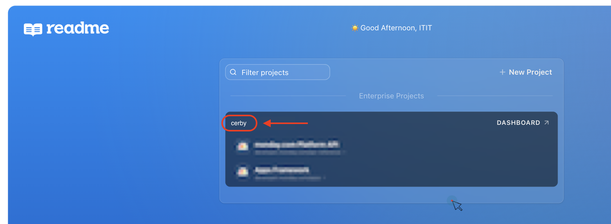
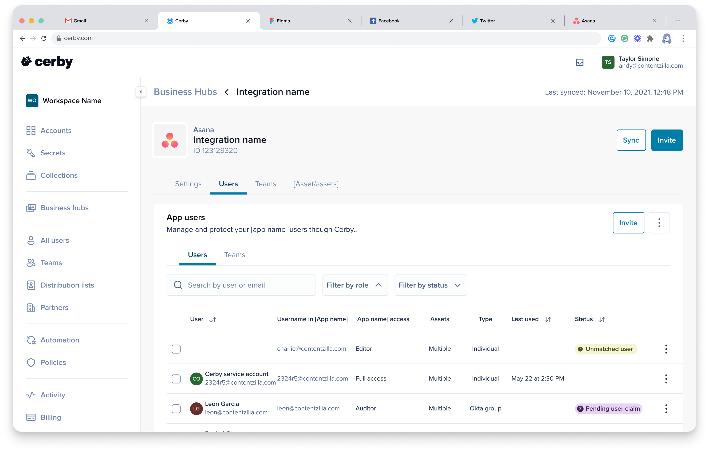

# Troubleshooting: JetBrains license assignment issues when using Okta push groups

This article helps you troubleshoot the issue with Cerby not correctly assigning licenses when sharing a JetBrains business hub to the users of a team created via Okta push groups.

## Cause of the problem

When a Cerby team is created through a push group from Okta, the name of the corresponding Okta group is inherited. If the team name does not comply with the expected naming convention required by Cerby, the automation job cannot assign the licenses to the team members.

The business hub automation job that adds teams to JetBrains relies on a specific naming pattern to map licenses to the intended team members. If the team name does not match this pattern, the license assignment fails, resulting in team members not receiving access to their allocated JetBrains licenses.

## Solution

To ensure successful license assignment when sharing a JetBrains business hub with a Cerby team created after a push group from Okta, you must ensure that the name of the team complies with the following naming convention:

**`<group_name>_<JetBrains_product_name>`**

* **`<group_name>`**: It is any descriptive name to identify the group.
* **`<jetbrains_product_name>`**: It is the **exact** name of the product to be assigned to your team as indicated in the [JetBrains Licenses](https://account.jetbrains.com/licenses) page. This includes uppercase, lowercase, and spaces.

For example, if you want to assign a **JetBrains AI Pro** license, the name of the Okta group and the Cerby team must be **`jetbrains_JetBrains AI Pro.`**

### Update an Okta push group name

If a group was created previously without following the defined naming convention, the Admin in Okta must update the group name to match the defined naming convention. For example, from **`cerby_jetbrains_pycharm`** to **`cerby_jetbrains_PyCharm`.**

To update the name of an Okta push group, you must complete the following steps:

1. Log in to the[ Okta Admin Console](https://developer.okta.com/login/) of your organization.
2. Update the name of the Okta group by performing the following actions:
   1. Select the **Group** option from the **Directory** drop-down menu located on the left navigation drawer. The **Groups** page is displayed.
   2. Search for and select from the list the group whose name you want to update. The group details page is displayed.
   3. Click the **Actions** button located at the top right of the page. A drop-down menu is displayed.
   4. Select the**Edit** option from the drop-down menu. The **Edit** **group** dialog box is displayed.
   5. Edit the **Name** field with the new group name to align with the defined naming convention.
   6. Click the **Save** button.
3. Verify that the changes are reflected in the **Cerby** application by performing the following actions:
   1. Select the **Applications** option from the **Applications** drop-down menu located in the left navigation drawer. The **Applications** page is displayed.
   2. Select the **Cerby** option from the list of applications. The **Cerby application** page is displayed with the **General** tab activated.
   3. Activate the **Push Groups** tab. The **Push Groups to Cerby** page is displayed.
   4. Verify that the updated group name is displayed in the **Group in Okta** and **Group in Cerby** columns.
4. (Optional) After updating the group name, it is common for the value displayed in the **Group in Cerby** column not to reflect the update, as shown in **Figures 1** and **2**.
​

**Figure 1. Group in Okta** column**** showing the updated group name
​

**Figure 2. Group in Cerby** column showing an incorrect group name
​
In this case, Cerby recommends the following workaround:

1. Edit the group name again and temporarily add a space within the JetBrains product name. For example, change from **`dotTrace`** to **`dot Trace`.**
2. Verify that the updated name with the space is reflected in both the **Group in Okta** and **Group in Cerby** columns.
3. After the update is visible in both columns, edit the group name again to remove the space and restore its correct format. For example, change from **`dot Trace`** to **`dotTrace`**.

Now you are done.
