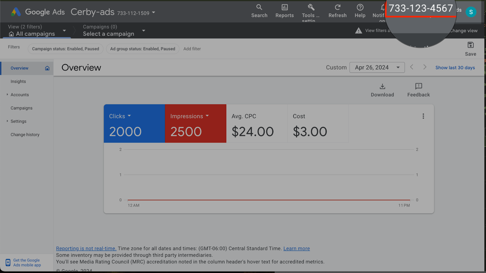
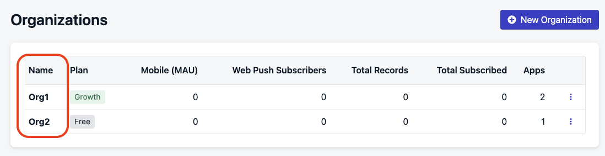

# Retrieve the Business ID to connect your disconnected apps to Cerby

When connecting a business hub for your external app, you might be asked to provide a Business ID. A Business ID is the unique identifier assigned to the When connecting an external app to Cerby, either via a business hub or IdLCM integration, you might be asked to provide a Business ID. This ID is the unique identifier assigned to the collaboration space of the seat-based or paid social app you want to connect, such as a workspace, team, dashboard, business manager, or business center.

Cerby uses this identifier to know which collaboration space's data to interact with and the scope of the permissions granted to users. Depending on the app, this identifier may appear under different names, including Account ID, Tenant ID, Manager ID, Organization ID, or Team ID.

Providing the correct Business ID is essential to ensure that Cerby accesses the intended target in your external app to start executing automation jobs. Therefore, you can prevent mistakes when your organization connects multiple integrations for the same external app.

Commonly, you can find the ID using the following methods:

* From the address bar
* From the user interface

The following sections describe each method.



**IMPORTANT:** Each business hub handles Business IDs differently. The examples in this article are intended as general guidance. For app-specific articles and videos, visit the [Connecting business hubs for your apps](https://help.cerby.com/en/collections/10289415-connecting-business-hubs-for-your-apps) and [Connecting business hubs for your paid social apps](https://help.cerby.com/en/collections/12330234-connecting-business-hubs-for-your-paid-social-apps) collections in the Cerby Help Center.



## From the address bar

After you log in to your app, sometimes the ID is displayed in the address bar as part of the URL. Depending on the app, it can appear in the subdomain, path, or query parameters. The following are examples of how different external apps display the ID:

* **[Productboard](https://cerby-test.gitbook.io/cerby-test/management/identity-lifecycle/business-hubs/apps/productboard/connect-a-business-hub-for-productboard)** : The workspace identifier appears as the subdomain. For example, **`cerby-poc`** in **`cerby-poc.productboard.com`**.
* **[Asana](https://cerby-test.gitbook.io/cerby-test/management/identity-lifecycle/business-hubs/apps/asana/connect-a-business-hub-for-asana)** : The workspace identifier is displayed in the path between the **`admin`** and **`insights`** directories. For example, **`1209392144075813`** in **`https://app.asana.com/admin/1209392144075813/insights`**.
* **[Built In](https://cerby-test.gitbook.io/cerby-test/management/identity-lifecycle/business-hubs/apps/built-in/connect-a-business-hub-for-built-in): **The company identifier is included as a query parameter. For example**,`0123` **in**`https://builtin.com/employer/company-admin?selectedCompanyId=0123`.**

## From the user interface

After logging in to your app, you can often find the ID by navigating to the settings or business information page. The ID is usually listed in the account details or organization information section. The following are examples of how different external apps display the ID:

* **[Google Ads Manager](https://cerby-test.gitbook.io/cerby-test/management/identity-lifecycle/business-hubs/apps/google-apps/connect-a-business-hub-for-a-google-ads-manager-account):** The identifier corresponds to the MCC ID, which is the 10-digit number shown in the top-right corner of your Google Ads Manager account, next to your profile, as shown in **Figure 1.**

**Figure 1.** MCC ID in Google Ads

<figure><figcaption></figcaption></figure>

* **[JetBrains](https://cerby-test.gitbook.io/cerby-test/management/identity-lifecycle/business-hubs/apps/jetbrains/connect-a-business-hub-for-jetbrains):** The identifier corresponds to the organization's customer ID, which is the number next to the organization's name, as shown in**Figure 2**.

**Figure 2.** Customer ID on the JetBrains account page

<figure><figcaption></figcaption></figure>

* **[OneSignal](https://cerby-test.gitbook.io/cerby-test/management/identity-lifecycle/business-hubs/apps/onesignal/connect-a-business-hub-for-onesignal):** The identifier corresponds to the organization name listed in the **Organizations** page, as shown in **Figure 3**.
​

<figure><figcaption></figcaption></figure>

**Figure 3.** Organization name in the OneSignal **Organizations** page
