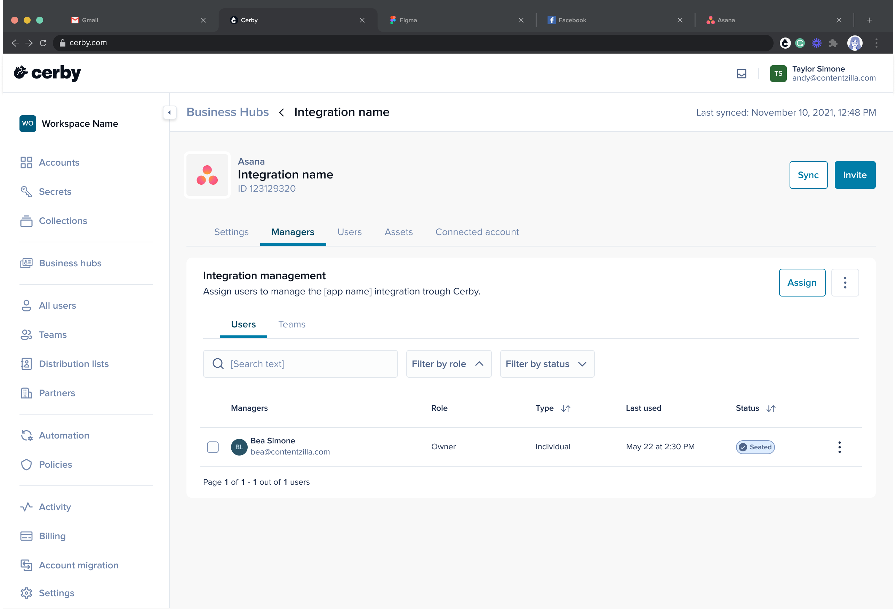

# View the managers of your business hub



**Who can use this feature?**

* Business hub **Owners**
* Only supported using the Cerby web app



The **Manager** tab, accessible through your business hub details page, provides a centralized view of your business hub managers.

Your business hub managers are grouped into two independent tables, **Users** and **Teams** , each with relevant details to help you manage access efficiently, as shown in **Figure 1.**

**Figure 1. Managers** tab in the business hub details page

The **Users** table provides information about the individual users with access to manage the business hub in the following columns:

* **Managers:** It lists the username and email of the users.
* **Role:** It lists the roles assigned to the users on the business hub integration.
* **Type** : It indicates the method by which the users were granted access to manage the business hub integration.
* **Last used:** It is the date and time of the user's most recent activity.
* **Status** : It indicates if the manager has a seat assigned in the external app. The possible values are the following:
  * Seated
  * Removed

  **NOTE:** If the manager has no status chip, it means they don't have a seat assigned on the external app.

Meanwhile, the **Teams** table provides information about the teams with access to manage the business hub in the following columns:

* **Team:** It lists the names of the teams.
* **Cerby role:** It lists the roles assigned to the teams on the business hub integration.
* **Type** :**** It indicates the native name of the team in the external application. For example, team, collection, or group.
