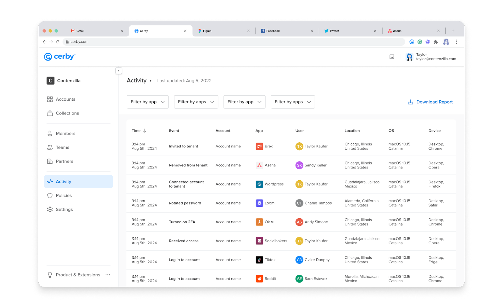

# Track activity on app members’ user accounts



**Who can use this feature?**

* Workspace **Admins** and business hub **Owners**
* Only supported using the Cerby web app



Workspace**Admins** and business hub **Owners** can see the activity log for the user accounts connected to a business hub.

To track the activity on these accounts, you must go to the **Activity** page, as shown in **Figure 1**.

**Figure 1.** **Activity** page of the Cerby dashboard

You can perform the following actions from this view:

* See the **Activity Log** table with information in the following columns:
  * **Time** : It is the time when the user activity was registered.
  * **Event** : It is the type of activity performed by the user, for example,**Log in To Cerby** o**r Account Added To Collection**.
  * **Account** : It is the label of the account in Cerby related to the user activity.
  * **App** : It is the application related to the user activity.
  * **User** : It is the name of the user in Cerby who performed the activity.
  * **Location** : It is the geographical location of the user.
  * **Device** : It is the user’s device from where the activity was registered.
* Download the activity report in a CSV file by clicking the**Download CSV** button.
