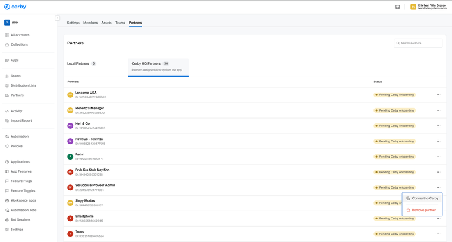

# Connect a Meta Business Manager native partner to Cerby

With Cerby, you can connect a Meta Business Manager [native partner](https://cerby-test.gitbook.io/cerby-test/support-and-use-cases/explore/explore-partners) to your workspace to gain visibility on the partner’s users with shared access to your assets.

This connection is established via a token that your partner must generate in their Meta Business Manager and share with you. After you add the native partner to Cerby, you can use our API and agent-based integration to sync and import the user data of your Meta Business Manager, including your partner’s data.

## **IMPORTANT:** You can only add a native partner in Cerby if you have shared at least one asset with a partner in your paid social app or vice versa.For security purposes, Cerby recommends that you invite the admin who will generate the token as a **Guest User** of your workspace. That way, they can securely share the token with you via a secret.

This article describes how to connect a Meta Business Manager native partner to Cerby.

***

## Requirements

The following are the requirements to connect a Meta Business Manager native partner to Cerby:

* A Cerby account
* A Meta Business Center integration in Cerby. For more information and instructions, read the article [How to add a Meta Business Center integration](https://cerby-test.gitbook.io/cerby-test/management/identity-lifecycle/business-hubs/paid-social-apps/meta-business-manager/connect-a-business-hub-for-meta-business-manager)
* A partner in Meta Business Manager with the **Full control** role and shared access to your assets. Also, they must have already joined your Cerby workspace as a **Guest User**. For more information and instructions, read the article [How to invite a guest user to your workspace](https://cerby-test.gitbook.io/cerby-test/support-and-use-cases/explore/explore-guest-users)

**NOTE:** Cerby recommends your partner isolate your shared assets into a single Meta Business Manager to avoid syncing and importing information from other organizations or customers.

***

## Connect a Meta Business Manager native partner to Cerby

To connect a Meta Business Manager native partner to Cerby, you and your partner must complete the following main steps:

1. [Partner setup in Meta Business Manager](connect-a-meta-business-manager-native-partner-to-cerby.md#id-1.-partner-setup-in-meta-business-manager)
2. [Native partner connection in Cerby](connect-a-meta-business-manager-native-partner-to-cerby.md#id-2.-native-partner-connection-in-cerby)

The following sections describe each main step.

### 1. Partner setup in Meta Business Manager

Your partner must complete the following steps in Meta Business Manager to set up the connection to Cerby:

1. [Request access to the Cerby Assets Manager app](connect-a-meta-business-manager-native-partner-to-cerby.md#h_c2dcc5248a)
2. [Generate a system user token](connect-a-meta-business-manager-native-partner-to-cerby.md#id-2.-generate-a-system-user-token)
3. [Share the token as a secret through Cerby](connect-a-meta-business-manager-native-partner-to-cerby.md#id-3.-share-the-token-as-a-secret-through-cerby)

The following sections describe each step.

#### 1. Request access to the Cerby Assets Manager app

To request access to the Cerby Assets Manager app, your partner must complete the following steps:

1. Log in to [Meta Business Manager](https://business.facebook.com/).
2. Click the **Settings** icon located at the bottom-left side of the page. The **Settings** view is displayed.
3. Select the **Apps** option from the **Accounts** drop-down list located in the left navigation drawer. The **Apps** page is displayed.
4. Click the **Add** button. A drop-down list is displayed.
5. Select the **Request Access to an App ID** option from the list. The **Request an app** dialog box is displayed, as shown in **Figure 1**.


**Figure 1. Request an app** dialog box in the **Apps** page of the **Settings** view

6. Enter **2965389650414399** in the **App ID** field.
7. Click the **Request app** button. A dialog box with an approved message is displayed, and the app permission request is sent to Cerby.


**IMPORTANT:** Your partner must wait for approval from Cerby for the app permission request to access the Cerby Assets Manager app. When approved, your partner receives a notification in their Meta Business Manager.


The next step is [2. Generate a system user token](connect-a-meta-business-manager-native-partner-to-cerby.md#id-2.-generate-a-system-user-token).

#### 2. Generate a system user token

To generate a system user token, your partner must complete the following steps:

1. Log in to [Meta Business Manager](https://business.facebook.com/).
2. Click the **Settings** icon located at the bottom-left side of the page. The **Settings** view is displayed.
3. Select the **System users** option from the **Users** drop-down list located in the left navigation drawer. The**System users** page is displayed.

**NOTE:** If you don’t have a system user, add one and assign it an **Admin** role before proceeding to step 4.

4. Assign your partner’s assets to the system user by performing the following actions:
   1. Click the **Assign assets** button. The **Assign assets and set permissions** dialog box is displayed.
   2. Select all of the assets you want your partner to have visibility through Cerby.
   3. Assign the **Full control** role to all of the assets.
   4. Click the **Save changes** button. The **Assets Added** dialog box is displayed.
   5. Click the **Done** button. The dialog box closes.
5.  Generate an access token by performing the following actions:

    1. Select the system user you created.

    **NOTE:** If you already have a system user with an **Admin** role, select it.

    2. Click the **Generate new token** button. The **Generate token** dialog box is displayed.
    3. Select the **Cerby Assets Manager** option from the **App** drop-down list. Informational messages and the **Token expiration** and **Permissions** sections are displayed in a dialog box.
    4. Select the **Never** option from the **Token expiration** section.
    5. Select the following options from the **Permissions** section:
       * **ads\_management**
       * **business\_management**
       * **catalog\_management**
       * **pages\_manage\_metadata**
       * **pages\_read\_engagement**
       * **pages\_show\_list**
    6. Click the **Generate token** button. An access token is generated and displayed in the dialog box, as shown in **Figure 2**.


**Figure 2.** Access token in the **Generate token** dialog box

```
 7. Click the **OK** button. The dialog box closes.
```

The next step is [3. Share the token as a secret through Cerby](connect-a-meta-business-manager-native-partner-to-cerby.md#id-3.-share-the-token-as-a-secret-through-cerby).

#### 3. Share the token as a secret through Cerby

To share the token with you as a secret through Cerby, your partner must follow the instructions in the articles [Add a secret](https://cerby-test.gitbook.io/cerby-test/how-to-use-cerby/cerby-web-app/secrets/add-a-secret) and [Share access to a secret or secret item in Cerby](https://cerby-test.gitbook.io/cerby-test/how-to-use-cerby/cerby-web-app/secrets/share-a-secret-or-secret-item).

Now, your partner is done. The next step is [2. Native partner connection in Cerby](connect-a-meta-business-manager-native-partner-to-cerby.md#id-2.-native-partner-connection-in-cerby) that you must complete using the Cerby web app.

### 2. Native partner connection in Cerby

You must complete the following steps in Cerby to connect with your Meta Business Manager native partner:

1. [Connect the partner to Cerby](connect-a-meta-business-manager-native-partner-to-cerby.md#id-1.-connect-the-native-partner-to-cerby)
2. [Sync and review your partner’s users](connect-a-meta-business-manager-native-partner-to-cerby.md#id-2.-sync-and-review-your-partners-users)

The following sections describe each step.

#### 1. Connect the native partner to Cerby

To connect the native partner to Cerby, you must complete the following steps:

1. Log in to your [Cerby](http://app.cerby.com) workspace.
2. Select the **Apps** option from the left navigation drawer. The **Apps** view is displayed.
3. Click the corresponding app card. The app details page is displayed.
4. Activate the **Partners** tab.
5. Activate the **Meta Business Partners** tab from the **Partners** section. A list of partners with shared access to your assets is displayed, as shown in **Figure 3**.



**Figure 3.** Meta Business Partners tab

**NOTE:** If your partner exists in Meta but is not displayed in Cerby, perform a check for updates to sync and import the user data.

6. Click the **More options** icon from the corresponding partner, which has a “Pending Cerby onboarding” status. A drop-down list is displayed.
7. Select the **Connect to Cerby** button. The **Add your partner token** dialog box is displayed.
8. Paste the token that your partner shared with you as a secret in the **Partner Token** field.
9. Click the **Connect** button. The dialog box closes, a success message is displayed, and your partner now has the “Cerby onboarded” status.

The next step is [2. Sync and review your partner’s users](connect-a-meta-business-manager-native-partner-to-cerby.md#id-2.-sync-and-review-your-partners-users), which you must complete from the app details page in Cerby.

#### 2. Sync and review your partner’s users

To sync and review your partner’s users, you must complete the following steps from the app details page in Cerby:

1. Click the **Check for updates** button located at the top right of the app details page. The process to sync and import to Cerby the partner’s user data may take a few seconds.

**NOTE:** You can review the progress of the check for updates through the **Automation** view. When the corresponding automation task has the “Complete” status, you can continue to step 2.

2. Activate the **Members** tab from the app details page.
3. Activate the **Meta Business guest users** tab from the **User Overview** section. A table with the partner’s users is displayed.

Now you’re done. In subsequent checks for updates, you can retrieve the updated information from your partner’s users.
