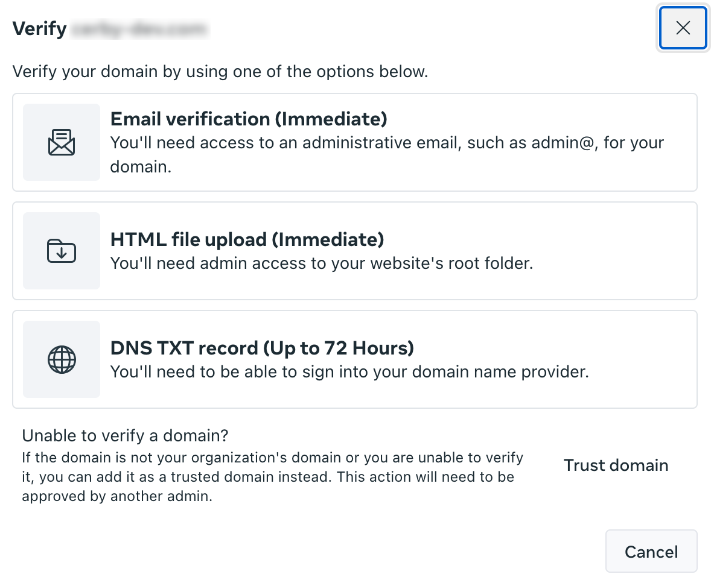
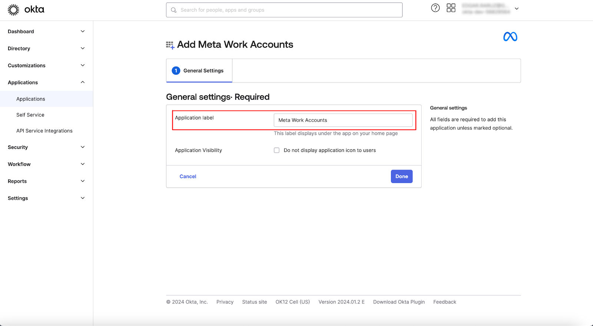
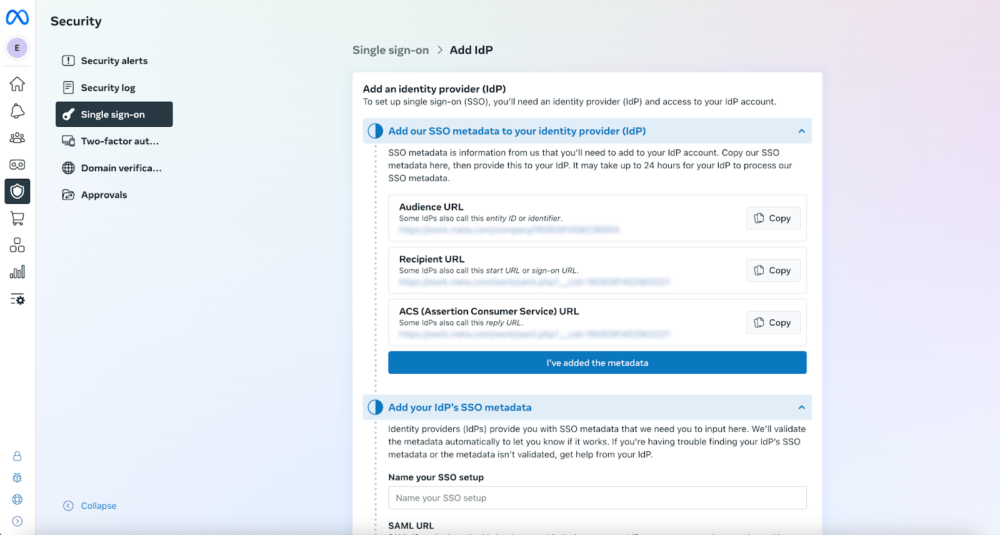
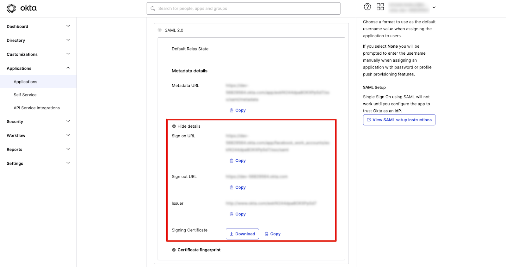
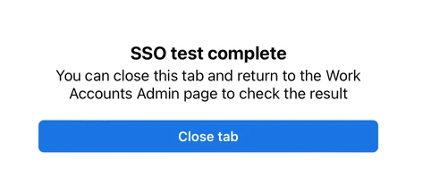
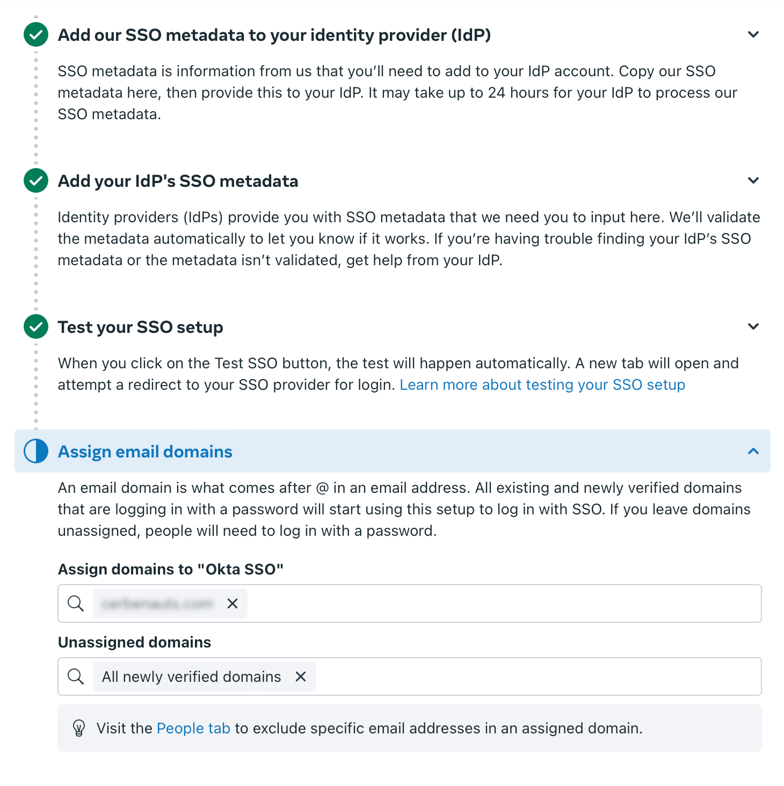
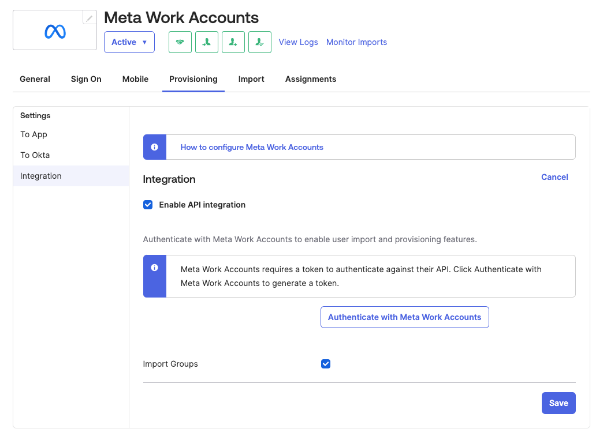
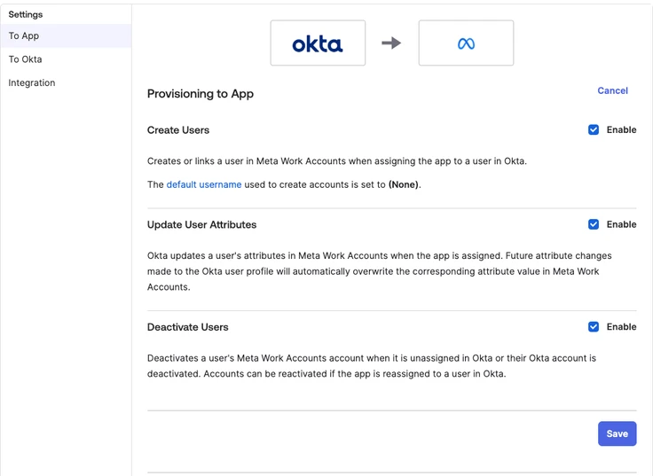

# Configure SSO and user provisioning between Meta and Okta via Meta Work Accounts

Meta Work Accounts enable organizations to separate personal and professional accounts on the Meta platform, specifically Facebook, Instagram, and WhatsApp.

By integrating Okta as your identity provider (IdP) for your Meta Work Accounts, you can manage employee access to Meta, increasing the security of your accounts and eliminating the need for employees to remember and manage multiple personal login credentials across different applications.

This document contains the steps to configure single sign-on (SSO) authentication using a Security Assertion Markup Language (SAML) integration and automatic user provisioning using the System for Cross-domain Identity Management (SCIM) specification between Meta and Okta via Meta Work Accounts.



**IMPORTANT:** [Meta for Work](https://forwork.meta.com/), released in July 2023 for beta testing, is being transitioned by some organizations to replace personal Facebook profiles as the default login for Meta Business Manager.
​

Note that this feature is currently available to **select customers only**. For more information or to inquire about eligibility, please contact your Meta support representative.



* * *

## Requirements

The following are the requirements to configure the integration between Okta and Meta:

  * An Okta admin with **Application Administrator** permissions (at least)
  * A Meta Business Manager admin
  * A Meta Work Accounts IT setup manager
  * Identify a [Migration team](https://business.facebook.com/business/help/968690314307771), if needed, for the necessary task delegation
  * Make sure you abide by all the requirements for the environment you’re working on, according to the [IT settings tasks to complete before your managed Meta accounts migration in Business Manager](https://business.facebook.com/business/help/1282083822669093) guide
  * Prepare the Meta environment following the [Overview of managed Meta accounts setup and migration in Business Manager](https://business.facebook.com/business/help/1428374961242667) guide.
  * Sign up your organization for managed Meta accounts following the [Launch the migration to managed Meta accounts in Business Manager](https://business.facebook.com/business/help/210453938514953) guide.

  **IMPORTANT:** You must have the **IT Setup Manager** permissions provided by the **Migration Manager** or **Owner**.

* * *

## Configure the Okta integration for Meta Work Accounts

To configure the Okta integration for Meta Work Accounts, you must complete the following main steps:

  1. [Configure Meta Work Accounts](configure-sso-and-user-provisioning-between-meta-and-okta-via-meta-work-accounts.md#id-1.-configure-meta-work-accounts)
  2. [Add and configure the Meta Work Accounts app in Okta](configure-sso-and-user-provisioning-between-meta-and-okta-via-meta-work-accounts.md#id-2.-add-and-configure-the-meta-work-accounts-app-in-okta)
  3. [Configure SSO in Meta and Okta](configure-sso-and-user-provisioning-between-meta-and-okta-via-meta-work-accounts.md#id-3.-configure-sso-in-meta-and-okta)
  4. [Configure automatic user provisioning in Okta](configure-sso-and-user-provisioning-between-meta-and-okta-via-meta-work-accounts.md#id-4.-configure-automatic-user-provisioning-in-okta)

The following sections describe each main step.

### 1\. Configure Meta Work Accounts

To configure the Meta Work Accounts, you must complete the following steps:

  1. Complete the account configuration, such as setting up the password, date of birth, and multi-factor authentication (MFA), after [signing up](https://business.facebook.com/business/help/210453938514953) your organization for Meta Work Accounts.
  2. Log in to the [Meta Business Admin Center](https://work.meta.com/). The **Business settings** page is displayed.
  3. Click the **Verify domain** button to verify your business domain. A verification method dialog box is displayed.
  4. Select the **Email verification (Immediate)** option to verify the domain ownership, as shown in **Figure 1**.

**Figure 1.** Verification method dialog box

  5. Select the email address previously registered to receive a verification code.
  6. Enter the verification code.
  7. Click the **Verify** button. The dialog box closes.
​**TIP:** Leave the browser tab with the Meta Business Admin Center open because you need it later.

The next step is to configure the Okta integration.

### 2\. Add and configure the Meta Work Accounts app in Okta

To add and configure the Meta Work Accounts app in Okta, you must complete the following steps:

  1. Log in to the[ Okta Admin Console](https://developer.okta.com/login/) of your organization in a new browser tab.
  2. Select the **Applications** option from the **Applications** drop-down list located in the left navigation drawer. The **Applications** page is displayed.
  3. Search for the **Meta Work Accounts** app by performing the following actions:
     1. Click the **Browse App Catalog** button. The **Browse App Integration Catalog** page is displayed.
     2. Enter **Meta Work Accounts** in the search bar. A list of apps is displayed below the search bar.
     3. Select the **Meta Work Accounts** option from the list. The **Meta Work Accounts** integration page is displayed.
  4. Click the **Add Integration** button. The **Add Meta Work Accounts** page is displayed with the **General Settings** tab activated.
  5. Enter your application name in the **Application label** field, as shown in **Figure 2**.

**Figure 2. General Settings** tab of the **Add Meta Work Accounts** page

  6. Click the **Done** button. The **Meta Work Accounts** app page is displayed with the **Assignments** tab activated.
​**TIP:** Leave this browser tab open because you need it to configure SSO authentication and automatic user provisioning in Meta.

The next step is to configure SSO authentication in Meta and Okta.

### 3\. Configure SSO in Meta and Okta

To configure SSO authentication in Okta, you must complete the following steps:

  1. Retrieve the corresponding URL values from Meta by performing the following actions:
     1. Go to the tab where you left open the Meta Business Admin Center.
     2. Select the **Security** option from the left navigation drawer. The **Security** view is displayed.
     3. Select the **Single sign-on** option from the left menu. The **Single sign-on (SSO)** page is displayed.
     4. Click the **Add IdP** button. The **Add IdP** page is displayed with the following values that you must copy to enter them in Okta, as shown in **Figure 3** :

        * **Audience URL**
        * **ACS (Assertion Consumer Service) URL**

**Figure 3.** **Add IdP** page in the **Security** view of your Meta Business Admin Center

**TIP:** Leave this browser tab open because you need it to copy each value.

  2. Enter the URL values in the **Meta Work Accounts** app in Okta by performing the following actions:
     1. Switch to the browser tab you left open with the **Meta Work Accounts** app page in Okta.
     2. Activate the **Sign On** tab. The **Settings** section is displayed.
     3. Click the **Edit** button located at the top right of the **Settings** section. Multiple input fields are displayed below.
     4. Paste the URL values that you copied from the Meta Business Admin Center in the corresponding fields:

        * **Audience URL**
        * **ACS (Assertion Consumer Service) URL**

     5. Click the **Save** button. A success message is displayed, and the changes are saved.
     6. Click the **More details** button from the **SAML 2.0** section. The following values are displayed for you to copy and enter in the Meta Business Admin Center, as shown in **Figure 4** :

        * **Sign on URL**
        * **Issuer**
        * **Signing Certificate**

**Figure 4.** **SAML 2.0** section in the **Sign On** tab of your **Meta Work Accounts** app in Okta

**TIP:** Leave this browser tab open because you need it to copy each value.

  3. Enter the corresponding information and SAML URL values in the **Add your IdP's SSO metadata** section of the **Add IdP** page of your Meta Business Admin Center by performing the following actions:
     1. Click the **I’ve added the metadata** button.
     2. Enter a name for your SSO setup in the **Name your SSO setup** field.
     3. Paste the**Sign on URL** value that you copied from Okta in the **SAML URL** field.
     4. Paste the**Issuer** value that you copied from Okta in the **SAML Issuer URL** field.
     5. Paste the**Signing Certificate** value that you copied from Okta in the **SAML Certificate** field.
  4. Test the SSO setup in your Meta Business Admin Center by performing the following actions:
     1. Click the **Validate IdP metadata** button.
     2. Enter an email address in the text field that is displayed.
     3. Click the **Test SSO** option. A new browser tab is displayed.
     4. Log in to your Okta account in the new browser tab to verify the SSO authentication if you don’t have an active session. The SSO test complete pop-up window is displayed, as shown in **Figure 5**.

**Figure 5.** Success message pop-up window for the SSO test

  5. Assign your business email domains for logging in with SSO authentication in your Meta Business Admin Center by performing the following actions:
     1. Switch to the browser tab you left open with the **Meta Work Accounts** app page.
     2. Click the **Check result** button. The **Assign email domains** section is displayed.
     3. Enter your domain in the **Assign domains to “Okta SSO”** field.
     4. Enter **All newly verified domains** in the **Unassigned domains** field, as shown in **Figure 6**.

**Figure 6. Assign email domains** section of the **Add IdP** page in the **Security** view of your Meta Business Admin Center

     5. Click the **Activate SSO** button to turn on SSO authentication.



**IMPORTANT:** The application you’ve created must be assigned to the active users of Meta Work Accounts before activating the SSO authentication. If the configuration is not done correctly, it could potentially lock you out from Meta. Upon assignment, the username requested by the application must match the email address of the admins configuring the Meta Business Manager.



**NOTE:** For more information about the SSO configuration in Meta and Okta, read the [Enable single sign-on for your organization’s managed Meta accounts in Admin Center](https://work.meta.com/help/624731485413747?helpref=faq_content) and [How to Configure SAML 2.0 for Workplace by Facebook ](https://saml-doc.okta.com/SAML_Docs/How-to-Configure-SAML-2.0-for-Workplace-by-Facebook.html)official documentation.



The next step is to configure automatic user provisioning in Okta.

### 4\. Configure automatic user provisioning in Okta

To configure automatic user provisioning in Okta, you must complete the following steps:

  1. Switch to the browser tab you left open with the **Meta Work Accounts** app page in Okta.
  2. Activate the **Provisioning** tab.
  3. Click the **Configure API integration** button. The **Enable API integration** option is displayed.
  4. Select the **Enable API integration** option. An informational message box and a button are displayed, as shown in **Figure 7**.

**Figure 7. Enable API integration** option in the **Provisioning** tab of the **Meta Work Accounts** app in Okta

  5. Click the **Authenticate with Meta Work Accounts** button. The **Meta** pop-up window with your Meta Work Accounts organization is displayed.
  6. Click the **Add to Work Accounts** button.
  7. Log in to Meta Work Accounts using your admin credentials to allow Okta to use the API on your behalf.

  **IMPORTANT:** You must be a Meta IT Setup Manager or Meta Business Manager to test the API integration.

  8. Click the **Save** button after configuring your new application.
  9. Close the pop-up window.
  10. Click the **Test API Credentials** button after Okta obtains the access token and the Meta Work window closes.
  11. Click the **Save** button.
  12. Select the **To App** option from the left panel of the **Provisioning** tab.
  13. Select the following options from the **Provisioning to App** section, as shown in **Figure 8** :

     * **Create Users**
     * **Update User Attributes**
     * **Deactivate Users**

**Figure 8. Provisioning to App** section in the **Provisioning** tab of the **Meta Work Accounts** app in Okta

  14. Click the **Save** button.



**NOTE:** For more information about the automatic user provisioning configuration, read the integration guide [Meta Work Accounts](https://help.okta.com/en-us/content/topics/provisioning/meta/meta-work-accounts-provisioning.htm) from the Okta official documentation.



Now you are done. You have enabled SSO authentication and automatic user provisioning of Meta Work Accounts with Okta.
