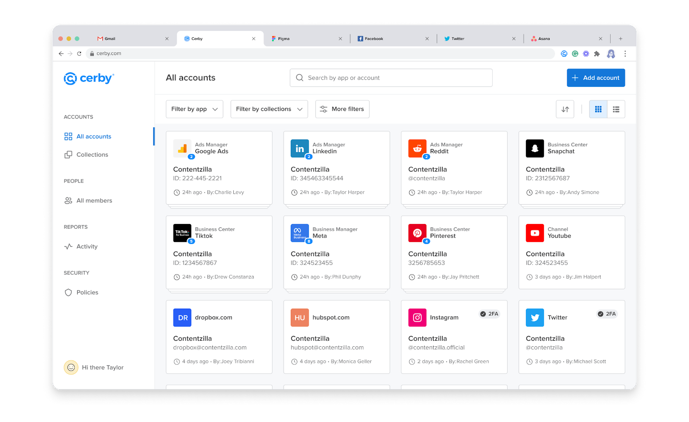

# Why managing your paid social apps through Cerby

Paid social apps, also known as business centers, are a helpful tool for companies that want to centralize the management of their social media accounts and assets, which typically consist of paid assets (such as ad accounts) and organic assets (such as pages, pins, videos, and stories).

However, by being directly linked to your brand, paid social apps are highly valuable resources to protect from cyberattacks. Without the proper protection and security best practices, attackers might gain access to your account credentials, which could lead to significant data breaches, data theft, site compromise, and millions of dollars in costs.

Cerby leverages business hub integrations to connect your paid social apps with your Cerby workspace. With this connection, you can securely manage the users and assets of your app from Cerby.

This article describes the benefits of managing your paid social apps through Cerby.

## Benefits of managing your paid social apps through Cerby

The following are the benefits of managing your paid social apps through Cerby:

* [Centralize account management](why-managing-your-paid-social-apps-through-cerby.md#centralize-account-management)
* [Automate user deprovisioning](why-managing-your-paid-social-apps-through-cerby.md#automate-user-deprovisioning)
* [Secure access to business centers and assets](why-managing-your-paid-social-apps-through-cerby.md#secure-access-to-business-centers-and-assets)

The following sections describe each benefit.

### Centralize account management

When you connect a paid social app to Cerby, you can assign, manage, and audit all user access to your business centers from one single location. Instead of using different user interfaces (for example, the dashboards of Meta Business Manager, TikTok For Business, or Pinterest Business), you can bring all of your workflows into our integrated interface.

The Cerby dashboard, as shown in **Figure 1** , enables you to perform the following actions:

* Assign or modify the account role within Cerby and the native business center role of members.
* Share the business center account and assets with members of your corporate directory when your corporate single sign-on (SSO) system is configured with Cerby.

**Figure 1.** Homepage of the Cerby dashboard

### Automate user deprovisioning

Cerby enables you to map your personal profile identities to real corporate records in your corporate SSO system. With this feature, you can remove users in your paid social apps automatically if and when a user is removed from your corporate SSO system.

Cerby supports integration with major enterprise identity providers to enable automated provisioning and SSO. For detailed configuration instructions, visit the [Creating and setting up your workspace](https://help.cerby.com/en/collections/5819419-creating-and-setting-up-your-workspace) collection.

### Secure access to business centers and assets

By managing user access through our platform, you and your team members only care about remembering one set of credentials to log in to Cerby. So, forget about sharing credentials with others (including third parties such as contractors and agencies) through email, phone, or a sticky note.

Cerby also enables you to grant or share access to specific assets of your business center account.
