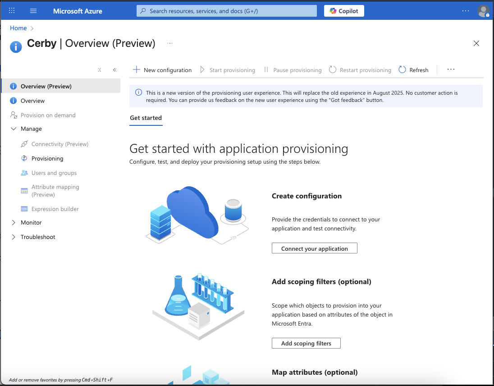

# Configure automatic user and group provisioning with Entra ID via SCIM

With Cerby, you can configure automatic provisioning with Entra ID (formerly Azure AD) using the System for Cross-domain Identity Management (SCIM) specification to manage the creation and synchronization of user accounts and teams based on user and group assignments.

This article describes how to configure both the Cerby enterprise application and Entra ID. When configured, Entra ID automatically provisions and deprovisions users and groups to Cerby using the Entra ID provisioning service. For more information on what this service does, how it works, and frequently asked questions, read the article [What is app provisioning in Microsoft Entra ID?](https://docs.microsoft.com/en-us/azure/active-directory/app-provisioning/user-provisioning)

* * *

## Supported features

The following are the supported features of automatic user and group provisioning with Entra ID:

  * **Push users:** Users assigned to the Cerby enterprise application in Entra ID are automatically able to access the Cerby clients (web app, mobile app, and browser extension); they are available to other users in Cerby for account sharing purposes.
  * **Push groups:** Users who are members of a group in Entra ID and assigned to the Cerby enterprise application are pushed to Cerby, and this grouping structure and its members are replicated in Cerby as [teams](https://cerby-test.gitbook.io/cerby-test/management/workspace-configuration/user-management/teams/how-to-use-teams).
  * Remove users in Cerby when they no longer require access.
  * Keep user attributes synced between Entra ID and Cerby.
  * **Disable or delete users:** Disabled or deleted users in Entra ID are automatically detected in Cerby, and their associated access grants in Cerby are removed. In some cases, additional follow-up actions, like password rotation, may occur in Cerby for privileged identities to which the deprovisioned user had access grants.
  * **Reactivate users:** Reactivated users in Entra ID will reappear as valid users in Cerby; however, account access grants must be reassigned in Cerby.
* * *

## Requirements

The following are the requirements to configure automatic user and group provisioning with Entra ID:



**IMPORTANT:** Make sure you have the automated group provisioning to apps feature included in your Entra ID plan level (P1 or P2 license plan).



  * An Entra ID tenant. For more information, read the article [Quickstart: Set up a tenant](https://docs.microsoft.com/en-us/azure/active-directory/develop/quickstart-create-new-tenant)
  * A user account in Entra ID with privileges to configure provisioning, such as the following:
    * **Application Administrator**
    * **Cloud Application Administrator**
    * **Application Owner**
    * **Global Administrator**
  * A user account in Cerby with any of the following roles:
    * **Workspace Owner**
    * **Workspace Super Admin**
    * **Workspace Admin**
  * The Cerby SAML2-based integration must be set up and deployed. You must have already deployed the integration as part of the article [Configure SSO in Cerby with Entra ID via SAML](https://cerby-test.gitbook.io/cerby-test/management/identity-providers-idps/entra-id/configure-sso-in-cerby-with-entra-id-via-saml)
  * Users and groups from your directory already assigned to the Cerby enterprise application in Entra ID. You must have done the assignments as part of the article [Manage users and group assignments for an application](https://learn.microsoft.com/en-us/entra/identity/enterprise-apps/assign-user-or-group-access-portal?pivots=portal).
  * A SCIM API authentication token. Follow the instructions in the article [Retrieve the SCIM API authentication token from Cerby](https://cerby-test.gitbook.io/cerby-test/management/identity-providers-idps/scim/retrieve-the-scim-api-authentication-token-from-cerby) to copy the token

  **NOTE:** If you need to regenerate the SCIM API authentication token, read the article [Regenerate the SCIM API authentication token](https://cerby-test.gitbook.io/cerby-test/management/identity-providers-idps/scim/regenerate-the-scim-api-authentication-token)

* * *

## Configure automatic provisioning with Entra ID

To configure automatic user provisioning for Azure AD, you must complete the following main steps:

  1. [Plan your provisioning deployment](configure-automatic-user-and-group-provisioning-with-entra-id-via-scim.md#id-1.-plan-your-provisioning-deployment)
  2. [Configure Cerby to support provisioning with Azure AD](configure-automatic-user-and-group-provisioning-with-entra-id-via-scim.md#id-2.-configure-cerby-to-support-provisioning-with-entra-id)
  3. [Add Cerby from the Entra ID application gallery](configure-automatic-user-and-group-provisioning-with-entra-id-via-scim.md#id-3.-add-cerby-from-the-entra-id-application-gallery)
  4. [Define the scope for provisioning](configure-automatic-user-and-group-provisioning-with-entra-id-via-scim.md#id-4.-define-the-scope-for-provisioning)
  5. [Configure automatic user provisioning to Cerby](configure-automatic-user-and-group-provisioning-with-entra-id-via-scim.md#id-5.-configure-automatic-user-and-group-provisioning-to-cerby)
  6. [Monitor your deployment](configure-automatic-user-and-group-provisioning-with-entra-id-via-scim.md#id-6.-monitor-your-deployment)

The following sections describe each main step.

### 1\. Plan your provisioning deployment

To plan your provisioning deployment with Entra ID, you must complete the following steps:

  1. Learn about how the provisioning service works. For more information, read the article [What is app provisioning in Microsoft Entra ID?](https://docs.microsoft.com/en-us/azure/active-directory/app-provisioning/user-provisioning)
  2. Determine who will be in scope for provisioning. For more information, read the article [Scoping users or groups to be provisioned with scoping filters](https://docs.microsoft.com/en-us/azure/active-directory/app-provisioning/define-conditional-rules-for-provisioning-user-accounts).
  3. Determine what data to map between Entra ID and Cerby. For more information, read the article [Tutorial - Customize user provisioning attribute-mappings for SaaS applications in Microsoft Entra ID](https://docs.microsoft.com/en-us/azure/active-directory/app-provisioning/customize-application-attributes).

The next step is [2. Configure Cerby to support provisioning with Entra ID](configure-automatic-user-and-group-provisioning-with-entra-id-via-scim.md#id-2.-configure-cerby-to-support-provisioning-with-entra-id).

### 2\. Configure Cerby to support provisioning with Entra ID

Cerby has enabled the provisioning support for Entra ID by default. You must follow the instructions from the article [Retrieve the SCIM API authentication token from Cerby](https://cerby-test.gitbook.io/cerby-test/management/identity-providers-idps/scim/retrieve-the-scim-api-authentication-token-from-cerby) to copy the SCIM API authentication token.

The next step is [3. Add Cerby from the Entra ID application gallery](configure-automatic-user-and-group-provisioning-with-entra-id-via-scim.md#id-3.-add-cerby-from-the-entra-id-application-gallery).

### 3\. Add Cerby from the Entra ID application gallery

You must add the Cerby enterprise application from the Entra ID application gallery to manage provisioning to Cerby.

You can use the same application if you have previously set up Cerby for SSO. However, we recommend you create a separate app when initially testing the integration. For more information about adding an application from the gallery, read the article [Quickstart: Add an enterprise application](https://docs.microsoft.com/en-us/azure/active-directory/manage-apps/add-application-portal).

The next step is [4. Define the scope for provisioning](configure-automatic-user-and-group-provisioning-with-entra-id-via-scim.md#id-4.-define-the-scope-for-provisioning).

### 4\. Define the scope for provisioning

The Entra ID provisioning service enables you to scope who will be provisioned based on assignment to the Cerby enterprise application and or based on user and group attributes.

  * **Scope based on assignment:** Follow the instructions from the article [Manage users and groups assignment to an application](https://docs.microsoft.com/en-us/azure/active-directory/manage-apps/assign-user-or-group-access-portal) to assign users and groups to the application.
  * **Scope based on user and group attributes:** Use a scoping filter as described in the article [Scoping users or groups to be provisioned with scoping filters](https://docs.microsoft.com/en-us/azure/active-directory/app-provisioning/define-conditional-rules-for-provisioning-user-accounts).

The following are some recommendations when defining the scope:

  * Start small. Test with a small set of users and groups before rolling out to everyone:
    * When the scope for provisioning is set to assigned users and groups, you can start by assigning one or two users or groups to the application.
    * When the scope is set to all users and groups, you can specify an attribute-based scoping filter, according to the article [Scoping users or groups to be provisioned with scoping filters](https://docs.microsoft.com/en-us/azure/active-directory/app-provisioning/define-conditional-rules-for-provisioning-user-accounts).
  * If you need additional roles, you can update the application manifest. For more information, read the article [Add app roles to your application and receive them in the token](https://docs.microsoft.com/en-us/azure/active-directory/develop/howto-add-app-roles-in-azure-ad-apps).

The next step is [5. Configure automatic user provisioning to Cerby](configure-automatic-user-and-group-provisioning-with-entra-id-via-scim.md#id-5.-configure-automatic-user-and-group-provisioning-to-cerby).

### 5\. Configure automatic user and group provisioning to Cerby

To configure automatic user and group provisioning to Cerby, you must complete the following steps:

  1. Log in to your [Microsoft Azure](https://portal.azure.com) account.
  2. Select your Cerby enterprise application by performing the following actions:
     1. Click the **Menu** () icon at the top left of the page. A drop-down menu is displayed.
     2. Select the **Microsoft Entra ID** option from the drop-down menu. The **Overview** page is displayed.
     3. Select the **Enterprise applications** option from the left navigation drawer. The **All applications** page is displayed.
     4. Select the **Cerby** option from the list of enterprise applications. The **Overview** page of your Cerby application is displayed.
  3. Configure automatic provisioning by performing the following actions:
     1. Select the **Provisioning** option from the **Manage** section of the left navigation drawer, as shown in **Figure 1**. The **Get started with application provisioning** page of the Cerby enterprise application is displayed with an empty state for provisioning.

**Figure 1. Overview** page of the Cerby application in Entra ID

     2. Click the **Get started** button in the top menu. The **New provisioning configuration** page is displayed.
     3. Enter the following information in the corresponding fields of the **Admin Credentials** section:

        * Enter **<https://api.cerby.com/v1/scim/v2>** in the **Tenant URL** field.
        * Paste the SCIM API authentication token in the **Secret Token** field. You copied this token previously from the Cerby web app by following the instructions in the article [Retrieve the SCIM API authentication token from Cerby](https://cerby-test.gitbook.io/cerby-test/management/identity-providers-idps/scim/retrieve-the-scim-api-authentication-token-from-cerby).

     4. Click the **Test Connection** button to validate the admin credentials by connecting to the SCIM endpoint. A success message box is displayed.

     **NOTE:** If the connection fails, ensure your Cerby account has the workspace **Admin, Owner** , or **Super Admin** role and try again.

     5. Click the **Save** button located at the top left of the page. The **Overview** page is displayed with information about the provisioning configuration.
  4. Click the **Attribute mapping (Preview)** option in the left navigation menu under the **Manage** section. The **Attribute mapping (Preview)** page is displayed.
  5. Review the user attributes that are synced between Entra ID and Cerby by performing the following actions:
     1. Click the **Provision Microsoft Entra ID Users** button. The **Attribute Mapping** page is displayed.
     2. Select the **Yes** option from the **Enabled** switch.
     3. Verify that the attributes and information from **[Table 1](configure-automatic-user-and-group-provisioning-with-entra-id-via-scim.md#id-table-1.-user-attribute-mappings-in-entra-id)** are configured correctly in the **Attribute Mappings** section.

     **NOTE:** The attributes selected as **Matching precedence** properties are used to match the user accounts in Cerby for update operations. If you change the matching target attribute, you must ensure that the Cerby API supports filtering users based on that attribute. For more information, read the article [Tutorial - Customize user provisioning attribute-mappings for SaaS applications in Microsoft Entra ID](https://docs.microsoft.com/en-us/azure/active-directory/app-provisioning/customize-application-attributes).

     4. Click the **Save** button. The **Attribute Mapping** page closes, and a success message box is displayed.
  6. Enable group provisioning from Entra ID to Cerby by performing the following actions:
     1. Click the **Provision Microsoft Entra ID Groups** button. The **Attribute Mapping** page is displayed.
     2. Select the **Yes** option from the **Enabled** switch.
     3. Verify that the attributes and information from **[Table 2](configure-automatic-user-and-group-provisioning-with-entra-id-via-scim.md#id-table-2.-group-attribute-mappings-in-entra-id)** are configured correctly in the **Attribute Mappings** section.
     4. Click the **Save** button. The **Attribute Mapping (Preview)** page is displayed again, and a success message box is displayed.
  7. Configure the email address for notifications and the scope in the **Settings** section by performing the following actions:
     1. Activate the **Properties** tab on the page. The **Basics** page is displayed.
     2. Click the **Edit** () option. The **Basics** side panel is displayed.
     3. Enter the email address of the person or group who must receive the provisioning error notifications in the **Notification Email** field.
     4. Select the option from the **Scope** drop-down list that corresponds to the scoping that you defined in step [4. Define the scope for provisioning](configure-automatic-user-and-group-provisioning-with-entra-id-via-scim.md#id-4.-define-the-scope-for-provisioning).

     **NOTE:** For more information on how to configure scoping filters, read the article [Scoping users or groups to be provisioned with scoping filters](https://docs.microsoft.com/en-us/azure/active-directory/app-provisioning/define-conditional-rules-for-provisioning-user-accounts).

     5. Click the **Apply** button to save the configuration.
  8. Click the **Start provisioning** button.



**NOTE:** This configuration starts the initial sync cycle of all users and groups defined in the **Scope** drop-down list from the **Settings** section. The initial cycle takes longer to complete than the next cycles, which occur approximately every 40 minutes, as long as the Entra ID provisioning service is running. Any group assigned to the Cerby application in Entra ID is pushed automatically as a team in the corresponding Cerby workspace.



The next step is [6. Monitor your deployment](configure-automatic-user-and-group-provisioning-with-entra-id-via-scim.md#id-6.-monitor-your-deployment).

### 6\. Monitor your deployment

Monitor your deployment by using the following resources:

  * Use the provisioning logs to determine which users have been provisioned successfully or unsuccessfully. For more information, read the article [What are the Microsoft Entra user provisioning logs?](https://docs.microsoft.com/en-us/azure/active-directory/reports-monitoring/concept-provisioning-logs)
  * Verify the progress bar of the provisioning cycle synchronization to see how close it is to completion. For more information, read the article [Check the status of user provisioning](https://docs.microsoft.com/en-us/azure/active-directory/app-provisioning/application-provisioning-when-will-provisioning-finish-specific-user).
  * Verify the provisioning configuration health. If it is in an unhealthy state, the application goes into quarantine. For more information about quarantine states, read the article [Application provisioning in quarantine status](https://docs.microsoft.com/en-us/azure/active-directory/app-provisioning/application-provisioning-quarantine-status).

Now you are done.

* * *

## **Table 1.** User attribute mappings in Entra ID

The following table shows the user attribute mappings you must configure in Entra ID as part of step [5. Configure automatic user provisioning to Cerby](configure-automatic-user-and-group-provisioning-with-entra-id-via-scim.md#id-5.-configure-automatic-user-and-group-provisioning-to-cerby):

**Cerby attribute**| **Microsoft Entra ID attribute**| **Matching precedence**
---|---|---
`userName`| `userPrincipalName`| 1
`emails[type eq "work"].value`| `mail`| 2
`active`| `Not([IsSoftDeleted])` |
`name.givenName`| `givenName`|
`name.familyName`| `surname`|
`externalId`| `objectId`|

* * *

## **Table 2.** Group attribute mappings in Entra ID

The following table shows the group attribute mappings you must configure in Entra ID as part of step [5. Configure automatic user provisioning to Cerby](configure-automatic-user-and-group-provisioning-with-entra-id-via-scim.md#id-5.-configure-automatic-user-and-group-provisioning-to-cerby):

**Cerby attribute**| **Microsoft Entra ID attribute**| **Matching precedence**
---|---|---
`displayName`| `displayName`| 1
`members`| `members`|
`externalId`| `objectId`|
