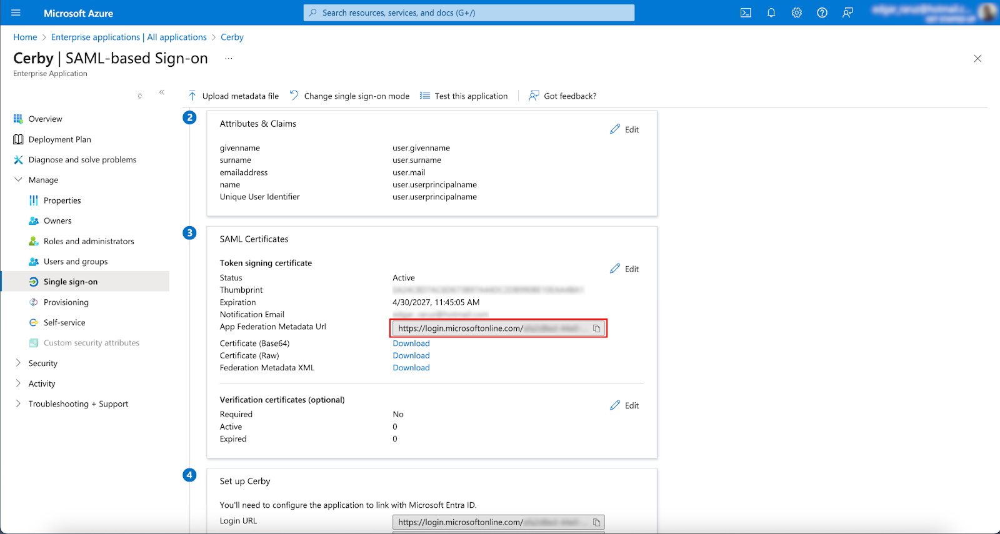
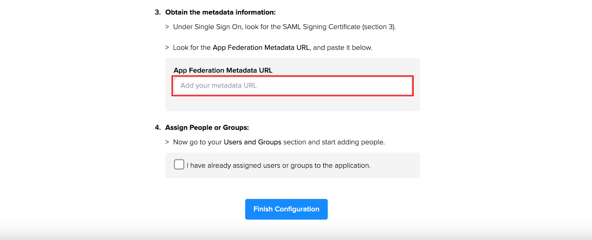

# Configure SSO in Cerby with Entra ID via SAML

With Cerby, you can configure Entra ID (formerly Azure AD) as your identity provider (IdP) to provide single sign-on (SSO) authentication for the users of your corporate directory. This integration enables seamless authentication, as users securely log in to Cerby with one set of credentials.

This article describes how to configure Entra ID as the primary IdP for your Cerby workspace using the Security Assertion Markup Language (SAML) v2.0 integration.

***

## Supported features

The following are the supported features of configuring SSO in Cerby with Entra ID:

* Control who has access to Cerby from Entra ID.
* **Service provider-initiated authentication flow:** This authentication flow occurs when users attempt to log in to the application from Cerby.

***

## Requirements

The following are the requirements to configure SSO in Cerby with Entra ID:

* An Entra ID tenant
* A user account in Entra ID with privileges to configure an enterprise application, such as the following:
  * **Application Administrator**
  * **Cloud Application Administrator**
  * **Application Owner**
  * **Global Administrator**
* An invitation sent from Cerby Support via email to create a workspace

**IMPORTANT:** If you have not received an invitation, send an email to [support@cerby.com](mailto:support@cerby.com) with your request. After you create the workspace, you are automatically granted the **Owner** role on it

* Users and groups created beforehand in your Entra ID directory. Follow the corresponding instructions in Microsoft’s official documentation to manage users and groups:
  * [How to create, invite, and delete users](https://learn.microsoft.com/en-us/entra/fundamentals/how-to-create-delete-users)
  * [Manage Microsoft Entra groups and group membership](https://learn.microsoft.com/en-us/entra/fundamentals/how-to-manage-groups)

***

## Configure SSO in Cerby with Entra ID

To configure SSO in Cerby with Entra ID, you must complete the following main steps:

1. [Set up a new workspace in Cerby](configure-sso-in-cerby-with-entra-id-via-saml.md#id-1.-set-up-a-new-workspace-in-cerby)
2. [Add the Cerby enterprise application in Entra ID](configure-sso-in-cerby-with-entra-id-via-saml.md#id-2.-add-the-cerby-enterprise-application-in-entra-id)
3. [Configure SSO in Entra ID](configure-sso-in-cerby-with-entra-id-via-saml.md#id-3.-configure-sso-in-entra-id)
4. [Assign users and groups to the Cerby enterprise application in Entra ID](configure-sso-in-cerby-with-entra-id-via-saml.md#id-4.-assign-users-and-groups-to-the-cerby-enterprise-application-in-entra-id)
5. [Retrieve metadata information from Entra ID and enter it in Cerby](configure-sso-in-cerby-with-entra-id-via-saml.md#id-5.-retrieve-metadata-information-from-entra-id-and-enter-it-in-cerby)

**NOTE:** Depending on the use case, you may be redirected to Entra ID for authentication if a session has not been established.

The following sections describe each main step.

### 1. Set up a new workspace in Cerby

To set up a new workspace in Cerby, you must complete the following steps:

1. Click the **Create my workspace** button from the invitation email you received from Cerby. The**Welcome to Cerby** page is displayed, as shown in **Figure 1**.

**Figure 1.** **Welcome to Cerby** page

2. Click the **Set up Azure AD** button. The **Let's create your workspace** page is displayed, as shown in **Figure 2**.

**Figure 2. Let's create your workspace** page

3. Enter the name of your workspace in the **Workspace name** field.

**NOTE:** Remember the workspace name that you have entered. You need it later.

4. Click the **Create Workspace** button. The **Configure SSO through Azure AD Gallery App** page is displayed with instructions to configure the Cerby app in your Entra ID tenant, as shown in **Figure 3.**

**Figure 3.** **Configure SSO through Azure AD Gallery App** page


**IMPORTANT:** Keep the **Configure SSO through Azure AD Gallery App** page open because it contains the required values you must enter in Entra ID by copying and pasting them to complete the configuration.


The next step is [2. Add the Cerby enterprise application in Entra ID](configure-sso-in-cerby-with-entra-id-via-saml.md#id-2.-add-the-cerby-enterprise-application-in-entra-id).

### 2. Add the Cerby enterprise application in Entra ID

To add the SAML-based Cerby enterprise application in Entra ID, you must complete the following steps:

1. Log in to your [Microsoft Azure](https://portal.azure.com) account in a new browser tab.
2. Click the **Menu** icon at the top left of the page. A drop-down menu is displayed.
3. Select the **Microsoft Entra ID** option from the drop-down menu. The **Overview** page is displayed.
4. Select the **Enterprise applications** option from the left navigation drawer. The **All applications** page is displayed.
5. Click the **New application** button located at the top horizontal menu. The **Browse Microsoft Entra Gallery** page is displayed.
6. Enter **Cerby** in the search bar above the **Cloud platforms** section. A list of applications is displayed below the search bar.
7. Select the **Cerby** option from the list, as shown in **Figure 4**. A side panel is displayed on the right.

**Figure 4.** Right side panel on top of the **Browse Microsoft Entra Gallery** page

8. Click the **Create** button from the right side panel. A success message box and the **Overview** page of the Cerby enterprise application are displayed.

The next step is [3. Configure SSO in Entra ID](configure-sso-in-cerby-with-entra-id-via-saml.md#id-3.-configure-sso-in-entra-id), which you must complete from the **Overview** page of the Cerby enterprise application.

### 3. Configure SSO in Entra ID

To configure SSO for the Cerby enterprise application, you must complete the following steps from the **Overview** page of the Cerby enterprise application:

1. Click the **Get Started** button from the **Set up single sign on** card of the **Getting Started** section. The **Single sign-on** page is displayed, as shown in **Figure 5**.

**Figure 5.** **Single sign-on** page of the Cerby enterprise application

2. Click the **SAML** card from the **Select a single sign-on** **method** section. The **SAML-based Sign-on** page is displayed.
3. Click the **Edit** button from the **Basic SAML Configuration** section. The **Basic SAML Configuration** side panel is displayed on the right.
4.  Copy the values from the browser tab you left open when completing step [1. Set up a new workspace in Cerby](configure-sso-in-cerby-with-entra-id-via-saml.md#id-1.-set-up-a-new-workspace-in-cerby) to paste them into their corresponding field, as shown in **Figure 6** :

    * **Identifier (Entity ID)**
    * **Reply URL (Assertion Consumer Service URL)**

    **IMPORTANT:** Click the **Add reply URL** button to display the input field.

    * **Sign on URL**

**Figure 6.** **Basic SAML Configuration** side panel

5. Click the **Save** button at the side panel's top left. A success message box is displayed.
6. Click the **Close** icon at the side panel's top right. The side panel closes, and the **Test single sign-on with Cerby** message box is displayed.

**NOTE:** You can click the **Yes** button from the message box to test the single sign-on integration.

7. Click the **Overview** option from the left navigation drawer. The **Overview** page of the Cerby enterprise application is displayed.

The next step is [4. Assign users and groups to the Cerby enterprise application in Entra ID](configure-sso-in-cerby-with-entra-id-via-saml.md#id-4.-assign-users-and-groups-to-the-cerby-enterprise-application-in-entra-id), which you must complete from the **Overview** page of the Cerby enterprise application.

### 4. Assign users and groups to the Cerby enterprise application in Entra ID

To assign users and groups to the Cerby enterprise application in Entra ID, you must complete the following steps from the **Overview** page:

1. Select the **Users and groups** option from the left navigation drawer. The **Users and groups** page is displayed.
2. Click the **Add user/group** button. The **Add Assignment** page is displayed.
3. Assign existing users and groups to Cerby as you normally do for any other enterprise application. For more instructions, read the article [Manage users and groups assignment to an application](https://learn.microsoft.com/en-us/entra/identity/enterprise-apps/assign-user-or-group-access-portal?pivots=portal).
4. Click the **Overview** option from the left navigation drawer. The **Overview** page of the Cerby enterprise application is displayed.


**IMPORTANT:** The following attributes _must_ be populated in Entra ID for users to be provisioned correctly in Cerby:

* User principal name (the email with which the user will log in to Cerby).
* First name
* Last name
* Email


The next step is [5. Retrieve metadata information from Entra ID and enter it in Cerby](configure-sso-in-cerby-with-entra-id-via-saml.md#id-5.-retrieve-metadata-information-from-entra-id-and-enter-it-in-cerby), which you must complete from the **Overview** page of the Cerby enterprise application.

### 5. Retrieve metadata information from Entra ID and enter it in Cerby

To retrieve metadata information from Entra ID and enter it in Cerby, you must complete the following steps from the **Overview** page of the Cerby enterprise application:

1. Select the **Single sign-on** option from the left navigation drawer. The **SAML-based Sign-on** page is displayed.
2. Copy the value from the **App Federation Metadata Url** field located in the **SAML Certificates** section, as shown in **Figure 7**.

**Figure 7.** **SAML Certificates** section in the **SAML-based Sign-on** page

3. Switch to the browser tab where you left open the **Configure SSO through Azure AD Gallery App** page.
4. Paste the value you have copied in the **App Federation Metadata URL** field, as shown in **Figure 8**.

**Figure 8.** **App Federation Metadata URL** field in the **Configure SSO through Azure AD Gallery App** page

5. Select the **I have already assigned users or groups to the application** option.
6. Click the **Finish Configuration** button. A page displays a message telling you your workspace has been created successfully.
7. Click the **Login** button. The corresponding Entra ID login screen is displayed.
8. Enter your credentials to log in to Entra ID. Your new Cerby workspace is displayed.

Now you are done.


**NOTE:** The SAML-based integration leverages Entra ID only for authentication. To assign permissions for Cerby, users must do so directly within Cerby.



**IMPORTANT:**

* After configuring SSO with Entra ID via SAML in a new workspace, it might take up to 45 minutes for Entra ID to propagate changes across all services. During this window, you might briefly be redirected to the fallback Cerby sign‑in page or notice that recently added users and settings haven’t appeared yet. This is the expected behavior. Please wait until the propagation is complete, then sign in again.
* Currently, after creating a workspace, you cannot change its name or update the IdP settings.
* The first user to log in to Cerby is assigned the [workspace **Owner** role](https://cerby-test.gitbook.io/cerby-test/management/workspace-configuration/user-management/how-cerby-manages-roles).

