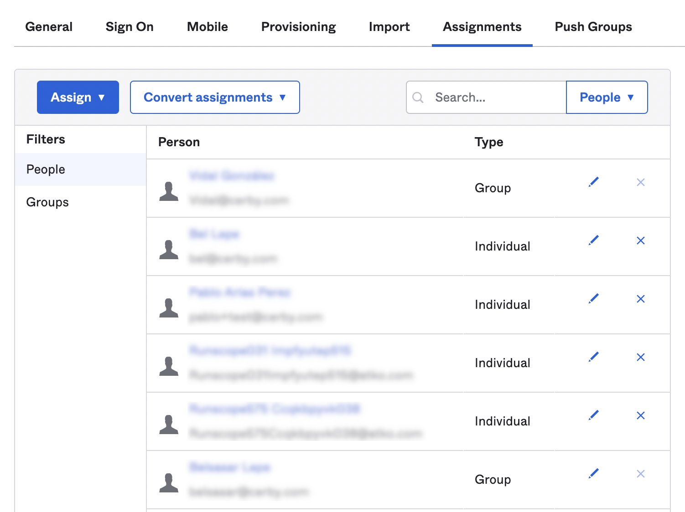

# Configure SSO between Cerby and Okta with OIDC


**Who can configure this feature?**

* Workspace**Owners**


With Cerby, you can configure Okta as your primary identity provider (IdP) to leverage single sign-on (SSO) authentication for your organization.

When you create a new Cerby workspace (therefore, becoming the workspace**Owner**), you can configure an OpenID Connect (OIDC) integration for it. With this integration, all the users assigned to the Cerby application in your Okta tenant can use their Okta login credentials to securely authenticate to Cerby.

This article describes how to configure Okta as the primary IDP for your Cerby workspace to enable SSO authentication using an OIDC integration.


**NOTE:** Currently, the configuration involves creating an app integration in Okta from scratch. To simplify the configuration, our Development team is working on adding a single OIDC and SCIM app integration for Cerby to the Okta Integration Network (OIN) catalog.


***

## Supported features

The following are the supported features of an Okta OIDC integration:

* **Service provider-initiated authentication flow.** This authentication flow occurs when users attempt to log in to the app through their Cerby workspace.
* **Automatic user account creation in Cerby.** This provisioning flow in Cerby occurs automatically on the initial SSO.


**NOTE:** OIDC-based workspaces don’t currently support guest users. This feature will be available in future releases.


***

## Requirements

The following are the requirements to perform the configuration:

* Okta
  * An Okta tenant
  * A user account in Okta with privileges to manage an app integration
  * Users and groups created beforehand in your Okta directory. Follow the corresponding instructions in the Okta Help Center to manage users and groups:\
    **NOTE:** When pushed to the app integration for Cerby, Okta groups become Cerby [teams](https://cerby-test.gitbook.io/cerby-test/management/workspace-configuration/user-management/teams/how-to-use-teams).
    * [Manage users](https://help.okta.com/en/prod/Content/Topics/users-groups-profiles/usgp-people.htm)
    * [Manage groups](https://help.okta.com/en/prod/Content/Topics/users-groups-profiles/usgp-groups-main.htm)
* Cerby
  * An invite to create a workspace emailed by the Cerby Customer Support team ​**IMPORTANT:** If you have not received an invite, send an email to [support@cerby.com](mailto:support@cerby.com) with your request
  * A user account in Cerby with the workspace**Owner** role ​**NOTE:** You automatically become the **Owner** when you log in to your Cerby workspace after creating and configuring it

***

## Configure SSO between Cerby and Okta with OIDC

To configure SSO between Cerby and Okta with an OIDC integration, you must complete the following main steps:

1. Create a Cerby workspace
2. Create an OIDC app integration in Okta
3. Assign users and groups to the OIDC app integration in Okta
4. Configure the OIDC integration in Cerby


**NOTE:** Depending on the use case, you may be redirected to Okta for authentication if a session has not been established.


The following sections describe each main step.

### 1. Create a Cerby workspace

To create a Cerby workspace, complete the following steps:

1. Click the **Create my workspace** button in the invitation email you received from Cerby. The **Welcome to Cerby** page is displayed in a new browser tab, as shown in **Figure 1**.

**Figure 1. Welcome to Cerby** page

<figure><figcaption></figcaption></figure>

2. Click the **Continue with Okta OIDC** button. The **Create your workspace** page is displayed.
3. Enter a name for your workspace in the **Workspace name** field. Use only lowercase letters and avoid entering spaces and special characters. For example, **contentzilla**. **NOTE:** Remember the workspace name that you have entered. You need it later.
4. Click the **Create Workspace** button. The **Configure SSO between Cerby and Okta with OIDC** page is displayed with instructions to configure the OIDC app integration in your Okta tenant, as shown in **Figure 2**.

**Figure 2.** **Configure SSO between Cerby and Okta with OIDC** page

<figure><figcaption></figcaption></figure>


**IMPORTANT:** Keep the **Configure SSO between Cerby and Okta with OIDC** page open because it contains the required values that you must enter in Okta to complete the configuration.


The next step is 2. Create an OIDC app integration in Okta, which you must complete in Okta.

### 2. Create an OIDC app integration in Okta

To create an OIDC app integration in Okta, complete the following steps:

1. Log in to the [Okta Admin Console](https://developer.okta.com/login/) of your organization.
2. Select the **Applications** option from the **Applications** drop-down list located in the left navigation drawer. The **Applications** page is displayed, as shown in **Figure 3**.

**Figure 3. Applications** page in the Okta Admin Console

<figure><figcaption></figcaption></figure>

3. Click the **Create App Integration** button. The **Create a new app integration** dialog box is displayed.
4. Select the **OIDC - OpenID Connect** option. The **Application type** section is displayed below.
5. Select the **Web Application** option in the **Application type** section.
6. Click the **Next** button. The dialog box closes, and the **New Web App Integration** page is displayed.
7. Set up your new app integration by completing the following steps:
   * Enter a name for your app integration in the **App integration name** field. For example, **Cerby OIDC app**.
   * Select the **Refresh Token** option in the Grant type section.
   * Edit the prefilled URI in the **Sign-in redirect URIs** section to include the subdomain and domain of your Cerby workspace. For example, [**https://contentzilla.cerby.com/auth/callback**](https://contentzilla.cerby.com/auth/callback).
   * Delete the prefilled URI in the **Sign-out redirect URIs** section.
   * Select the corresponding option for the **Controlled access** configuration in the **Assignments** section:
     * **Allow everyone in your organization to access**
     * **Limit access to selected groups**
     * **Skip group assignment for now**
8. Click the **Save** button. A success message and the app integration details page are displayed with the **General** tab activated.

The next step is 3. Assign users and groups to the OIDC app integration in Okta, which you must complete in Okta.

### 3. Assign users and groups to the OIDC app integration in Okta

To assign existing users and groups to the OIDC app integration in Okta, complete the following steps from the app integration details page:

1. Activate the **Assignments** tab of the app integration details page. The users of your Okta directory are displayed in the **People** table, as shown in **Figure 4**.

**Figure 4. People** table in the **Assignments** tab

<figure><figcaption></figcaption></figure>

2. Assign individually the users from your directory to the OIDC app integration by completing the following steps:
   1. Select the **Assign to People** option from the **Assign** drop-down list. A dialog box for assigning users is displayed, as shown in **Figure 5**.

**Figure 5.** Dialog box for assigning users to the OIDC app integration

<figure><figcaption></figcaption></figure>

```
 2. Click the **Assign** button of the user you want to add to the OIDC app integration. A dialog box for assigning a username is displayed.
 3. Enter the username in the **Username** field.
```

**IMPORTANT:** Make sure that the username is a valid email address.

```
 4. Click the **Save and Go Back** button. The dialog box closes.
 5. Click the **Done** button. The dialog box closes.
```

3\. Assign the groups you have already created to the OIDC app integration by performing the following steps: 1. Select the **Assign to Groups** option from the **Assign** drop-down list. A dialog box for assigning groups is displayed, as shown in **Figure 6**.

**Figure 5.** Dialog box for assigning groups to the OIDC app integration

<figure><figcaption></figcaption></figure>

```
 2. Click the **Assign** button for each group you want to assign the OIDC app integration to. The **Assign** button changes to an **Assigned** status.
 3. Click the **Done** button when you have completed assigning groups. The dialog box closes.
```

​**TIP:** To verify the groups are successfully assigned to the OIDC app integration, click the **Groups** button from the **Filters** column of the table. The groups you assigned are displayed in the table.

The next step is 4. Configure the OIDC integration in Cerby, which you must complete in the page you kept open with values you retrieve from Okta.

### 4. Configure the OIDC integration in Cerby

To configure the OIDC integration in Cerby, complete the following steps:

1. Activate the **General** tab in the app integration details page in Okta, as shown in **Figure 6**.

**Figure 6.** **General** tab in the app integration details page

<figure><figcaption></figcaption></figure>

2.  Click the **Copy to clipboard** (

    <figure><figcaption></figcaption></figure>

    ) icon of the **Client ID** field in the **Client Credentials** section to copy the client ID.
3. Paste the client ID in the **Client ID** field of the page you kept open in Cerby.
4. Click the **Copy to clipboard** icon below the **Secret** column in the **CLIENT SECRETS** section to copy the client secret.
5. Paste the client secret in the **Client Secret** field of the page you kept open in Cerby.
6. Enter the issuer URL of your Okta tenant in the **Issuer URL** field of the page you kept open in Cerby. The URL contains the unique subdomain assigned to your Okta organization. For example, [**https://contentzilla.okta.com**](https://contentzilla.okta.com). **IMPORTANT:** Make sure the URL doesn’t have a trailing slash (/).
7. Click the **Done** button in the page you kept open in Cerby. The page closes, and the dashboard of your Cerby workspace is displayed.
8. (Optional) Configure adding tiles in the Okta dashboard for all users by completing the following steps:
   1. Click the **Edit** button in the **General Settings** section of the app integration details page in Okta.
   2. Select the corresponding option in the **Login initiated by** drop-down list:
      * **App Only:** The user must go to the Okta tenant URL to log in\*\*.\*\*
      * **Either Okta or App:** The user can see a tile in their Okta dashboard.
   3. Select the **Display application icon to users** option in **Application visibility**.
   4. Enter the URL of your Cerby workspace in the **Initiate login URI** field. For example, [**https://contentzilla.cerby.com**](https://contentzilla.cerby.com).
   5. Click the **Save** button. A success message is displayed.

Now you are done.


**IMPORTANT:** Currently, after creating a workspace, you cannot change its name or update the IdP settings.



**NOTE 1:** Users and groups assigned to the OIDC app integration in Okta can now access their Cerby workspace with SSO authentication through the corresponding tile in their Okta dashboard. In Cerby, user accounts are automatically created after the initial SSO login.



**NOTE 2:** The OIDC-based integration leverages Okta only for authentication. To assign permissions within the Cerby workspace, users must do so directly in the Cerby platform.

