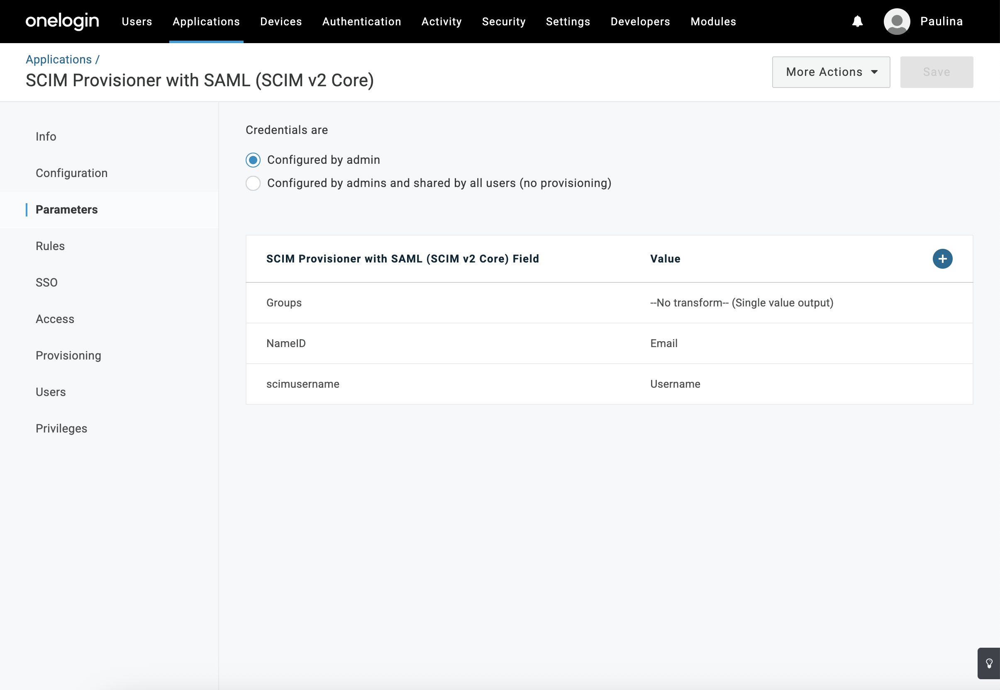
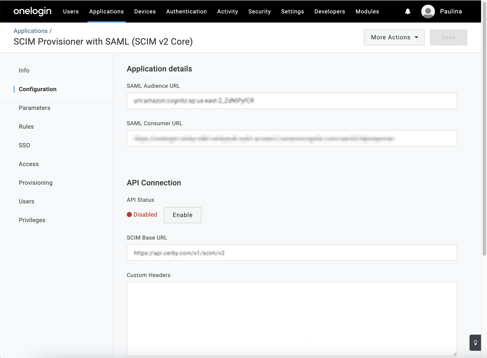
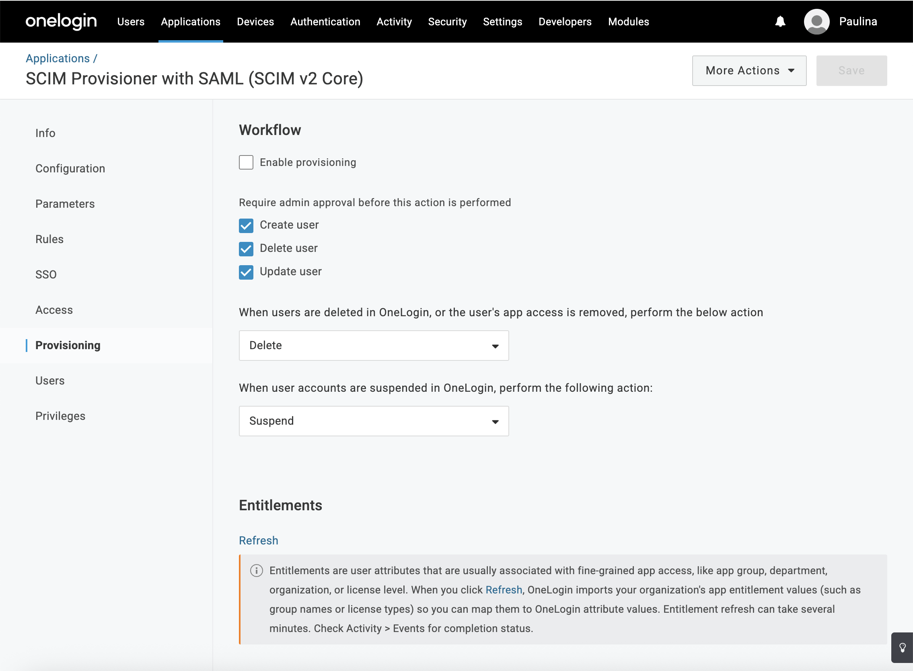

# Configure automatic user provisioning with OneLogin via SCIM

With Cerby, you can configure automatic provisioning with OneLogin using the System for Cross-domain Identity Management (SCIM) specification to manage the creation and synchronization of user accounts based on user assignments.

When you enable user provisioning in a OneLogin application, you can automate multiple critical tasks for downstream user management, ensuring that configuration is performed once and propagated throughout the Cerby platform.

This article describes how to enable OneLogin user provisioning for the Cerby platform with SCIM.

***

## Supported features

The following are the supported features of automatic user provisioning with OneLogin:

* **Push users:** Users assigned to the Cerby application in OneLogin are automatically able to access the Cerby clients (web app, mobile app, and browser extension); they are available to other users in Cerby for account sharing purposes.
* **Update user attributes:** The user attributes are automatically synchronized between Cerby and OneLogin.
* **Suspend or delete users:** Suspended or deleted users in OneLogin are automatically detected in Cerby, and their associated access grants in Cerby are removed. In some cases, additional follow-up actions, like password rotation, may occur in Cerby for privileged identities to which the deprovisioned user had access grants.

***

## Requirements

The following are the requirements to enable OneLogin user provisioning with SCIM:

* A user account in Cerby with the workspace**Owner** role
* The Cerby SAML-based app integration must be set up and deployed. You must have already deployed the integration as part of the article [Configure SSO between Cerby and OneLogin with SAML](https://cerby-test.gitbook.io/cerby-test/management/identity-providers-idps/one-login/configure-sso-between-cerby-and-onelogin-with-saml).
* Users from your directory already assigned to the Cerby application in OneLogin. You must have done the assignments as part of the article [Configure SSO between Cerby and OneLogin with SAML](https://cerby-test.gitbook.io/cerby-test/management/identity-providers-idps/one-login/configure-sso-between-cerby-and-onelogin-with-saml).
* A SCIM API authentication token. Follow the instructions in the article [Retrieve the SCIM API authentication token from Cerby](https://cerby-test.gitbook.io/cerby-test/management/identity-providers-idps/scim/retrieve-the-scim-api-authentication-token-from-cerby) to copy the token. ​**NOTE:** If you need to regenerate the SCIM API authentication token, read the article[ Regenerate the SCIM API authentication token](https://cerby-test.gitbook.io/cerby-test/management/identity-providers-idps/scim/regenerate-the-scim-api-authentication-token)

***

## Configure automatic provisioning with OneLogin

To configure automatic user provisioning with OneLogin, you must complete the following steps:

1. Log in to[ OneLogin](https://cerby-test.onelogin.com/admin2) as an administrator.
2. Select the **Applications** options that appear when hovering over the **Applications** tab. The **Applications** page is displayed, as shown in **Figure 1.**

**Figure 1. Applications** page in OneLogin

3. Search and select your SCIM Provisioner with SAML (SCIM v2 Core) app. You created this application by following the instructions in the article [Configure SSO between Cerby and OneLogin with SAML](https://cerby-test.gitbook.io/cerby-test/management/identity-providers-idps/one-login/configure-sso-between-cerby-and-onelogin-with-saml).
4. Select the **Configuration** option from the left menu. The configuration details page is displayed, as shown in **Figure 2.**

**Figure 2.** Configuration details page in OneLogin

5. Paste the SCIM API authentication token in the **SCIM Bearer Token** field. You copied this token previously from the Cerby web app by following the instructions in the article[ Retrieve the SCIM API authentication token from Cerby](https://cerby-test.gitbook.io/cerby-test/management/identity-providers-idps/scim/retrieve-the-scim-api-authentication-token-from-cerby).
6. Click the **Enable** button in **API Status** label. The status changes to **Enabled.**
7. Select the **Provisioning** option from the left menu. The provisioning details page is displayed, as shown in **Figure 3.**

**Figure 3.** Provisioning details page in OneLogin

8. Select the **Enable** **provisioning** option in the **Workflow** section. ​**NOTE:** When the\*\*\*\* options in the **Require admin approval before this action is performed** section are selected, OneLogin will create provisioning tasks that will require admin approval. If you’d rather approve all tasks automatically, you can deselect those options.
9. Click the **Save** button. A success message is displayed, and the **Info** details page activates.

Now you are done.
