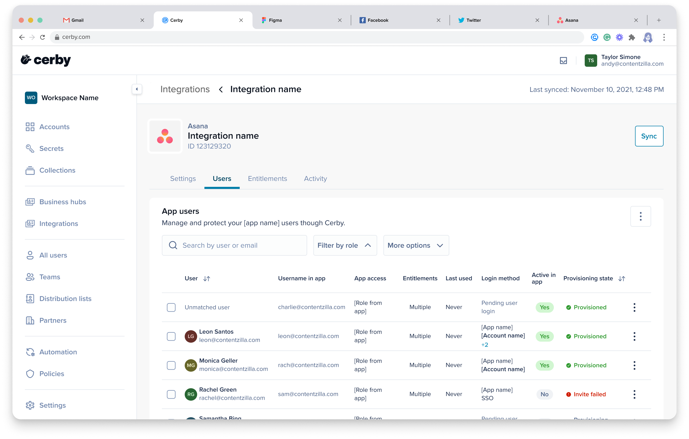

# Configure SSO between Cerby and OneLogin with SAML

All Cerby users are able to configure a default Identity Provider (IdP) such as OneLogin to leverage the single sign-on (SSO) authentication feature to securely authenticate using a single set of credentials.

OneLogin supports a Security Assertion Markup Language (SAML) application to integrate with other service providers easily. In this case, the integration is with Amazon Cognito, and the SAML application is customized and points to a specific Cerby workspace.

This article describes how to configure OneLogin as the primary IdP to enable SSO with the Cerby platform using a SAML integration.

* * *

## Supported features

The following are the supported features of configuring SSO in Cerby with OneLogin:

  * Control who has access to Cerby from OneLogin.
  * **Service provider-initiated authentication flow.** This authentication flow occurs when users attempt to log in to the application from Cerby.
  * **Automatic user account creation in Cerby.** This provisioning flow in Cerby occurs automatically on the initial SSO.
* * *

## Requirements

The following are the requirements to configure SSO in Cerby with OneLogin:

  * A user account in OneLogin with admin privileges to configure an application
  * You must have received an invitation from Cerby Support via email to create a workspace.
​**IMPORTANT:** If you have not received an invitation, send an email to [support@cerby.com](mailto:support@cerby.com) with your request

* * *

## Configure SSO in Cerby with OneLogin

To configure SSO in Cerby with OneLogin, you must complete the following main steps:

  1. [Set up a workspace in Cerby](configure-sso-between-cerby-and-onelogin-with-saml.md#id-1.-set-up-a-workspace-in-cerby)
  2. [Add a SAML-based application to OneLogin](configure-sso-between-cerby-and-onelogin-with-saml.md#id-2.-add-a-saml-based-application-to-onelogin)
  3. [Configure SAML for Cerby in OneLogin](configure-sso-between-cerby-and-onelogin-with-saml.md#id-3.-configure-saml-for-cerby-in-onelogin)
  4. [Assign users to the application](configure-sso-between-cerby-and-onelogin-with-saml.md#id-4.-assign-users-to-the-application)
  5. [Finish the workspace creation in Cerby](configure-sso-between-cerby-and-onelogin-with-saml.md#id-5.-finish-the-workspace-creation-in-cerby)

The following sections describe each main step.

### 1\. Set up a workspace in Cerby

To set up a workspace in Cerby, complete the following steps:

  1. Click the**Create your Workspace** button from the invitation email. The**Welcome to Cerby** page is displayed, as shown in **Figure 1.**
​

**Figure 1. Welcome to Cerby** page

  2. Click the **Continue with Generic SAML** button. The **Create your workspace** page is displayed, as shown in **Figure 2**.

**Figure 2.** **Create your Workspace** page

  3. Enter the name of your workspace in the **Workspace name** field.
​**NOTE:** Remember the workspace name that you have entered. You need it later.

  4. Click the **Create workspace** button. The **Configure SSO through Your Generic SAML App** page is displayed, as shown in **Figure 3**. This page contains information to configure the Cerby application in your OneLogin tenant.
​

**Figure 3. Configure SSO through Your Generic SAML App** page
​

**IMPORTANT:** Keep the **Configure SSO through Your Generic SAML App** page open because it contains the required values that you must provide to OneLogin and Cerby to complete the configuration.

The next step is [2. Add a SAML-based application to OneLogin](configure-sso-between-cerby-and-onelogin-with-saml.md#id-2.-add-a-saml-based-application-to-onelogin), which you must complete from OneLogin.

### 2\. Add a SAML-based application to OneLogin

To add a SAML-based application to OneLogin, complete the following steps:

  1. Log in to [OneLogin](https://cerby-test.onelogin.com/admin2) as an administrator.
  2. Select the Applications options that appear when hovering over the Applications tab. The **Applications** page is displayed, as shown in **Figure 4.**
​

**Figure 4. Applications** page in OneLogin

  3. Click the **Add App** button located at the top right. The **Find Application** page is displayed.
  4. Enter **SCIM** in the search bar. A list of applications is displayed.
  5. Select the **SCIM Provisioner with SAML (SCIM v2 Core)** option. The **Add SCIM Provisioner with SAML (SCIM v2 Core)** page is displayed, as shown in**Figure 5.**

**Figure 5. Add SCIM Provisioner with SAML (SCIM v2 Core)** page in OneLogin

  6. (Optional) Update the name for your OneLogin SAML application in the **Display Name** field.
  7. Click the **Save** button. A success message is displayed.

The next step is [3. Configure SAML for Cerby in OneLogin](configure-sso-between-cerby-and-onelogin-with-saml.md#id-3.-configure-saml-for-cerby-in-onelogin), which you must complete from OneLogin.

### 3\. Configure SAML for Cerby in OneLogin

To configure OneLogin to provide SSO for Cerby using SAML, complete the following steps:

  1. Select the **Configuration** option from the left menu. The configuration details page is displayed, as shown in **Figure 6.**

**Figure 6**. Configuration details page in OneLogin

  2. Enter the following information in the **Application details** section using the values from the browser tab you left open when completing step [1. Set up a workspace in Cerby](configure-sso-between-cerby-and-onelogin-with-saml.md#id-1.-set-up-a-workspace-in-cerby):

     * **SAML Audience URL:** Copy and paste the **Entity ID** value.
     * **SAML Consumer URL:** Copy and paste the **ACS URL** value.

  3. Enter **<https://api.cerby.com/v1/scim/v2>** in the **SCIM Base URL** field**** of the **API Connection** section**.**
  4. Click the **Save** button. A success message is displayed, and the **Info** details page activates.
  5. Select the **Parameters** option from the left menu. The parameters details page is displayed, as shown in **Figure 7**.

**Figure 7**. The parameters details page in OneLogin

  6. Map the user identity SAML attributes by completing the following steps using the values listed in **Table 1** :
     1. Click the plus () icon. The **New Field** dialog box is displayed, as shown in **Figure 8.**

**Figure 8. New Field** dialog box in OneLogin

     2. Copy and paste the URI from **[Table 1](configure-sso-between-cerby-and-onelogin-with-saml.md#id-table-1.-user-identity-saml-attributes)** into the **Field name** field. For example, **`http://schemas.xmlsoap.org/ws/2005/05/identity/claims/name`**
     3. Select the**Include in SAML assertion** option.
     4. Click the **Save** button. The **Value** field is displayed.
     5. Copy and paste the attribute from **[Table 1](configure-sso-between-cerby-and-onelogin-with-saml.md#id-table-1.-user-identity-saml-attributes)** into the **Value** field, then select the matching option that appears in the drop-down list.
     6. Click the **Save** button. The dialog box closes.
     7. Repeat steps **a** to **f** for each attribute listed in **[Table 1](configure-sso-between-cerby-and-onelogin-with-saml.md#id-table-1.-user-identity-saml-attributes).**
  7. Update the attribute assigned to the **scimusername** field by completing the following steps:
     1. Click the **scimusername** field. The **Edit Field scimusername** dialog box is displayed, as shown in **Figure 9**.

**Figure 9. Edit Field scimusername** dialog box in OneLogin

     2. Select the **Email** option from the **Value** drop-down menu**.**
     3. Click the **Save** button. The dialog box closes.
  8. Click the **Save** button. A success message is displayed, and the **Info** details page activates.
  9. Click the **More Actions** menu located at the top right. A drop-down menu is displayed.
  10. Select the **SAML Metadata** option. An XML metadata file is automatically downloaded to your computer.

The next step is [4. Assign users to the application](configure-sso-between-cerby-and-onelogin-with-saml.md#id-4.-assign-users-to-the-application), which you must complete from OneLogin.

### 4\. Assign users to the application

You can assign users to the newly created application in the following ways:

  * **Manually assigning apps to individual users**. For instructions, read the official OneLogin documentation [Manually Assigning Apps to Users](https://onelogin.service-now.com/support?id=kb_article&sys_id=e5e35e0047ccbd509d8dfd1f536d43c2&kb_category=e9866930db185340d5505eea4b9619b7).
  * **Assigning apps to users in batches**. The most efficient way to assign apps to users is to batch-apply them in collections, using roles and mappings. For instructions, read the official OneLogin documentation [Roles](https://onelogin.service-now.com/support?id=kb_article&sys_id=cc2e602a973b2150c90c3b0e6253af3c&kb_category=566ffd6887332910695f0f66cebb3556).

The next step is [5. Finish the workspace creation in Cerby](configure-sso-between-cerby-and-onelogin-with-saml.md#id-5.-finish-the-workspace-creation-in-cerby), which you must complete in Cerb

### 5\. Finish the workspace creation in Cerby

To finish the workspace creation in Cerby, complete the following steps from the**Configure SSO through Your Generic SAML App** page that you left open:

  1. Upload the XML file that you downloaded recently in the **2\. Upload the metadata information** section. The name of the file is displayed below the **Metadata XML file** field when it is uploaded.
​**TIP:** You can drag the file from another window or click the button below the **Metadata XML file** field to look for the file on your computer.

  2. Select the **I have already assigned users or groups to the application** option located in the **3\. Assign People or Groups** section**.**
  3. Click the**Finish Configuration** button located at the bottom of the page. The**Your Workspace** page is displayed confirming that your workspace has been created successfully.
  4. Click the **Login** button. Your new Cerby workspace is displayed.

Now you are done.



**NOTE:** After completing the SSO setup in this guide, you can also configure automatic user provisioning via SCIM between OneLogin and Cerby.

To enable automatic creation, updates, and deactivation of user accounts in Cerby based on user assignments in OneLogin, see the article [Configure automatic user provisioning with OneLogin via SCIM.](https://cerby-test.gitbook.io/cerby-test/management/identity-providers-idps/one-login/configure-automatic-user-provisioning-with-onelogin-via-scim)



* * *

## Table 1. User identity SAML attributes

The following table shows the user identity SAML attributes you must configure in OneLogin as part of step [3. Configure SAML for Cerby in OneLogin](configure-sso-between-cerby-and-onelogin-with-saml.md#id-3.-configure-saml-for-cerby-in-onelogin):

**URI**| **Attribute**
---|---
`http://schemas.xmlsoap.org/ws/2005/05/identity/claims/name`| Name
`http://schemas.xmlsoap.org/ws/2005/05/identity/claims/surname`| Last Name
`http://schemas.xmlsoap.org/ws/2005/05/identity/claims/emailaddress`| Email
`http://schemas.xmlsoap.org/ws/2005/05/identity/claims/givenname`| First Name

**Table 1.** User identity SAML attributes
