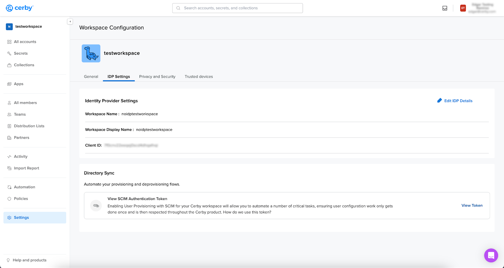
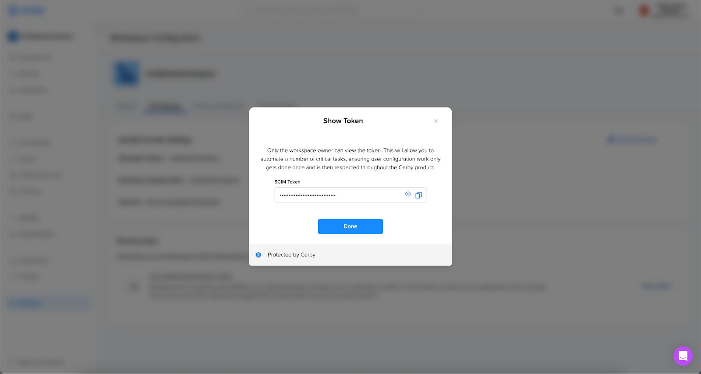

# Retrieve the SCIM API authentication token from Cerby



**Who can use this feature?**

* Workspace **Owners** , **Super Admins** , and **Admins**
* Only supported using the Cerby web app



Cerby uses the System for Cross-domain Identity Management (SCIM) specification to configure automatic user and group provisioning between identity providers (IdPs), such as Okta and Entra ID (formerly Azure AD), and the multiple applications that companies use.

By enabling automatic provisioning, Cerby can manage the creation and synchronization of user accounts and teams based on the user and group assignments in your corporate IdP. To configure automatic provisioning and authenticate SCIM provisioning requests, you need a SCIM API authentication token generated by Cerby.

To retrieve the SCIM API authentication token, complete the following steps:



**IMPORTANT:** To view the SCIM API authentication token, you must verify your identity. Therefore, you must have installed and logged in to the Cerby mobile application to receive push notifications.



  1. Log in to your corresponding [Cerby](https://app.cerby.com/) workspace.
  2. Select the **Settings** option from the left navigation drawer. The **Workspace Configuration** page is displayed.
  3. Activate the **IDP Settings** tab. The details of your IDP and the **Directory Sync** section are displayed, as shown in **Figure 1**.

**Figure 1. Directory Sync** section in the **IDP Settings** tab

<figure><figcaption></figcaption></figure>

  4. Click the **View Token** button located in the **Directory Sync** section. The **Confirm your identity to continue** dialog box is displayed, and a push notification is sent to your Cerby mobile app.
  5. Confirm your identity by using one of [Cerby's multi-factor authentication methods](https://cerby-test.gitbook.io/cerby-test/management/identity-providers-idps/scim/set-up-your-identity-with-cerby-s-mfa-methods). The **Confirm your identity to continue** dialog box closes in the Cerby web app, and the **Show Token** dialog box is displayed, as shown in **Figure 2**.

**Figure 2. Show Token** dialog box

<figure><figcaption></figcaption></figure>

  6. Click the **Copy** button to copy the SCIM API authentication token to the clipboard.
**TIP:** Keep the **Show Token** dialog box open, as shown in **Figure 2** , to copy the token at any time. You need the token to configure automatic provisioning with your IdP tenant.

Now you’re done.
