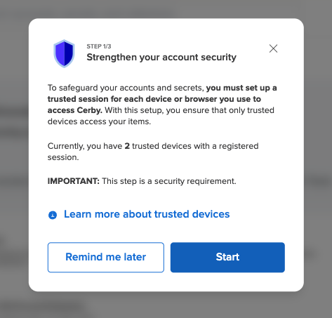
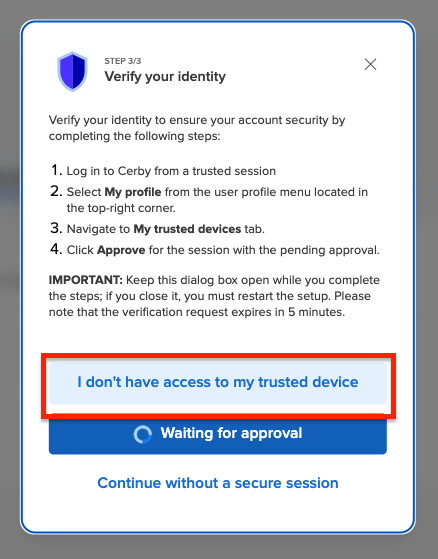

# Set up trusted sessions on your devices

At Cerby, trusted sessions and devices help strengthen the security of your accounts. They provide an additional layer of protection by ensuring that all interactions with the Cerby platform come from authorized devices that meet corporate security standards.

A trusted device can be any of the three client apps you use to access a workspace: the Cerby web app, the Cerby browser extension, or the Cerby mobile app.



**IMPORTANT:** If you access the Cerby web app using different web browsers, you must set up a trusted session for each browser. It also applies if you install the Cerby browser extension in different browsers.



Regardless of their workspace role, all users must set up trusted sessions on their devices, and they can have up to 20 registered devices. When reaching the limit, users must disable a device before setting up a new one.

Trusted sessions are associated with their users; therefore, when a user is deprovisioned, all their trusted sessions and devices are automatically disabled.

Management actions on trusted sessions and devices can only be performed using the Cerby web app.

This article describes how to set up and manage trusted sessions on your devices.

* * *

## Set up a trusted session

Trusted sessions are a security requirement to use Cerby; therefore, all users must set up at least one session on a device.

When users join Cerby or log in to their workspace with any of the Cerby client apps, a dialog box, page, or screen is automatically displayed, asking them to set up a trusted session. For example, **Figure 1** shows the **Strengthen your account security** dialog box for the configuration of a trusted session in the Cerby web app.

<figure><figcaption></figcaption></figure>

**Figure 1. Strengthen your account security** dialog box in the Cerby web app

To set up a trusted device, you must complete the following steps from the **trusted session setup** dialog box, page, or screen in the Cerby web app, browser extension, or mobile app, respectively:

**TIP:** Cerby recommends setting up your first trusted session on the Cerby web app. This initial setup is helpful when registering sessions on other devices and managing the previously registered sessions, which can only be performed from the web app.
---

  1. Click the **Start** button. The **Name your device** dialog box is displayed.
  2. Enter a name for your device in the **Device name** field.
**NOTE:** Cerby automatically creates a name for you using the format: `[username][device name] - [operating system]/[browser]`. If you want to change it, Cerby recommends using a name that is easy to recognize and including the name of your web browser or mobile operating system. Device names must be unique.

  3. Click the **Next** button. Depending on whether you have previously set up a trusted session or not, one of the following scenarios occurs:

     * If it is the first trusted session you are setting up or you are onboarding the Cerby browser extension, a message with a verification code is sent to your email, and the **Verify your device** dialog box is displayed:

       1. Copy the verification code from the email Cerby sent you.
**IMPORTANT:** The verification code expires in 5 minutes.

       2. Enter the code in the **Verification code** field.
       3. Click the **Verify code** button. The dialog box closes, and a success message box is displayed.

     * If you have previously registered a trusted session on a Cerby web app, the **Verify your identity** dialog box is displayed with instructions to approve the device from a trusted session:

       1. Log in to Cerby from a trusted session on the Cerby web app.
       2. Select the **My profile** option from the user profile menu located in the top-right corner.
       3. Activate the **My trusted devices** tab in your **Profile** information. The list of your trusted sessions is displayed.
       4. Hover the mouse over the device with the **Pending approval** status. The **Approve** and **Deny** buttons are displayed.
       5. Click the **Approve** button. The status of the device changes to **Approved,** and a success message box appears for the session.

     * If you have previously registered a trusted session on a Cerby mobile app:

       1. Log in to Cerby from a trusted session on the Cerby mobile app.
       2. Tap the user profile menu. The **My profile** screen or side menu is displayed.
       3. Tap the **My trusted devices** option. The **My trusted devices** screen is displayed.
       4. Tap the device name with the **Pending approval** status. The **Trust this session?** screen is displayed.
       5. Tap the **Approve** button. The device is added to your trusted devices, and a success message box is displayed.

     * If you have previously set up a trusted session but don’t have your device at hand, the **Verify your identity** dialog box is displayed:

       1. Click the **I don’t have access to my trusted device** button, as shown in **Figure 3**.
**Figure 3. I don’t have access to my trusted device** button
The **Name your device** dialog box is displayed again.

<figure><figcaption></figcaption></figure>

       2. Click the **Next** button. A message with a verification code is sent to your email, and the **Verify your device** dialog box is displayed.
       3. Copy the verification code from the email Cerby sent you. **IMPORTANT:** The verification code expires in 5 minutes.
       4. Enter the code in the **Verification code** field.
       5. Click the **Verify code** button. The dialog box closes, and a success message box is displayed.

* * *

## Set up a trusted session later

If you click the **Remind me later** button or dismiss the **Set up trusted device** screen on your mobile phone in the **Strengthen your account security** dialog box or screen, a message indicating that your current session is not secure is displayed on top.

To set up your device later, you must complete the following steps on your corresponding client app:

* **Cerby web app**

    1. Click the user profile menu located at the top right of the dashboard. A drop-down menu is displayed.
    2. Select the **My Profile** option. The **My Profile** page is displayed.
    3. Activate the **My trusted devices** tab.
    4. Click the **Set up this device** button. The **Strengthen your account security** dialog box is displayed.
    5. Follow the instructions to set up your device.

* **Cerby browser extension**

    1. Open the Cerby browser extension popup.
    2. Click the user profile icon located at the top right of the popup. The **My Profile** page is displayed.
    3. Click the **Set up new device** button. The **Let's set up your extension to access Cerby** page is displayed.
    4. Follow the instructions to set up your device.

* Cerby mobile app

    1. Tap the yellow banner at the top of the screen, indicating that your current session is not secure. The **Set up trusted device** screen is displayed.
    2. Follow the instructions to set up your device.

Now, you can start managing your trusted sessions on your devices.

* * *

## Related articles

The following articles contain more information about trusted sessions on your devices:

* [View the trusted sessions and devices in your workspace](https://cerby-test.gitbook.io/cerby-test/management/workspace-configuration/trusted-devices/view-the-trusted-sessions-and-devices-in-your-workspace)
* [Disable trusted sessions and devices in your workspace](https://cerby-test.gitbook.io/cerby-test/management/workspace-configuration/trusted-devices/disable-trusted-sessions-and-devices-in-your-workspace)
