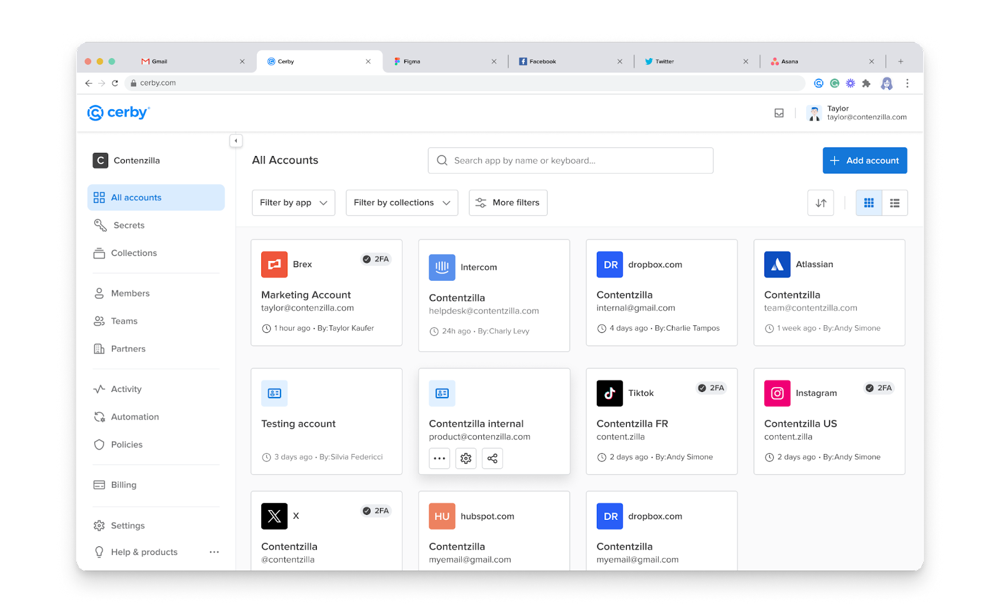
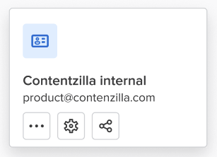

# Explore Accounts

At Cerby, accounts are digital records that contain user login information for a particular application or service provider. They are the equivalent of a password in a password management platform.

Typically, an account comprises a username, password, and login URL (optionally); however, it may contain additional information depending on the app, user needs, and Cerby product.

All users, except those with the **Login-only** or **Guest user** role, can add an account to their workspace to manage and secure access through Cerby. When you add an account, you automatically become the **Owner** of it, and when you share access with other workspace users or teams, you can assign them one of the following two roles:

* **Owner:** They can share access and manage the account configuration.
* **Collaborator:** They can log in to the account.

For more information about roles and the actions users can perform on an account, read the article [How Cerby manages roles](https://cerby-test.gitbook.io/cerby-test/management/workspace-configuration/user-management/how-cerby-manages-roles).

You can add your accounts to Cerby manually, at login, or import them from your password manager. For instructions, read the following articles:

* [Add an account](https://cerby-test.gitbook.io/cerby-test/how-to-use-cerby/cerby-web-app/accounts/add-an-account)
* [How to save your credentials at login via the Cerby browser extension](https://cerby-test.gitbook.io/cerby-test/how-to-use-cerby/cerby-browser-extension/autosave-an-account-at-login-or-signup-with-the-cerby-browser-extension)
* [How to use the Password Manager Importer](https://cerby-test.gitbook.io/cerby-test/management/credential-management/item-importer/migrate-from-lastpass-to-cerby)

Accounts are displayed as cards in your dashboard, whether you use the Cerby web app, browser extension, or mobile app. **Figure 1** shows different accounts in the **All accounts** page of the Cerby web app dashboard.

<figure><figcaption></figcaption></figure>

**Figure 1.** Account cards in the **All accounts** page of the Cerby web app dashboard

By interacting with account cards, you can trigger an automatic login, share access to the account, or open the account settings.

* * *

## Account types

The following are the account types you can add to Cerby:

* Managed accounts
* Self-managed accounts
* No URL accounts

The following sections describe each account type.

### Managed accounts

Managed accounts are accounts for integrated apps with built-in support in Cerby, which means our Development team has identified their login flow, and they are available in our app catalog. When you add a managed account to Cerby, you can just select it from the catalog.

Logging in to your managed accounts from Cerby is a one-click experience: the login URL of your app opens in a new browser tab, and the Cerby browser extension automatically fills in your credentials. If you have multi-factor authentication (MFA) managed by Cerby, the verification codes are also automatically filled in.

For Cerby Automate users, in addition to automatic login, managed accounts also support the following hygiene security automated tasks triggered by one click in the Cerby web app:

* **Turn on or off MFA:** You can automatically turn on or off MFA for an account. When turning on MFA, you can also store the secret key for authentication in Cerby.
* **Check MFA status:** You can automatically verify if MFA is active and has the correct secret key.
* **Swap email:** You can change the current email registered in your accounts for a Cerby-managed email.
* **Swap phone:** You can change the current phone number registered in your accounts for a Cerby-managed phone number.
* **Rotate password:** You can automatically rotate your accounts' passwords to Cerby-generated secure passwords that comply with the password strength rules of each app.



**NOTE:** Our Development team constantly adds new integrations to the app catalog. If you would like us to support a specific application or service provider, please send your request via email to the Customer Support team at [support@cerby.com](mailto:support@cerby.com).



### Self-managed accounts

Self-managed accounts are accounts for apps that you access through their website. When you add a self-managed account to Cerby, you must enter its login URL so the Cerby browser extension can identify the input fields and attempt to autofill them.



**NOTE:** Cerby does its best to autofill your login credentials for self-managed accounts. Successful login attempts depend on having the correct login URL and on how complex the app’s user interface is. If you would like us to support a specific app or service provider, please send your request via email to the Customer Support team at [support@cerby.com](mailto:support@cerby.com).



Besides automatic login, Cerby doesn’t support additional security automated tasks for self-managed accounts.

### No URL accounts

No URL accounts are for non-integrated apps that you access locally, not through a website. Therefore, when you add them to Cerby, the login URL is not mandatory, and the rest of the account details are optional.

Some apps that can be accessed without a URL account are hardware devices and desktop applications. Cerby doesn’t support security automated tasks for these accounts. No URL accounts are identified visually in the Cerby dashboard, as shown in **Figure 2**.

<figure><figcaption></figcaption></figure>

**Figure 2.** No URL account card
