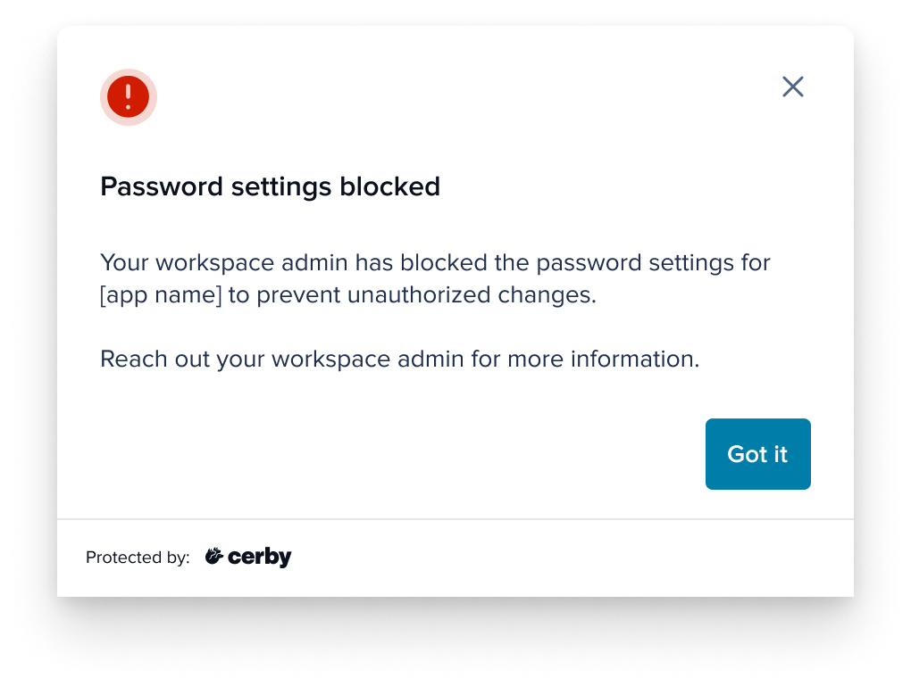
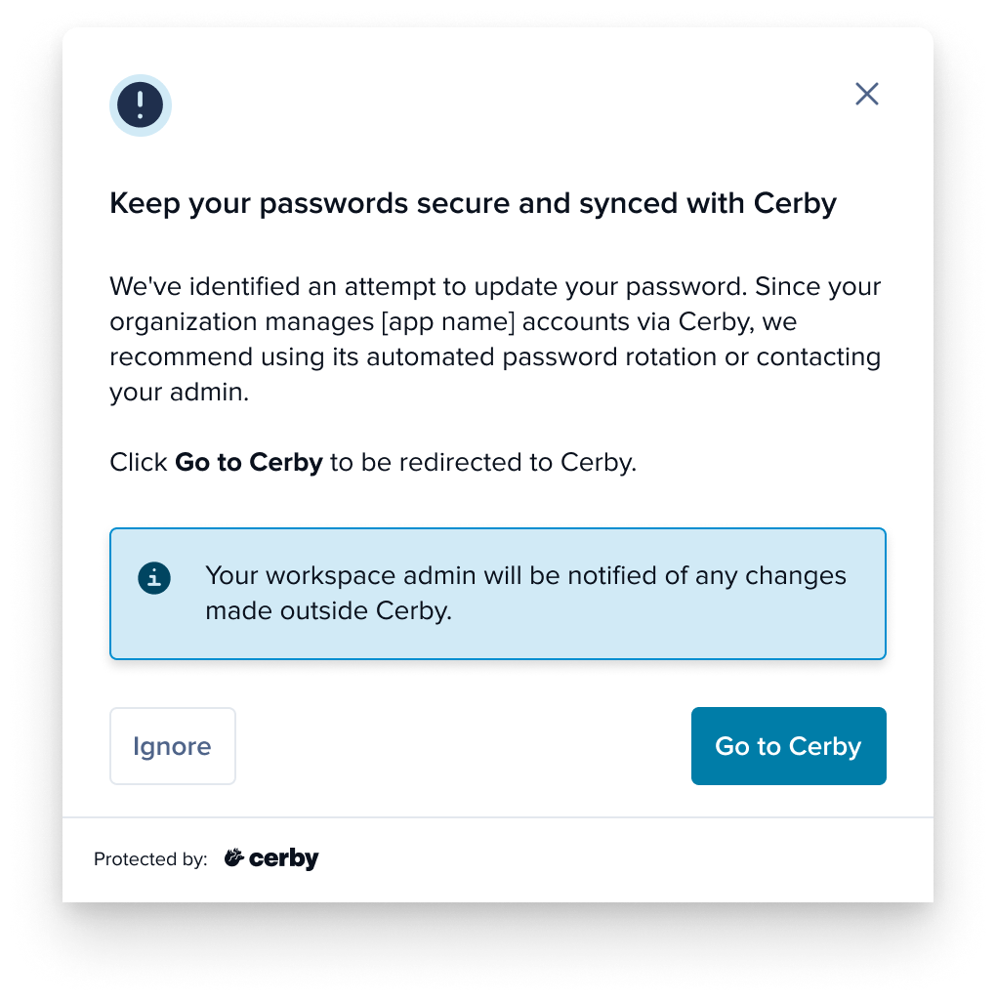

# Explore App settings restrictions

With Cerby, you can achieve more granular tracking and visibility in user management and password changes across your apps with our **App settings restrictions** feature.

Commonly, in shared account scenarios, apps don’t enable admins to restrict or control specific settings according to the users' roles and permissions. The App settings restrictions feature helps organizations improve security by encouraging employees to use Cerby rather than the app’s interface to manage users and update passwords.

This feature provides you with the flexibility to implement either a recommendation-based approach for reducing user friction or a full-block approach. In any scenario, you can monitor compliance and take action on potential security risks.

As a workspace**Admin** , **Super Admin** , or **Owner** , you can manage and apply restrictions to the following settings for all workspace users:

* **Password settings:** Control how users configure and change account passwords, including changing, resetting, or updating the password within the app.
* **Member settings:** Control how users manage user access, roles, or permissions within the app.

These restrictions give you control over how and where users can modify critical settings, helping to ensure the security and integrity of your accounts.



**IMPORTANT:** Any password or member settings restrictions apply only to workspace **Users**. Workspace **Owners** , **Admins** , and **Super** **Admins** are unaffected by these restrictions.



* * *

## How restrictions work

The workspace **Owner** , **Admins** , or **Super Admins** can only configure the app settings restrictions using the Cerby web app. The client app performing the restrictions on the app’s user interface is the Cerby browser extension.



**IMPORTANT:** For the feature to work correctly, users must have the Cerby browser extension installed and logged in. It is not available in the Cerby mobile app.



The following are the available restriction options for managing password and user settings:

  * **Fully block:** Users cannot change the settings directly in the app because Cerby blocks the user interface. Any attempt to change the settings results in a notification informing the user that they do not have permission to make the change. Workspace**Admins** received an email about blocked attempts, giving them visibility into restricted actions in the **Activity** view.
  * **Monitor and prompt to Cerby:** Users are recommended to make changes through Cerby using the account capabilities, such as automated password rotation. However, they can still make updates directly in the app. Workspace **Admins** are notified when a user changes the app settings.
  * **No restriction:** Users have complete freedom to change the settings as needed directly in the app. Changes are not limited or monitored; users can modify their passwords or settings without intervention.
* * *

## User notifications

The following is the behavior for the different restriction settings when users attempt to make changes in the app:

  * **Full block** : When a setting is fully blocked, any modification attempt displays an error message in the app, as shown in **Figure 1**.

**Figure 1.** Error messages displayed in the app when the password or user settings are fully blocked

**Monitor and prompt to Cerby** : When users are prompted to use Cerby, any attempt to modify settings will display an informational window, recommending users to configure the setting through Cerby, either via **Accounts** or **Members** , as shown in **Figure 2**.

**Figure 2.** Information messages displayed in the app when the password and user settings are recommended to be modified on Cerby

* * *

## Supported apps

The following are the domains of the apps that support the Apps settings restrictions feature:

  * google.com
  * appbot.co
  * bitrise.io
  * mailchimp.com
  * make.com
  * ngrok.com
  * paypal.com
  * surveymonkey.com
  * developers.google.com/ads-data-hub
  * cloud.google.com/document-ai
  * acsense.com
  * meraki.com
  * explorium.ai
  * x.com
  * instagram.com
  * facebook.com
  * tiktok.com
  * bsky.app
  * pinterest.com
  * snapchat.com
* * *

## Related articles

The following articles contain more information about App settings restrictions:

  * [Manage access to app settings](https://cerby-test.gitbook.io/cerby-test/management/workspace-configuration/app-settings-restrictions/manage-access-to-app-settings)
  * [Add settings restrictions to an app](https://cerby-test.gitbook.io/cerby-test/management/workspace-configuration/app-settings-restrictions/add-settings-restrictions-to-an-app)
  * [Edit an app settings restriction](https://cerby-test.gitbook.io/cerby-test/management/workspace-configuration/app-settings-restrictions/edit-an-app-settings-restriction)
  * [Customize the user message for setting restrictions](https://cerby-test.gitbook.io/cerby-test/management/workspace-configuration/app-settings-restrictions/customize-the-user-message-for-setting-restrictions)
  * [Remove apps from settings restrictions](https://cerby-test.gitbook.io/cerby-test/management/workspace-configuration/app-settings-restrictions/remove-apps-from-settings-restrictions)
