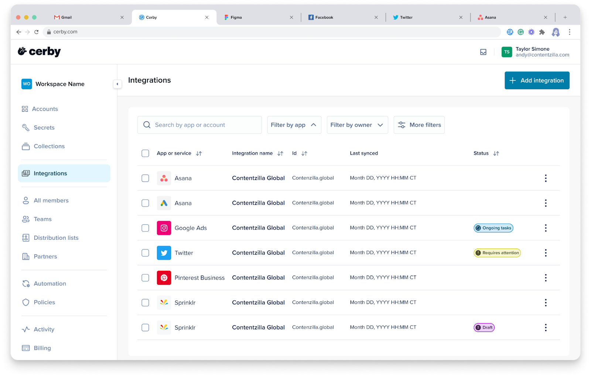

# Explore Business Hubs

With Cerby’s **Business Hubs** , you can connect all your external seat-based and paid social apps–even disconnected or nonfederated apps–to your workspace for centralized user and asset management.

Business hub integrations keep user and access information up to date between your apps and Cerby, so you can use only one platform to perform the following user and access management operations:

* Add users to your app
* Remove users from your app
* Update user roles in your app

If your Cerby workspace is connected to an identity provider (IdP), such as Okta or Entra ID, business hubs help you propagate changes in your organization across your connected apps.

The main goal is to ensure your employees, and even your external collaborators (contractors, agencies, or partners), have the right access at the right time and with the least privileges. The following are other benefits of the Business Hubs feature:

* Extend single sign-on (SSO) to apps that don’t support it.
* Track the progress of user management operations.
* Secure user access with multi-factor authentication (MFA) and password policies.
* Retrieve full audit trails for governance.

Business hub integrations are intended for apps that have collaboration spaces (workspaces, teams, or dashboards) to which users access with different roles and permissions. These apps typically use individual seats or licenses rather than shared accounts, such as Meta Business Manager, TikTok for Business, Apple, Asana, Atlassian, Calendly, and GitHub.

* * *

## The Business Hubs page

The **Business Hubs** page in the Cerby web app dashboard is the centralized view of all your connected integrations, as shown in **Figure 1**. From this page, you can manage user access to your external seat-based and paid social apps.

**Figure 1.** **Business Hubs** page in the Cerby web app dashboard

* * *

## How business hub integrations work

Cerby's business hub integrations connect Cerby and your external apps, centralizing user access management for all your apps and assets (if supported) in a single interface.

The general flow for a business hub integration is the following:

  1. A workspace member connects a seat-based or paid social app to Cerby through a business hub integration.
  2. Cerby retrieves information about who has access to the app, which roles they have, and, when supported, which assets are assigned to them.
  3. Cerby associates the app’s users with their Cerby user accounts, whether they come from your IdP or are managed directly in Cerby, such as [guest users](https://cerby-test.gitbook.io/cerby-test/support-and-use-cases/explore/explore-guest-users) and [local partners](https://cerby-test.gitbook.io/cerby-test/support-and-use-cases/explore/explore-partners).
  **NOTE:** For apps supporting the [native partners](https://cerby-test.gitbook.io/cerby-test/support-and-use-cases/explore/explore-partners) feature, you can also gain visibility on the users who access your assets to run ad campaigns on your partner's side.

  4. Depending on their business hub integration role, users can do the following through Cerby:

     * Collaborators can connect their app accounts to Cerby so they can log in through Cerby and benefit from security policies such as MFA and password rotations.
     * Owners can use Cerby to add, update, or remove users from the external app.

## What you can do from your business hub

The main functionalities of a business hub integration are the following:

  * [User and access management tasks](explore-business-hubs.md#id-user-and-access-management-tasks)
  * [Extended user and access management from your IdP](explore-business-hubs.md#id-extended-user-and-access-management-from-your-idp)
  * [Business hub integration management in Cerby](explore-business-hubs.md#id-business-hub-integration-management-in-cerby)
  * [Connected account management and login methods](explore-business-hubs.md#id-connected-account-management-and-login-methods)

The following sections describe each functionality.

### User and access management tasks

The following are the user and access management tasks you can perform on your external apps via a business hub integration:



**NOTE:** The availability of management tasks varies from app to app. For example, for some external apps, it is not possible to update roles because they only support one role natively.



  * **Check for updates:** Retrieves information about the users, roles, and assets in your external app.
  * **Add users:** Creates the user accounts in your external app with the specified roles, including assets (if supported).
  * **Update user roles:** Updates the native user roles in your external app and its assets (if supported).
  * **Remove users:** Removes the user accounts from your external app, including assets (if supported).

Additionally, Cerby supports the following tasks for partners that natively exist on paid social apps, such as Meta Business Manager or TikTok For Business:

  * **Monitor partners:** View which [native partner’s](https://cerby-test.gitbook.io/cerby-test/support-and-use-cases/explore/explore-partners) users have access to the assets you own or that a partner shared with your paid social app, including their roles and the list of assets.
  * **Manage partner assets:** Assign roles and assets to the users of a specific native partner in your app.

### Extended user and access management from your IdP

When you have a workspace configured with an IdP, such as Okta or Entra ID, you can use business hubs to extend your existing user provisioning and deprovisioning to the external apps you connect.

In this setup, you can base access decisions on IdP groups and use business hubs to ensure that the users who belong to those groups have the appropriate access to the external apps. As users join, move between, or leave groups in your IdP, business hubs help ensure their access to the external apps is up to date.

### Business hub integration management in Cerby

A business hub integration is like other regular accounts you add, protect, and manage through Cerby because users and teams are granted access to them.

**Owners** can share a business hub integration and assign one of the following Cerby roles to other users and teams:

  * **Owner:** It enables users and teams to perform the supported [user and access management tasks](https://docs.google.com/document/d/1EIsGCD7qIueaDk4JC13PiDou3KVzB3dV0g3qqyUAjoo/edit?tab=t.0#heading=h.buw3jrwnsdmr) via the business hub. They can also update the business hub settings and log in to the external app through Cerby.
  * **Collaborator:** It enables users and teams to log in to the external app through Cerby.
  * **Manager:** It enables users and teams to perform the supported user and access management tasks via the business hub and log in to the external app through Cerby.

This lets you separate responsibilities between users who configure and manage access, and users who simply use the external app.

For more information about roles on business hubs, read the article [How Cerby manages roles](https://cerby-test.gitbook.io/cerby-test/management/workspace-configuration/user-management/how-cerby-manages-roles).

### Connected account management and login methods

The user management and login method of a business hub integration is the way your users log in to the external app. This method also determines whether they must save their login credentials as a Cerby account connected to the business hub.

You can select one of two user management and login methods depending on the setup of your app:

  * **Single sign-on (SSO):** Access is managed via your IdP, and users log in via SSO authentication. In this case, users are not asked to save their credentials in Cerby, and they continue accessing their seat-based and paid social apps as usual.
  * **Username and password:** Account security and access are managed from Cerby, and users log in to their external apps through Cerby. In this case, users are asked to save their credentials in Cerby and connect them to the business hub integration; therefore, you can apply the following security policies to user accounts:
    * Turn on MFA
    * Rotate passwords

Business hub integrations rely on connected accounts for logins to external apps. A connected account links a user’s Cerby account to their individual account on an external app, allowing seamless and secure access.
