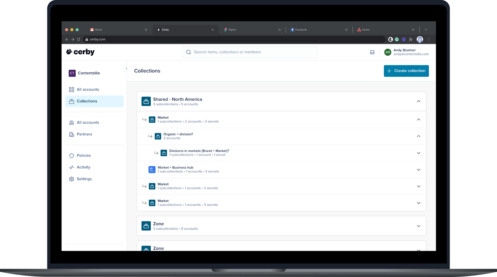
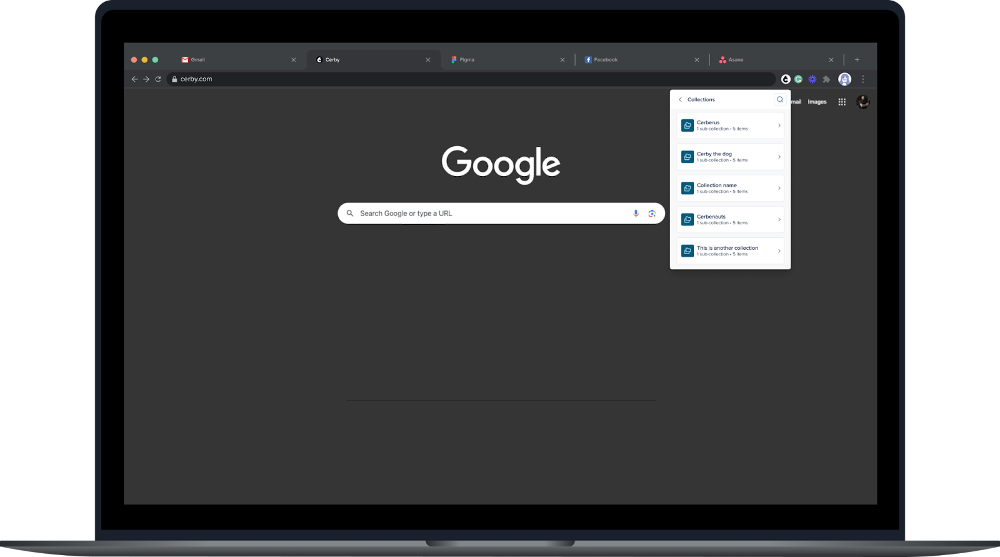

# Explore Collections

With **Collections** , you can group your accounts, secrets, business hubs, and subcollections for easy organization in your dashboard. Additionally, they enable you to efficiently share items in bulk with other workspace members and teams for collaborative access.

If you have used other password managers, like LastPass or 1Password, collections are the equivalent of a folder or vault.

The following are the characteristics and actions you can perform with the Collections feature:

* Group accounts, secrets, business hubs, assets, and subcollections in a hierarchical structure.
* Share items in bulk with other members and teams assigning predefined roles (**Owner** and **Collaborator** roles on collections and subcollections) based on Cerby’s role-based access control (RBAC) system.
  * Subcollections inherit access permissions from their top-level collection, simplifying permission management.
* Share multiple business hub integrations and assets with other members and teams, letting them claim access to their external app accounts when they are ready. As part of this process, you specify the app role to assign to the users and teams. For more information, read the article [Manage access to business hubs and assets with collections](https://cerby-test.gitbook.io/cerby-test/management/identity-lifecycle/business-hubs/manage-integrations/manage-access-to-business-hubs-and-assets-with-collections).
* Improve organization and searchability of items.
* Streamline collaboration and knowledge sharing.
* Enhance security and control over access to sensitive information.



**NOTE:** Only item **Owners** can add their items to a collection**** and share this collection with other workspace members. For more information about the roles on collections, read the article [How Cerby manages roles](https://cerby-test.gitbook.io/cerby-test/management/workspace-configuration/user-management/how-cerby-manages-roles).



* * *

## The Collections page

The **Collections** page displays all the root collections you have created or to which you have been granted shared access. This page provides a convenient location to access and manage your accounts, secrets, business hubs, assets, and subcollections in a hierarchical structure.

You can perform the following actions from the **Collections** page:

  * View and interact with collection cards, accounts, secrets, business hubs, assets, and nested subcollections.
  * Search for collections and subcollections by their name.
  * Create a collection through a wizard by clicking the **Create collection** button.
  * Access the collection settings page that enables you to see the members who have access to it and the items within it, share a collection, assign a subcollection, delete a collection, and others.

**Figure 1** shows the **Collections** page that you can access from the left menu of the Cerby web app dashboard.

**Figure 1. Collections** page in the Cerby web app dashboard

**Figure 2** shows the **Collections** page that you can access from the Cerby browser extension popup.

**Figure 2. Collections** page in the Cerby browser extension popup

**Figure 3** shows the **Collections** screens that you can access from the Cerby mobile app on iOS and Android.

 

**Figure 3. Collections** screens in the Cerby mobile app for iOS (left) and Android (right)
