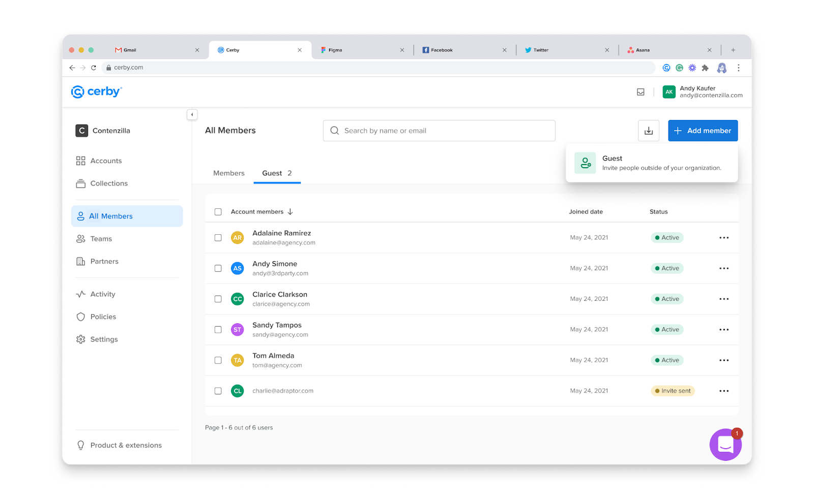

# Explore guest users

With Cerby, you have a secure way to collaborate closer with external parties through guest users. This role enables you to invite any collaborator who doesn't belong to your domain or corporate directory to join your Cerby workspace.

Unlike a [host-guest partnership](https://cerby-test.gitbook.io/cerby-test/support-and-use-cases/explore/explore-partners), where you must establish a connection with another Cerby workspace to share accounts, with the guest user role, you can directly share items (accounts, secrets, and collections) because your external collaborators are part of your workspace, using an identity and account provided and managed by Cerby. Therefore, they are searchable through the item-sharing dialog boxes.

Management of guest users is performed by **Workspace Owners** , **Super Admins** , and **Admins** , and invites can be sent by any workspace member in three ways:

* From the [Password Manager Importer](https://cerby-test.gitbook.io/cerby-test/management/credential-management/item-importer/migrate-from-lastpass-to-cerby), to persist the imported user access permissions on LastPass folders, passwords, and secure notes to Cerby collections, accounts, and secrets.
* From the **[All Members](https://cerby-test.gitbook.io/cerby-test/management/workspace-configuration/user-management/guest-users/invite-a-guest-user-to-your-workspace)**[ view](https://cerby-test.gitbook.io/cerby-test/management/workspace-configuration/user-management/guest-users/invite-a-guest-user-to-your-workspace), via a direct invite.
* From the **[Partners](https://cerby-test.gitbook.io/cerby-test/support-and-use-cases/explore/explore-partners)**[ view](https://cerby-test.gitbook.io/cerby-test/support-and-use-cases/explore/explore-partners), when external collaborators belong to a local partner.



**IMPORTANT:** If your external collaborators are already managed by your identity provider (such as Okta or Entra ID), contact your Cerby Admin or IT team to assign them to Cerby as regular workspace members.



After joining Cerby, all of the workspace members from your organization who have the **Owner** role on collections, accounts, and secrets can share their items directly with guest users or via a local partnership. However, they can only grant them the **Collaborator** role.

Guest users are displayed on a table within the **Guest** tab of the **All Members** view, as shown in **Figure 1**.

<figure><figcaption></figcaption></figure>

Figure 1. **Guest** tab within the **All Members** view

Access of guest users to the following workspace features is limited as follows:

* They cannot access the **All members** view.
* They cannot access the**Distribution Lists** view.
* They cannot use the Password Manager Importer.
* They can only view the teams to which they belong.
* They can only view their user activity through the **Activity** view.
* They cannot invite other guest users.

For more information about roles and supported features, read the article [How Cerby manages roles](https://cerby-test.gitbook.io/cerby-test/management/workspace-configuration/user-management/how-cerby-manages-roles).

If you are interested in this feature but don't see it available in your workspace, contact your **Admin** or our Customer Support team via email at [support@cerby.com](mailto:support@cerby.com).

* * *

## Related articles

The following articles contain more information about invitations and management of guest users:

* [Invite a guest user to your workspace](https://cerby-test.gitbook.io/cerby-test/management/workspace-configuration/user-management/guest-users/invite-a-guest-user-to-your-workspace)
* [Join Cerby from a guest user invite](https://cerby-test.gitbook.io/cerby-test/how-to-use-cerby/cerby-web-app/partners/guest-users/join-cerby-from-a-guest-user-invite)
* [Log in to Cerby as a guest user](https://cerby-test.gitbook.io/cerby-test/how-to-use-cerby/cerby-web-app/partners/guest-users/log-in-to-cerby-as-a-guest-user)
* [Remove a guest user from your workspace](https://cerby-test.gitbook.io/cerby-test/management/workspace-configuration/user-management/guest-users/remove-a-guest-user-from-your-workspace)
* [Remove guest user access to an item](https://cerby-test.gitbook.io/cerby-test/management/workspace-configuration/user-management/guest-users/remove-guest-user-access-to-an-item)
