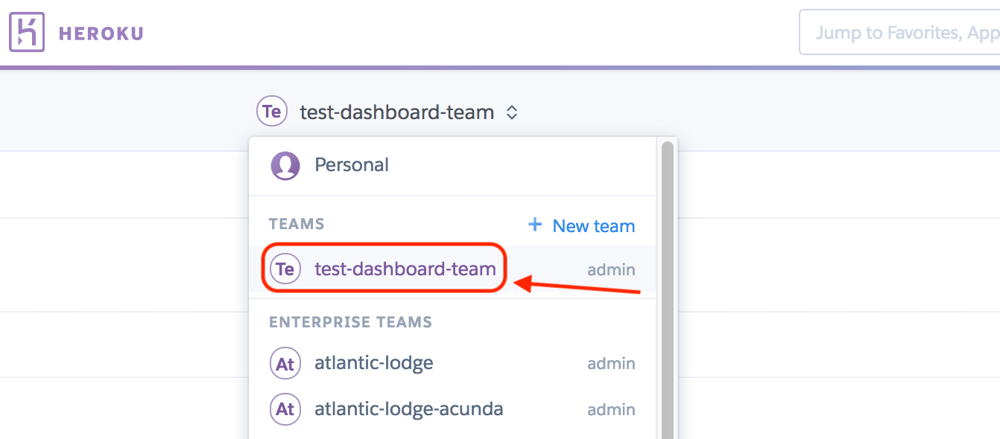
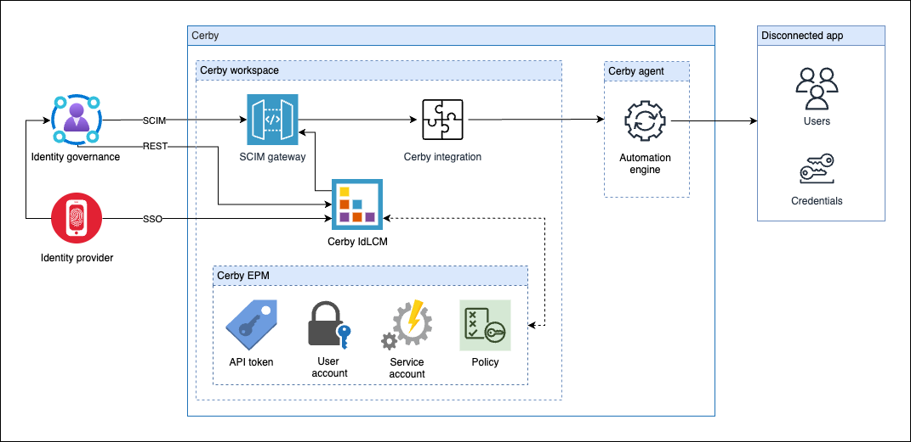

# Explore IdLCM

With Cerby's **Identity Lifecycle Management**(IdLCM) solution, you can connect all your disconnected apps to your identity provider (IdP), such as Okta or Entra ID, to provide a single place to manage enterprise identities.

Despite the significant adoption of IdP and identity governance and administration (IGA) systems, organizations still face major gaps in identity and access management. Apps are expanding faster than the adoption of standards to simplify identity and access management. Cerby’s IdLCM solution helps close this gap by extending the visibility, control, and automation of users and their access to an organization’s disconnected apps.

IdLCM provides the missing interoperability between your IdP and disconnected apps by offering SCIM and RESTful interfaces. Acting as an intermediary, Cerby receives user and group provisioning or deprovisioning events from the IdP or IGA system, translates them, and sends the appropriate instructions to the external disconnected apps, enabling the automation of the joiner-mover-leaver tasks.

Combined with Cerby’s credential management capabilities, IdLCM offers IdP-compatible single sign-on (SSO), account discovery, and credential capture functionality to address the challenges of disconnected apps. Furthermore, IdLCM is integrated with the posture management capabilities of Cerby, enabling corporations to enforce password rotation and MFA policies in managed accounts and integrated apps. The following are other benefits of IdLCM:

  * **Automated user account management** : Streamlines user onboarding and offboarding by automatically creating, updating, and removing accounts in Cerby-integrated apps based on changes in your IdP or IGA system.
  * **Role and permission synchronization:** Ensures user roles and permissions are consistently synchronized and up-to-date across your Cerby-integrated apps.
  * **Audit trails for governance and compliance:** Maintains detailed logs of all identity lifecycle events, facilitating effective governance and compliance, along with real-time notifications for provisioning and deprovisioning errors.
  * **Secure access enforcement:** Improves security posture by enforcing policies like MFA and password rotation for Cerby-integrated apps.
  * **SSO integration:** Enables seamless login experiences for users, even for apps that do not natively support SSO.
  * **Simplified integration setup:** Ensures reliable provisioning operations across all supported apps.
* * *

## Key concepts

**Table 1** contains the key concepts that are essential for understanding the IdLCM solution:

**Concept**| **Description**
---|---
**Asset**|  It is a resource, entity, or subproduct associated with and managed by external apps for specific purposes within the app’s core functionality. Access to assets is governed by the user’s license or seat. In paid social apps, assets are used for advertising and marketing, such as pages, pixels, or ad accounts. In apps with other use cases, assets can be projects, teams, boards, libraries, or workspaces.
**Connected account**|  It is a Cerby account associated with an integration user. This account corresponds to an individual user who has a license or seat in an external app; therefore, it’s not an account meant to be shared with other users.
**Credential capture**|  It is the process of detecting and autosaving user login credentials to enable secure automation and account usage monitoring.
**Entitlement**|  It is a specific permission granted to a user or role to perform actions on a resource. Entitlements dictate what a user can do, for example, read a file, modify a database record, or view customer data. These permissions can be granted or denied.
**External app**|  It is a third-party app or service provider that relies on Cerby to manage the lifecycle of enterprise identities. Access to these apps is governed by users’ licenses or seats.
**Group**|  It is a collection of users in identity and access management (IAM) systems with shared characteristics, access rights, or responsibilities.  Groups are used to streamline user assignment and provisioning to downstream apps with specific entitlements.
**Integration**|  It is the entity that represents the SCIM gateway configuration for an external app within Cerby.
**Just-in-time provisioning**|  It is the automated process of creating user accounts in external apps with predefined permissions when they are needed.
**Role**|  It is a collection of permissions that typically align with a user’s job function or responsibility within an organization. Roles are designed to simplify access management.
**SCIM gateway**|  It is the intermediary that transmits SCIM messages or information between two or more SCIM-enabled systems, facilitating the exchange of user identity and attribute data. It also exposes a SCIM interface consisting of a set of standard endpoints on top of a system that doesn’t natively support the SCIM protocol. Being a gateway implies it performs "protocol translation," not only proxying of messages.
**Service account**|  It is a user account intended for managing the external app or service provider. Service accounts are used for machine-to-machine operations.  These accounts are added to Cerby and associated with an integration to execute automated user management tasks.
**Disconnected app**|  It is an app or service provider that doesn’t integrate with identity management systems or follow standard authentication protocols and security standards. Commonly, these apps lack API integrations for user management.

**Table 1.** IdLCM key concepts

* * *

## The Integrations page

The **Integrations** page in the Cerby web app dashboard, as shown in **Figure 1,** is the centralized view of all the apps you have connected via Cerby’s IdLCM solution. It is accessible only to workspace **Admins** , **Super Admins** , and **Owners**.

**Figure 1.** **Integrations** page in the Cerby web app dashboard

In the **Integrations** page, you can view the list of your Cerby-integrated apps along with the following information:

  * **App or service** : It is the name of the disconnected app for which an integration is added to Cerby.
  * **Integration name** : It is the name assigned to the integration when adding it to Cerby.
  * **SCIM Gateway ID** : It is a unique identifier assigned to SCIM gateways created for the integrated app.
  * **Last synced:** It is the date and time of the last sync attempt.
  * **Status:** It is the current status of the SCIM gateways.

From this page, you can navigate to the integrations details page to explore more information, such as the integration settings, users, and activity events.

* * *

## How IdLCM works

As mentioned previously, the purpose of the IdLCM solution is to enable disconnected apps to function like standard apps. Cerby achieves this functionality by integrating a SCIM gateway into apps that lack native SCIM support.

**Figure 2** shows a high-level architecture of the IdLCM solution for disconnected apps connected to IdP and IGA systems through Cerby.

**Figure 2.** High-level architecture of the IdLCM solution

When you add and set up an integration, Cerby automatically generates a SCIM gateway that connects to the disconnected app. This gateway provides SCIM endpoint capabilities to the app, enabling it to receive notifications from your IdP whenever user and group provisioning and deprovisioning events are detected.

Upon receiving a notification from the IdP, the SCIM gateway authenticates the request, parses the payload, verifies that the operation can be performed by the requesting party, and processes the operation.

Cerby initiates automation jobs to implement provisioning actions within the integrated app. For disconnected apps, it's essential to establish a dedicated service account or token and configure the app details. This configuration enables Cerby to securely access the app using the associated service account credentials, facilitating the execution of user and access management tasks through automation jobs or API calls.

The main functionalities of an IdLCM integration are the following:

  * [User and access management tasks](explore-idlcm.md#user-and-access-management-tasks)
  * [Provisioning model](explore-idlcm.md#provisioning-model)
  * [Audit trail](explore-idlcm.md#audit-trail)
  * [Posture management](explore-idlcm.md#posture-management)
  * [IdP-compatible SSO](explore-idlcm.md#idp-compatible-sso)

The following sections describe each functionality.

### User and access management tasks

The following are the user and access management tasks you can perform from your IdP and extend to your external apps through Cerby’s IdLCM solution:

  * **Joiner (provision user)** : The SCIM gateway detects the provisioning events coming from the IdP and triggers the automation job to create the user accounts in your Cerby-integrated app with the specified roles, including entitlements (if supported), triggering the corresponding invites through email.
  * **Mover (update user):** The SCIM gateway detects update events from the IdP and triggers the task to propagate the changes into the Cerby-integrated app.
  * **Leaver (deprovision user)** : The SCIM gateway detects the deprovisioning events from the IdP and triggers tasks to remove the user accounts from your Cerby-integrated app, including entitlements (if supported).



**NOTE:** The available management tasks vary from app to app. For example, for some apps it is not possible to update roles because they only support one role natively.



### Provisioning model

The provisioning model in IdLCM defines how users are added and granted access to the external app. Cerby enables you to select the preferred method to provision users to your Cerby-integrated app, by offering the following options:

  * **Just-in-time provisioning:** With automation, Cerby ensures users have the correct access to their apps, right when they need it, with minimal manual intervention. By being connected to an IdP, user provisioning to external apps is immediate.
  * **Flexible invite propagation model:** IT admins can choose whether Cerby sends the invites for users to join the app immediately after provisioning their accounts or when users are ready to claim access.

### Audit trail

For each integration, Cerby offers a detailed, read-only record of all lifecycle management actions, such as provisioning, role updates, deprovisioning, and related events, helping you ensure compliance, maintain security, and quickly troubleshoot access issues.

The **Activity** tab in the integration details page displays the following data organized in the following columns:

  * The time when each event was registered
  * The entities that triggered the event
  * The event type
  * The entities affected by the event

Having a detailed audit trail enables you to track events in real time, providing the transparency and accountability needed for effective governance.

### Posture management

An essential component of a complete identity lifecycle management solution is posture management. The goal is to help organizations implement and enforce their security policies and ensure users can’t use apps when permissions are unassigned.

At Cerby, posture management goes beyond simply provisioning and deprovisioning accounts for disconnected apps. You can leverage the following features of our platform to enhance your security posture and complement IdLCM:

  * **Account security hygiene:** When access to external apps is managed by IdLCM, integration managers can trigger automation jobs for rotating passwords and turning on MFA.
  * **RBAC efficacy:** Cerby’s role-based access control (RBAC) system is designed to maintain data security, streamline access management, and offer transparency in access control, making it clear who has access to what resources and why.
  * **Error handling and logging:** Our platform provides information about all relevant events and automation errors, as well as the list of users and integration managers with their app roles and their activity, to support auditing and incident response.

### IdP-compatible SSO

Disconnected apps don't natively support standard SSO protocols, such as SAML or OIDC. Therefore, offering IdP-compatible SSO bridges a crucial gap between modern identity management and legacy or uncooperative applications.

By connecting external apps to corporate IdPs through a SCIM gateway, the IdP dashboard becomes the centralized access point for users. With the IdLCM and credential capture capabilities, Cerby matches all app accounts to the corresponding integration and IdP users, and extends the corporate SSO experience to all users.
