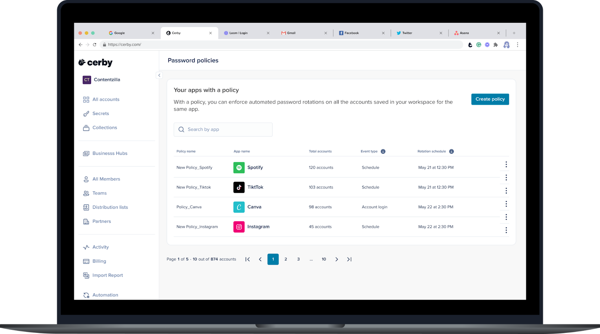
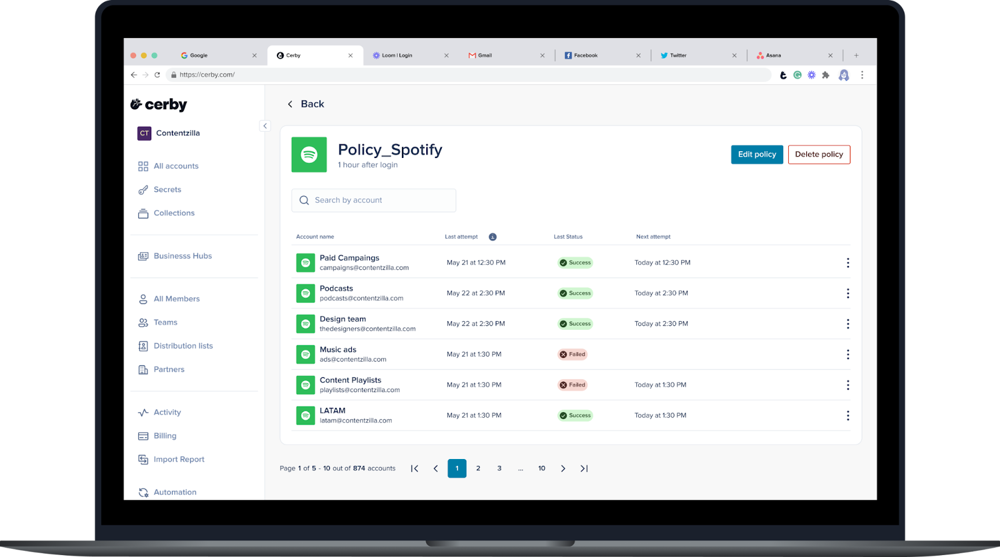

# Explore Password Policies

With Cerby, you can implement more granular security controls on your accounts based on your corporate policies and the sensitivity level of your apps.

The **Password Policies** feature enables workspace **Admins** to set up and enforce password rotation policies for all the accounts belonging to an app. Unlike workspace-wide policies enforced to all users and all accounts, you can balance security best practices and workflow efficiency in your organization with app-specific policies.

The automation approach of Cerby makes the policy implementation and execution more seamless and less manual. You just need to create and set up the policy, specifying the event that will start the policy and trigger the automated password rotation execution. Currently, the following are the supported events:

* **User login:** The policy starts when Cerby identifies a user login event to an account using autofill with the Cerby browser extension or mobile app. You select the schedule interval for the execution of automated password rotations.
* **Schedule:** The policy starts on the date you select, and you specify the frequency and time window for the execution of automated password rotations.

Nonstandard apps have varied password policies, and some of them, such as those handling sensitive data (personal information, financial data, or proprietary information), may require more frequent password rotations. With Cerby's Password Policies, you can schedule rotations to meet the specific needs of each app.

Additionally, by centralizing access to your accounts in Cerby, you can ensure uninterrupted access while maintaining a high level of security.



**NOTE:** You can only configure password policies for managed apps that support the password rotation automated task.



The following are some of the benefits of the Password Policies feature:

* **Enhanced security:** Cerby generates strong and unique passwords according to the app policies and password strength rules.
* **Reduced risk of breaches:** Regular password rotations minimize the impact of potential data breaches because they typically terminate all active user sessions.
* **Compliance adherence:** Password policies can help organizations comply with corporate and industry regulations and standards.
* **Complementary protection:** On-demand password rotations and rotations based on deprovisioning events in your corporate identity provider (IdP) are not blocked by this feature.\
  **NOTE:** For any new account belonging to an app with an active policy, Cerby verifies if the account must be affected by the policy.

* **Improved visibility:** Cerby has a dedicated user interface to show the status of the policy and the affected accounts: the **Password Policies** page in the Cerby web app dashboard, described in the following section.
* * *

## The Password Policies page

The **Password Policies** page displays a table with all the policies you have created for your apps in Cerby. This view provides a convenient location to manage your policies and see all the accounts affected by them.

**Figure 1** shows what the **Password Policies** page looks like.

<figure><figcaption></figcaption></figure>

**Figure 1.** **Password Policies** page in the Cerby web app dashboard

This view provides the following information about your policies in a table:

* **App provider:** It is the app for which the policy is implemented.
* **Name:** It is the name of the policy.
* **Total accounts:** It is the total count of accounts affected by the policy.
* **Type:** It is the event type that triggers the automated password rotation. Currently, the possible values are the following:
    * **User login:** The automated password rotation is executed in a specified interval after a user logs in to an account using autofill with the Cerby browser extension or mobile app.
    * **Schedule:** The automated password rotation is executed within a time window at a specified recurring date and time.
* **Schedule interval:** It is the time to wait to execute the automated password rotation after a login event in user login-based policies or the password rotation frequency in schedule-based policies.
* **More options (**<figure><figcaption></figcaption></figure>**):** It is a drop-down menu with the following options:
    * **View all accounts**
    * **Edit policy**
    * **Delete policy**

When clicking the **View all accounts** (<figure><figcaption></figcaption></figure>) icon or selecting the **View all accounts** option from the **More options** drop-down menu, the policy details page is displayed, as shown in **Figure 2**.

<figure><figcaption></figcaption></figure>

**Figure 2.** Policy details page in the Cerby web app dashboard

This page lists the following information about the accounts affected by the policy:

* **Account:** It contains the account name and username associated with the account.
* **Last attempt:** It is the date and time of the last password rotation attempt.
* **Last status:** It is the status of the last automated password rotation attempt. The possible values are the following:
    * **Scheduled:** The event has started the policy, but the automated password rotation execution is waiting for the specified time to elapse.
    * **Queued:** The automated password rotation is in the queue, waiting to be executed.
    * **Excluded:** The account was excluded from the password policy.
    * **Started:** The password policy has started based on the specified event.
    * **Not started:** The password policy is waiting for the event to start.
    * **Running:** The automated password rotation is being executed.
    * **Completed:** The automated password rotation was completed successfully.
    * **Not completed:** The last automated password rotation attempt was not completed.
* **Next attempt:** It is the date and time of the next automated password rotation attempt. For user login-based policies, this column is only populated after the event triggered the rotation execution.
* **More options (**<figure><figcaption></figcaption></figure>**):** It is a drop-down menu with the following options:
    * **Include in policy:** This option is displayed for accounts with the **Excluded** status to include them in the policy.
    * **Exclude from policy:** This option excludes an account from the policy; therefore, the account status changes to **Excluded**.
* * *

## Related articles

The following articles contain more information about the Password Policies feature:

* [Create a password policy](https://cerby-test.gitbook.io/cerby-test/management/security-and-policy/password-policies/create-a-password-policy)
* [View all accounts with a password policy](https://cerby-test.gitbook.io/cerby-test/management/security-and-policy/password-policies/view-all-accounts-with-a-password-policy)
* [Edit a password policy](https://cerby-test.gitbook.io/cerby-test/management/security-and-policy/password-policies/edit-a-password-policy)
* [Exclude an account from a password policy](https://cerby-test.gitbook.io/cerby-test/management/security-and-policy/password-policies/exclude-an-account-from-a-password-policy)
* [Include an account in a password policy](https://cerby-test.gitbook.io/cerby-test/management/security-and-policy/password-policies/include-an-account-in-a-password-policy)
* [Delete a password policy](https://cerby-test.gitbook.io/cerby-test/management/security-and-policy/password-policies/delete-a-password-policy)
