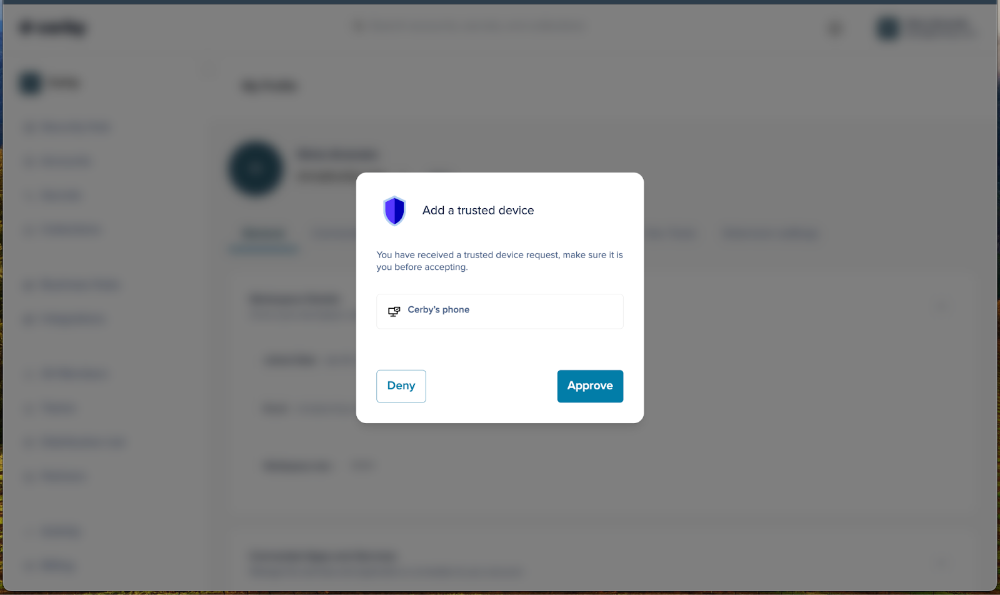
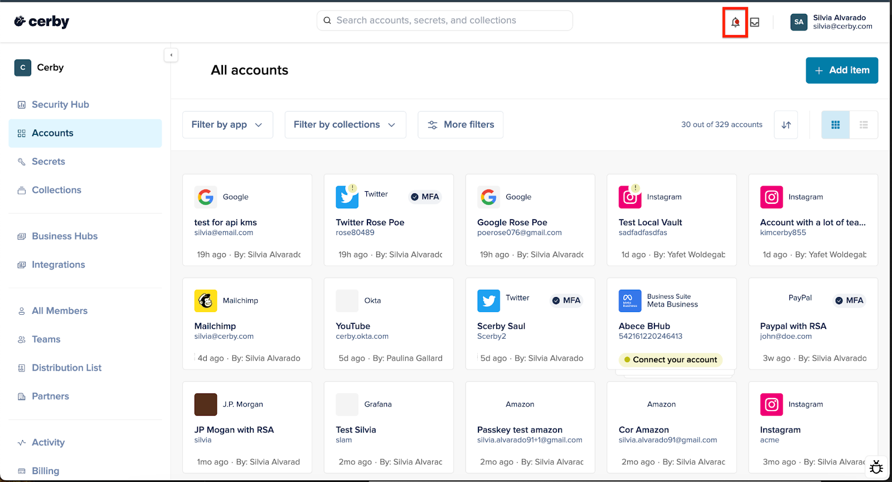
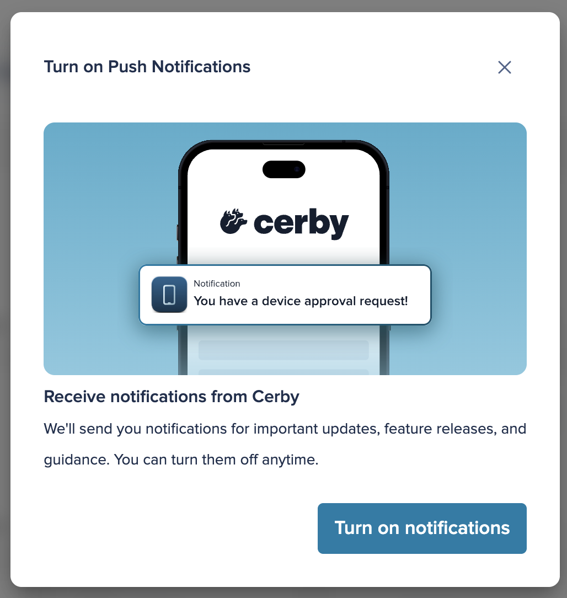

# Explore Push Notifications

With Cerby’s push notifications, you can receive real-time alerts directly in your Cerby dashboard. When you enable this feature, Cerby immediately notifies you whenever a new trusted device is added to your workspace, enabling you to approve or deny access with just a single tap, ensuring you're always in control.

The following are some of the benefits you get by turning on push notifications:

* **Immediate visibility:** Get a prompt notification when a device is onboarded, rather than discovering it later through your profile.
* **One-tap approval:** Review the device details and approve or reject new trusted devices directly from the notification.

**NOTE:** At the moment, Cerby shows notifications when onboarding a new trusted device.
---

* * *

## How push notifications work

With Cerby’s push notifications, the process to onboard a new trusted device is simplified as follows:

  1. Turn on push notifications in your Cerby dashboard.
  2. When Cerby detects an onboarding request from an unrecognized device, it automatically sends you a push notification directly to your Cerby dashboard, as shown in **Figure 1**.

**Figure 1.** The **Add a trusted device** push notification displayed anywhere in the Cerby dashboard

  3. Click the notification buttons to approve or reject the new device:

     * **Approve:** Adds the device to your trusted list and finishes onboarding.
     * **Deny:** Rejects the onboarding of the new device and keeps its session as not trusted.

And, that’s it.

* * *

## Turn on Cerby’s push notifications

To turn on push notifications for your Cerby account, you must complete the following steps:

  1. Log in to your [Cerby](https://app.cerby.com/) workspace using the Cerby web app.
  2. Click the **Notifications** () button at the top menu of the Cerby dashboard, as displayed in **Figure 2**.

**Figure 2.** The **Notifications** button at the top of the Cerby dashboard

The **Turn on Push Notifications** dialog box is displayed, as shown in **Figure 3**.

**Figure 3.** The **Turn on Push Notifications** dialog box

  3. Click the **Turn on notifications** button. A browser’s dialog box is displayed asking you whether you want to grant Cerby permission to show you notifications.
  4. Click the **Allow** button. The following occurs:

     * The browser’s dialog box closes.
     * The **Notifications** () icon disappears from the Cerby dashboard.
     * Cerby’s push notifications are displayed the next time you onboard a new trusted device.

Now you are done.

* * *

## Turn off Cerby’s push notifications

To turn off Cerby’s push notification for your Cerby dashboard, you must complete the official steps for the browser you are using. The documentation you can consult per browser is the following:

  * [Google Chrome](https://support.google.com/chrome/answer/95472?sjid=4596672148443517277-SA)
  * [Safari](https://support.apple.com/en-ph/guide/mac-help/mchl39cc046c/mac)
  * [Microsoft Edge](https://support.microsoft.com/en-us/microsoft-edge/manage-website-notifications-in-microsoft-edge-0c555609-5bf2-479d-a59d-fb30a0b80b2b)
  * [Mozilla Firefox

](https://support.mozilla.org/en-US/kb/push-notifications-firefox)
