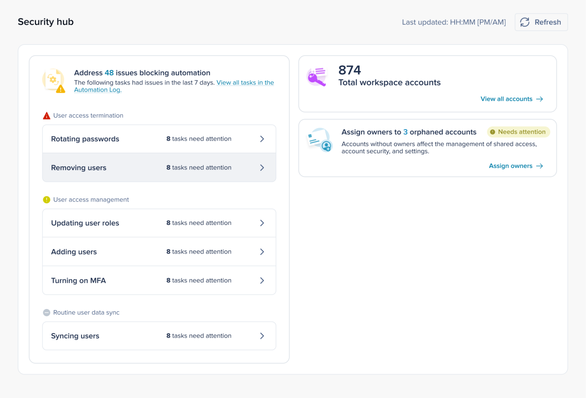
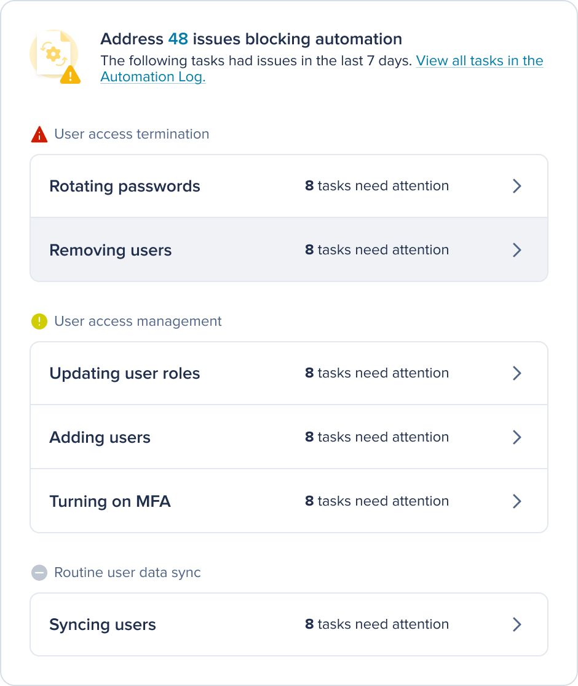
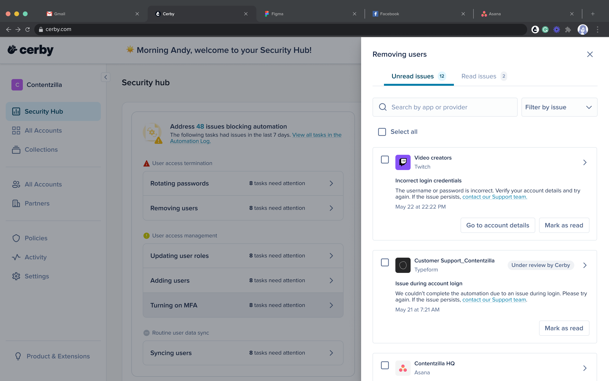
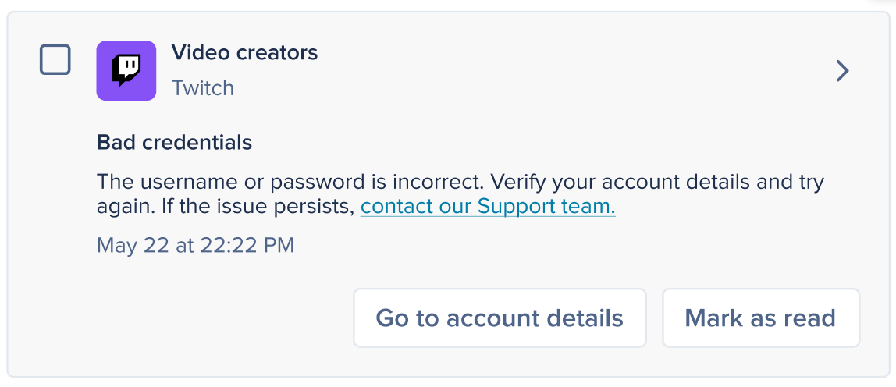

# Explore Security Hub



**Who can use this feature?**

* Workspace**Owners** , **Super Admins** , and **Admins**
* Only supported using the Cerby web app



With Cerby’s**Security Hub** , you gain a centralized view of the current health and status of your accounts and automation jobs, enabling you to stay on top of any issues that could compromise the security of your workspace.

By aggregating data and presenting it in a single, user-friendly dashboard, the Security Hub highlights any risky behavior and misconfigurations in your workspace accounts so you can take action as follows:

* Spot and address potential vulnerabilities before they escalate.
* Make proactive decisions.
* Reduce the likelihood of breaches and maintain a secure workspace.
* * *

## The Security Hub page

**Figure 1** displays the Security Hub page, which contains a dashboard with the total number of accounts and the number of orphaned accounts within the workspace.

<figure><figcaption></figcaption></figure>

**Figure 1. Security Hub** page in the Cerby web app dashboard

The **Security Hub** page centralizes the following elements and information:

* The time when the **Security Hub** page was last updated is displayed in the top-right corner.
* The **Refresh** button enables you to update the view with the latest information.
* The **Automation tasks issues** card is the main card on the dashboard. It displays the automation tasks that had issues in the last seven days.
* The **Total number of accounts** is displayed on the first card on the right side.
* The **Orphaned accounts** card indicates the number of accounts in the workspace that do not have an **Owner**.

The following sections describe the main elements of the dashboard.

* * *

## The Automation tasks issues card

The **Automation tasks issues** card displays the list and number of automation tasks that had issues in the last seven days and are blocking automation. This information is retrieved from the [Automation Log](https://cerby-test.gitbook.io/cerby-test/support-and-use-cases/explore/explore-the-automation-log) and grouped by the following issue types:

* User access termination
* User access management
* Routine user data sync

From this card, you can address automation task issues that need attention. Refer to the article [Address the automation task issues displayed in the Security Hub ](https://cerby-test.gitbook.io/cerby-test/management/security-and-policy/security-hub/address-automation-task-issues-in-the-security-hub)to learn more about automation task issues and how to acknowledge them.

**Figure 2** shows the composition of the **Address the** **issues blocking automation** card.

<figure><figcaption></figcaption></figure>

**Figure 2.** Automation task issues displayed in the **Address the** **issues blocking automation** card

To quickly access the individual cards for each automation task issue that needs your attention in each category, click the right arrow (<figure><figcaption></figcaption></figure>) within the issue type categories. A side drawer is displayed, as shown in **Figure 3**.

<figure><figcaption></figcaption></figure>

**Figure 3.** Automation task issues side drawer displayed

per category in the **Security Hub**

The side drawer contains the following tabs at the top:

* **Unread issues:** It displays the automation task issues that require acknowledgment and have not yet been marked as _read_. Their status changes to _read_ only when you click the **Mark as read** button individually or in bulk.\
  **NOTE:** _Unread_ reflects status only. It does not imply fault or severity on its own.

* **Read issues:** It displays the automation task issues that were previously Unread and have been marked as read (acknowledged).
**NOTES:**

    * Read issues under the **Read issues** tab and do not contribute to **Unread** counts. If a new related activity occurs later, a new _unread_ issue is created.
    * You can mark automation task issues as read in the following ways:
      * Individually
      * In bulk

Both the **Unread** and **Read issues** tabs contain individual automation task issue cards if the issue is recognizable and belongs to an established category. These cards include the name of the related account, a description of the issue and its solution, and buttons for taking actionable next steps.

**Figure 4** shows an example of an issue card displayed within the side drawer.

<figure><figcaption></figcaption></figure>

**Figure 4.** Example of an individual automation task issue card

displayed in the Security Hub

Consider the following notes regarding individual automation task issue cards:

* The **Under review by Cerby** chip appears only on cards where the Cerby team has acknowledged the issue and is working on it.
* All individual issue cards contain the **Mark as read** button. Additional buttons might be displayed for actionable next steps, such as redirecting you to the corresponding page in the Cerby web app or opening a Cerby help center article.
* When provided, you can also contact the Cerby support team directly from the card by clicking the **Contact our Support team** link.

By clicking the right arrow (<figure><figcaption></figcaption></figure>) on the issue card, you can access the issue details screen that includes the following information and elements:

* The issue name, the status chip, and the date and time when it occurred.
* The issue description, a link to the Cerby Support team, and any available action.
* The screenshot captured when the automation stopped, and the error occurred, if available.
* The automation identifier.
* The name of the user who triggered the automation task, the trigger source, and the date and time when it started.
* Multiple issue cards are generated if Cerby encounters issues in multiple nested jobs.
* * *

## The Total number of accounts card

The **Total number of accounts** card indicates the total number of accounts in the workspace. You can access the **Total accounts** dashboard by clicking the **See all accounts** link.

**Figure 5** shows the information displayed on the card.

<figure><figcaption></figcaption></figure>

**Figure 5.** The **Total workspace accounts** card

The **Total Accounts** dashboard displays the total number of accounts across all statuses. Refer to the article [View the details of all accounts in your workspace](https://cerby-test.gitbook.io/cerby-test/management/security-and-policy/security-hub/view-the-details-of-all-accounts-in-your-workspace) to learn more about the **Total workspace accounts** page.

* * *

## The Orphaned accounts card

The **Orphaned accounts** card helps you quickly identify any accounts that should be assigned to one or more **Owners**. Refer to the article [Assign Owners to orphaned accounts in your workspace](https://cerby-test.gitbook.io/cerby-test/management/security-and-policy/security-hub/assign-owners-to-orphaned-accounts-in-your-workspace) to learn more about orphaned accounts.

An account is marked as _orphaned_ when no active user is assigned as its **Owner**. The following are some of the common ways an account is orphaned:

* The only **Owner** was deprovisioned, suspended, or left the workspace.
* Ownership was removed or transferred incorrectly during role changes.
* The account was imported without an assigned **Owner**.
* Teams still have access, but no individual **Owner** is assigned (known issue).

Orphaned accounts create unmonitored access, increasing the risk of misuse or unauthorized entry. So, you must have at least one active **Owner** or disable the account if it’s no longer needed. This restores accountability and reduces security risk.

* * *

## Get started

As a workspace **Owner** , **Admin** , or **Super Admin** , you must complete the next steps to start getting the most benefits of the Security Hub:

  1. Log in to your [Cerby](https://app.cerby.com/) workspace.
  2. Select the **Security Hub** option from the left navigation drawer. The **Security Hub** page is displayed.
  3. Select the card you want to act on.

Now, you are ready to make your workspace safer.

* * *

## Related articles

Refer to the following articles to learn more about the **Security Hub** view:

* [View the details of all accounts in Cerby](https://cerby-test.gitbook.io/cerby-test/management/security-and-policy/security-hub/view-the-details-of-all-accounts-in-your-workspace)
* [Assign Owners to orphaned accounts in your workspace](https://cerby-test.gitbook.io/cerby-test/management/security-and-policy/security-hub/assign-owners-to-orphaned-accounts-in-your-workspace)
* [Address the automation task issues displayed in the Security Hub](https://cerby-test.gitbook.io/cerby-test/management/security-and-policy/security-hub/address-automation-task-issues-in-the-security-hub)
