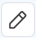
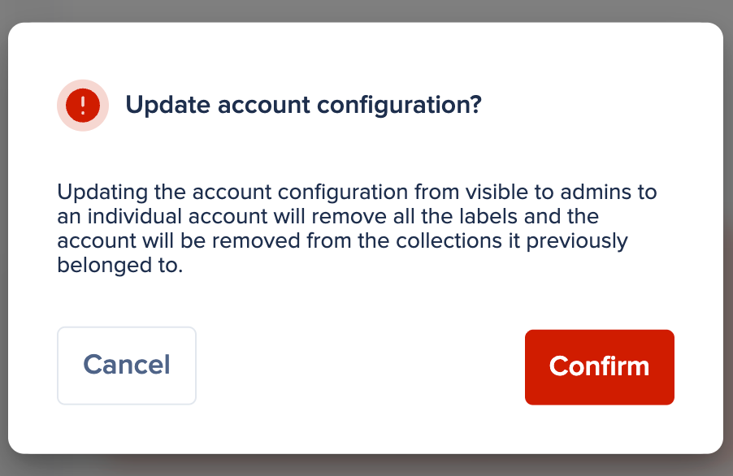
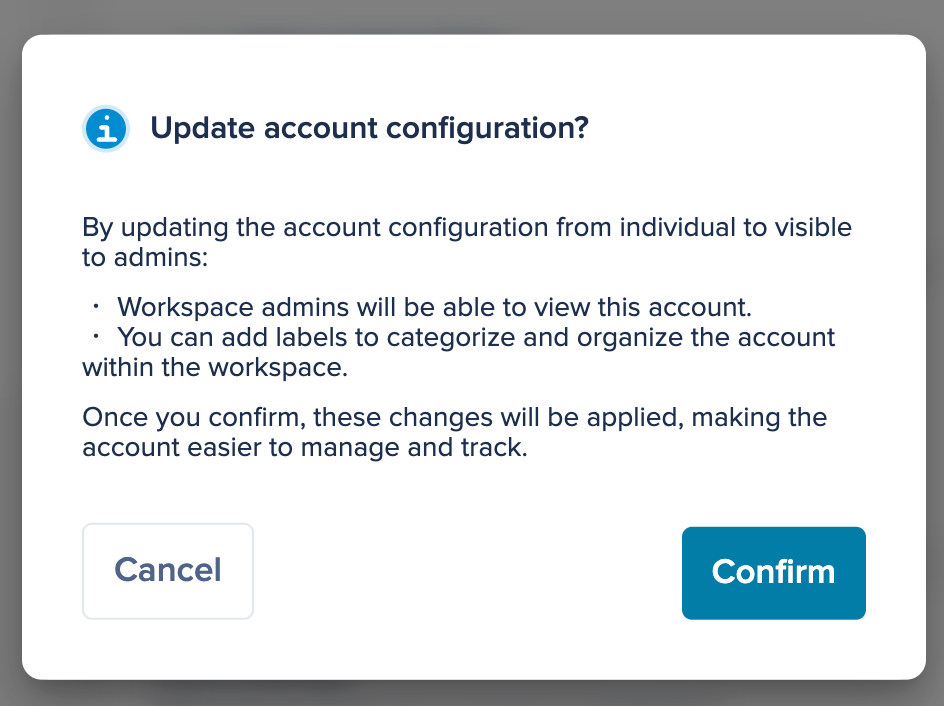

# Explore Smart Collections

Previously, L'Oréal users had the autonomy to create and organize accounts into collections as they saw fit. This freedom, however, resulted in inconsistent and arbitrary naming conventions and storage methods, complicating administrators' account management efforts. This lack of standardization highlighted the need for a more structured approach to managing and organizing accounts and collections, which is **where Smart Collections comes in**.

With Smart Collections, you can automatically organize corporate accounts into collections based on predefined tags at the moment of account creation. Smart Collections have the following characteristics in a L'Oréal workspace:

* Automatically assign an account to a collection based on its account tags.
* Reassign an account to the appropriate collection if tags are edited.
* Reassign accounts from one collection to another if the collection tags are edited.
* Enable workspace users to add an account to a collection without being part of that collection, ensuring they cannot see the collection details.
* Enable users with **Owner** access to modify, move, or delete accounts, collections, or sub-collections within the structure, while maintaining the integrity of the structure established by L’Oréal.
* Restrict the ability to add or modify collection assignment rules, making it exclusive to workspace **Admins**.
* Enable users to specify when an account is an individual account instead of a corporate account (tagged), thereby removing the need to add tags and excluding the account from any automatic assignment rules.

As stated in the last point of the previous list, L'Oréal users can create two types of accounts: corporate (tagged) and individual. Corporate accounts are intended to be automatically added to preexisting collections with the same tags, following the established auto-assignment criteria. On the other hand, individual accounts are not required to use tags, and therefore, they are excluded from automatically shared collections.

**NOTE:** Workspace **Admins** can create collections, which can be shared or not. Administrators may create collections solely for their internal auditing or troubleshooting purposes.
---

According to L'Oréal's naming conventions, the tags for corporate accounts are the following:

`{Division} {Zone} {Brand} {Market} {Additional information}`
---

For example, if a user adds an account to Cerby with the following tags:

* **Division:** `CDP`
* **Zone:** `Europe`
* **Brand:** `Garnier`
* **Market:** `AL`
* **Additional information:** `TikTok Business Hub`

The account name (also created automatically) is `Garnier-AL-TikTok Business Hub`. After creation, the account is automatically added to all corresponding collections with the `CDP`, `Europe`, `Garnier`, and `AL` tags.

With the current release of Smart Collections, the following features are not supported:

* You can add tags to Cerby Apps and save them. This generates the Apps name following L’Oréal’s nomenclature; however, these Apps are not assigned to any collection.
* Accounts created before the release of Smart Collections are not assigned automatically to any collection. L'Oréal admins must manually update the tags to assign accounts to the corresponding collections.

Finally, consider the following security recommendations when using Smart Collections:

* New corporate accounts are automatically added to a collection, implying that other users with shared access to the corresponding subcollection, parent, and root collections also gain access to these accounts.
* When a tagged collection is added to a parent collection, all assigned **Owners** and **Collaborators** of the parent collection gain access to all the nested items.
* When updating collection tags, other users might gain access to existing accounts to which they previously did not have access.

This article contains the instructions to perform the following actions using the Smart Collections feature:

* [Add an account](explore-smart-collections.md#add-an-account)
* [Edit the tags of a corporate account](explore-smart-collections.md#edit-the-tags-of-a-corporate-account)
* [Convert an account from corporate to personal](explore-smart-collections.md#convert-an-account-from-corporate-to-personal)
* [Convert an account from personal to corporate](explore-smart-collections.md#convert-an-account-from-personal-to-corporate)
* [Update the tags of a collection](explore-smart-collections.md#update-the-tags-of-a-collection)
* [View the accounts assigned to a collection](explore-smart-collections.md#view-the-accounts-assigned-to-a-collection)

The following sections contain the steps for each action.

* * *

## Add an account

To add an individual or corporate account to Cerby, you must complete the following steps:

**IMPORTANT:** After creation, an individual account cannot be converted into a corporate account; however, a corporate account can be converted into a personal account.
---

  1. Log in to your Cerby workspace. The **All accounts** view is displayed.
  2. Click the **Add item** button. A drop-down list is displayed.
  3. Select the **Account** option from the drop-down list. The **Add account details** dialog box is displayed.
  4. Perform the following depending on whether you are creating an individual or corporate account:

     * **Individual account**

       1. Select the **This is an individual account (no labels required)** checkbox. The **Account label in Cerby*** field is enabled, meaning that you have to fill in the account label manually, and this account must not be assigned to any collection automatically.

     * **Corporate account**

       1. Select the corresponding account tags:

          * **Division:** Select the division to which the account belongs.
          * **Zone:** Select the zone to which the account belongs.
          * **Brand:** Select the brand to which the account belongs.
          * **Market:** Select the market to which the account belongs.
          * **Additional Information:** Add information that can better help identify the account. The information in this field does not impact the collection assignment.

  5. Enter your account information in the corresponding fields:

     * **Account label in Cerby:** It is the name to assign to your account in Cerby, and it will be displayed on the account card.
     * **App name or URL:** It is the name of the app or service provider to which the account belongs, or the login URL. ​
     * **Username:** It is the username you use to log in to your account. Sometimes, the username is your email address.
     * **Current password:** It is the password you use to log in to your account. **NOTE:** You can click the **Add Email linked to account** or **Add Phone number linked to account** buttons to display the corresponding input fields. These are optional fields.

  6. Select optionally an existing collection from the **Collection** drop-down menu to add the account to it. Besides the automatic assignment, you can add the account to another collection manually.
​**NOTE:** Accounts can belong to more than one collection.

  7. Optionally, if you see the **Vault** field, select the corresponding vault from the drop-down list to add the account to it.

  **NOTE:** If you only have access to one vault, this drop-down list will not be displayed.

  8. Click the **Add account** button. The dialog box closes, and a success message box and the account details page are displayed.

Now you are done. You have created a new account.

* * *

## Edit the tags of a corporate account

To edit the tags of a corporate account, you must complete the following steps:

  1. Log in to your Cerby workspace. The **All accounts** view is displayed.
  2. Click the corporate account you want to modify. The account details page is displayed with the **General** tab activated.
  3. Hover the mouse over the **Division** , **Zone** , **Brand** , and **Market** fields in the **Account labels** section. The **Edit** () icon is displayed.
  4. Click the **Edit** () icon. The drop-down lists are enabled next to the **Division** , **Zone** , **Brand** , and **Market** fields.
  5. Select the corresponding option in the following fields:

     * **Division**
     * **Zone**
     * **Brand**
     * **Market**

  6. Click the **Done** () icon. The edit fields are disabled, and a success message box is displayed.

Now you are done. You have edited the tags of a corporate account.

* * *

## Convert an account from corporate to personal

To convert a corporate account into a personal account, you must complete the following steps:

  1. Log in to your Cerby workspace. The **All accounts** view is displayed.
  2. Click the corporate account you want to modify. The account details page is displayed with the **General** tab activated.
  3. Select the **This is an individual account** switch. The **Update account configuration?** dialog box is displayed, as shown in **Figure 1**.

**Figure 1. Update account configuration?** dialog box to convert from

corporate to personal account

  4. Click the **Confirm** button. A success message box is displayed, and the account is updated as follows:

     * Corporate tags are removed from the account.
     * The original account name is kept, but you can edit it.

Now you are done.

* * *

## Convert an account from personal to corporate

To convert a personal account into a corporate account, you must complete the following steps:

  1. Log in to your Cerby workspace. The **All accounts** view is displayed.
  2. Click the corporate account you want to modify. The account details page is displayed with the **General** tab activated.
  3. Deselect the **This is an individual account** switch. The **Update account configuration?** dialog box is displayed, as shown in **Figure 2**.

**Figure 2. Update account configuration?** dialog box to convert from

personal to corporate account

  4. Click the **Confirm** button. A success message box is displayed, and the account is updated as follows:

     * The **Account label** section is displayed.
     * The original account name is kept, and it cannot be edited.

  5. Hover the mouse over the **Account label** section. The **Edit** () button is displayed.
  6. [Edit the tags of a corporate account](explore-smart-collections.md#edit-the-tags-of-a-corporate-account). A success message box is displayed, and the account is updated as follows:

     * The account name is updated, according to the tags established.
     * The account name cannot be edited.
     * The account is added to the corresponding collection that matches the tags established.

Now you are done.

* * *

## Update the tags of a collection

As an **Admin** , **Super** **Admin** , or **Workspace** **Owner** , you can update the tags of an existing collection to reassign matching corporate accounts to it automatically.

To update the tags of a collection, you must complete the following steps:

  1. Log in to your Cerby workspace.
  2. Select the **Collections** option from the left navigation drawer. The **Collections** view is displayed.
  3. Click the **Settings** () icon of the corresponding collection card. The collection details page is displayed with the **General** tab activated.
  4. Hover the mouse over the **Division** , **Zone** , **Brand** , and **Market** fields in the **Tags** section. The **Edit** () icon is displayed.
  5. Click the **Edit** () icon. The drop-down lists appear next to the **Division** , **Zone** , **Brand** , and **Market** fields.
  6. Select the corresponding option in the following fields:

     * **Social Media Type**
     * **Division**
     * **Zone**
     * **Brand**
     * **Market**

  7. Click the **Done** () icon. The edit fields are disabled, and a success message is displayed. The accounts that match the tags are displayed in the **Accounts** tab.

Now you are done. You have updated the corporate tags of a collection.

* * *

## View the accounts assigned to a collection

To view the assigned accounts of a collection, you must complete the following steps:

  1. Log in to your Cerby workspace.
  2. Select the **Collections** option from the left navigation drawer. The **Collections** view is displayed.
  3. Click the **Settings** () icon of the corresponding collection card. The collection details page is displayed with the **General** tab activated.
  4. Activate the **Accounts** tab. The list of accounts in the collection is displayed.

Now you are done.
