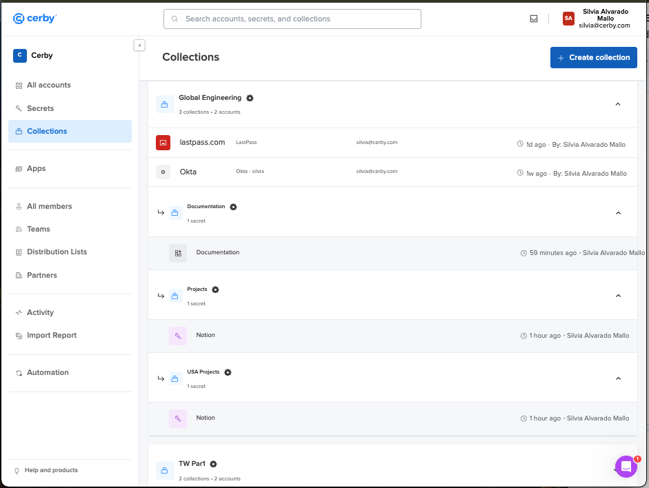
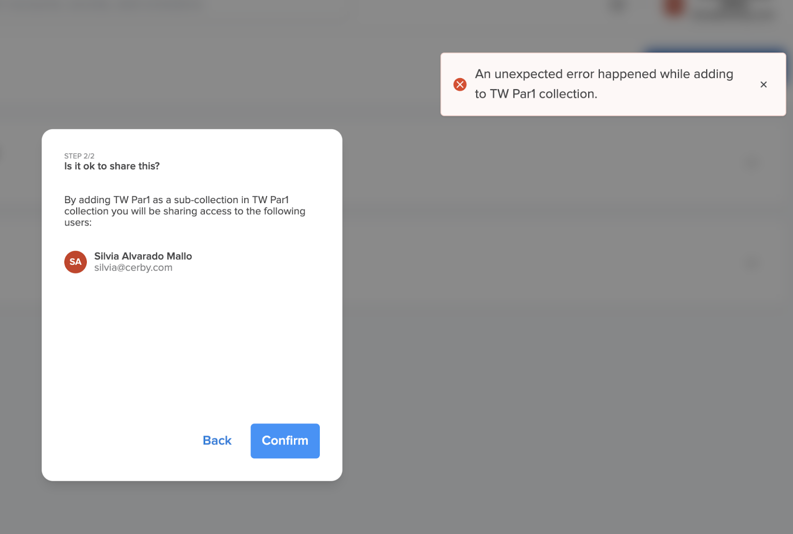

# Explore Subcollections

With **Subcollections** , you can efficiently organize your accounts and secrets under different collections called “parents.” Also, with Subcollections, you can easily complete the migration of nested folder-like entities from other password managers, such as LastPass, ensuring minimal disruption and maintaining productivity.

**Subcollections** in Cerby have the following characteristics:

* Visually represent the relationship between collections, secrets, and accounts, enabling easy navigation.
* Organize and enable easy management of multiple secrets and accounts with other members and teams in a workspace.
* Support up to six levels of nested subcollections from a parent collection.
* Easily propagate accesses and permissions on items to teams and individuals using role-based access control (RBAC).

**Figure 1** shows how secrets, accounts, and subcollections are displayed in the **Collections** view.

<figure><figcaption></figcaption></figure>

**Figure 1. Collections** view of the Cerby web app dashboard



**NOTE:** Within the **Collections** view, you can see the collections and their nested subcollections and items. We use the term "root" to refer to the collections displayed at the highest level of the hierarchy. Depending on how a user received shared access to these collections, they might actually belong to a larger hierarchy of parent (top-level) collections and child (nested within parents) subcollections. For clarity, this document consistently uses the terms "parent" for top-level collections, "child" for nested subcollections, and "root" for the highest-level collection you see in the **Collections** view.



**TIP:** You can use the global search field to search for a collection or subcollection.



With subcollections, you can perform the following actions:

* [Create a subcollection](https://cerby-test.gitbook.io/cerby-test/management/credential-management/collections/subcollections/create-a-subcollection)
* [Add an existing collection as a subcollection](https://cerby-test.gitbook.io/cerby-test/management/credential-management/collections/subcollections/add-an-existing-collection-as-a-subcollection)
* [Share a subcollection](https://cerby-test.gitbook.io/cerby-test/management/credential-management/collections/subcollections/share-a-subcollection)
* [Remove user access to a subcollection](https://cerby-test.gitbook.io/cerby-test/management/credential-management/collections/remove-a-user-from-a-collection)
* [Remove a subcollection from a collection](https://cerby-test.gitbook.io/cerby-test/management/credential-management/collections/subcollections/remove-a-subcollection-from-a-collection)
* [Delete a subcollection](https://cerby-test.gitbook.io/cerby-test/management/credential-management/collections/subcollections/delete-a-subcollection)

Click the corresponding links to open the instructions for each action.



**NOTE:** Our Development team continues working on the Subcollections feature. Refer to the Known issues in subcollections section for a list of known issues. We will keep you posted when these issues are resolved.



## Known issues in subcollections

The following are the known issues in subcollections. Our Development team is already working on solving them, and we will update this list after they are resolved:

* It is not possible to see your subcollections in the Cerby mobile app yet.
* It is not possible to create an empty subcollection (a subcollection without items) yet.
* It is not possible to reassign a subcollection yet.
* If you get the following error when [adding an existing subcollection to a parent collection](https://docs.google.com/document/d/1_taRKHSX2zpT_s6Kj4JwyAwQSqMANMeo_YEraXFvAL4/edit#heading=h.rvg4f8khaicc): “An unexpected error happened while adding to the <parent collection> collection,” as shown in **Figure 2.**

<figure><figcaption></figcaption></figure>

**Figure 2**. “An unexpected error happened while adding to the <parent collection> collection” error message

The following might have happened:

* You might have selected the parent collection as a subcollection. Please try again the assignment process.
* You surpassed the six-level nesting rule from a parent collection.
