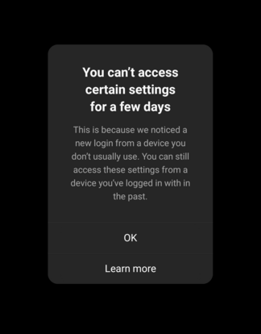
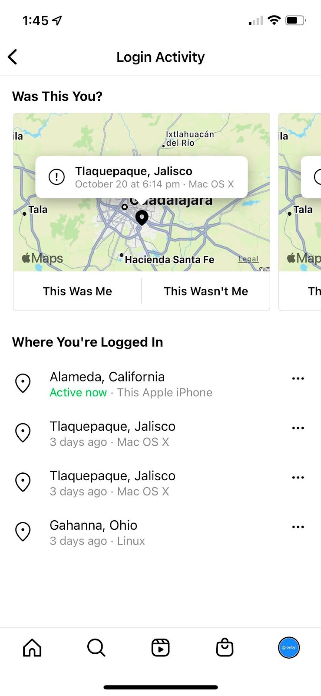

# Unable to access settings when turning on MFA

When you attempt to turn on MFA manually or automatically from Cerby using a new device (mobile phone or computer), Instagram may display the **You can’t access certain settings for a few days** dialog box, as shown in **Figure 2**.

**Figure 2. You can’t access certain settings for a few days** dialog box

This behavior happens because Instagram verifies and keeps track of the devices you normally use. Therefore, if the attempt to turn on MFA comes from a new device, Instagram will not let you change any security settings for one or two days.

### Solution

To solve the MFA enrollment attempt prompt, you have two options:

* Try again to turn on MFA in a day or two.
* Use a device with an active session to turn on MFA manually by performing the following actions:

  1. Identify the device with an active session by following the instructions in the [View your account’s recent login activity](https://help.instagram.com/2761108904184084) official documentation from Instagram. The device must have an **Active now** status, as shown in **Figure 3**.

**Figure 3. Instagram Login Activity** screen

2\. Use the device with the active session to turn on MFA manually. Follow the instructions in the [How to turn on MFA in Instagram manually](https://cerby-test.gitbook.io/cerby-test/how-to-use-cerby/cerby-web-app/accounts/protecting-your-account/video-how-to-turn-on-mfa-in-instagram-manually) video.

* * *

## Manual MFA enrollment

Instagram is one of the apps supported by Cerby. It has an automation workflow that turns on MFA by simply activating a switch in the **Settings** tab of your account. This automation configures the Cerby mobile app as an authenticator app.

To execute the workflow successfully, you must create and configure a Cerby-managed email address in your Instagram account to receive verification codes. If your business needs prevent you from using a Cerby-managed email address, you can enroll in MFA manually.

You can only perform this manual configuration with your Instagram mobile app to retrieve the secret key to configure Cerby as an authenticator app.

**IMPORTANT:** Make sure to securely save the recovery or backup codes in Cerby after turning on MFA to help you get back into your account if, for any reason, you lose access. To save the codes, you must complete the following steps:

  1. Copy the recovery codes from Instagram. Follow the instructions in the [How you can use a recovery code on Instagram](https://help.instagram.com/1006568999411025) official documentation.
  2. Click the **Settings** icon of the corresponding Instagram account card in the Cerby web app. The **Settings** tab is displayed in the account details page.
  3. Click the **Add Codes** button located in the **Emergency Controls** section. The **Add MFA Backup Codes** dialog box is displayed.
  4. Paste the recovery codes in the **MFA Backup Codes** field.
  5. Click the **Save Codes** button. The dialog box closes, and a success message box is displayed.

After turning on MFA and configuring Cerby as an authenticator app, your login experience improves. Verification codes are automatically distributed to all account members and auto-filled when they log into Instagram from Cerby as follows:

  * When logging in through the Cerby web app, the verification code is entered automatically as part of the workflow.
  * When logging in through the Instagram mobile app, the verification code is copied to the clipboard by using the autofill feature. For more information, see the [Cerby mobile app behavior](unable-to-access-settings-when-turning-on-mfa.md#id-cerby-mobile-app-behavior) section.

You can turn off MFA through your web browser on a computer or the Instagram mobile app.

* * *

## Cerby mobile app behavior

The Cerby mobile app helps you easily log in to your apps by auto-filling the credentials of the Instagram account you added to Cerby. Open the Instagram app's login screen on your mobile phone and use autofill on every input field according to your operating system (iOS or Android).



**NOTE:** For more information on how to enable autofill in your mobile phone, see the [Install the Cerby Mobile App](https://help.cerby.com/en/collections/10147391-install-the-cerby-mobile-app) collection.



When MFA is on, you may have to enter a verification code on an additional screen after auto-filling your credentials. Perform the following actions to retrieve the code according to your verification method:

  * **Cerby app as an authenticator app:** When autofill is enabled on your mobile phone, the verification code is automatically copied to the clipboard. Tap the **Paste** button to fill in the verification code field. For more information, read the article [Turn on MFA with Cerby as an authenticator app for your account](https://cerby-test.gitbook.io/cerby-test/how-to-use-cerby/cerby-web-app/accounts/protecting-your-account/turn-on-mfa-with-cerby-as-an-authenticator-app-for-your-account-using-the-web-app).

  **NOTE:** If autofill is not enabled or the code is not automatically copied to the clipboard, copy the verification code from the **MFA Code** section. This section is located in the account details using the Cerby mobile app.

  * **Cerby-managed email address:** The verification code is sent to the **Shared Inbox** , and you can retrieve it through the Cerby web app. For more information on the **Shared Inbox** , refer to the articles:
    * [Set up and associate a Cerby-managed email address for your account](https://cerby-test.gitbook.io/cerby-test/how-to-use-cerby/cerby-web-app/accounts/protecting-your-account/set-up-and-associate-a-cerby-managed-email-address-for-your-account)
    * [View the messages sent to a Cerby-managed email address or phone number](https://cerby-test.gitbook.io/cerby-test/how-to-use-cerby/cerby-web-app/accounts/protecting-your-account/view-the-messages-sent-to-a-cerby-managed-email-address-or-phone-number)
* * *

## Cerby-managed phone number support

Cerby provides and manages securely generated phone numbers you can use for your Instagram account and across your organization.

By managing this service, Cerby can improve the Instagram login process by automatically filling in your verification codes when MFA is turned on, using your phone number as a verification method. These codes are retrieved from your **Shared Inbox** in Cerby. For more information, refer to the article [Set up and associate a Cerby-managed phone number for your account](https://cerby-test.gitbook.io/cerby-test/how-to-use-cerby/cerby-web-app/accounts/protecting-your-account/set-up-and-associate-a-cerby-managed-phone-number-for-your-account).

**IMPORTANT:** You can’t configure a Cerby-managed phone number when signing up for an Instagram account. When you have it, configure it in Instagram after validating your account.

* * *

## Email swap

When you automatically swap the email address of your Instagram account for a Cerby-managed email address, verify it by clicking the link in the confirmation email you receive from Instagram.

This email is sent to your **Shared Inbox** in Cerby, and to be able to click the link, you must forward the message. Follow the instructions in the [How to forward a message from your Cerby inbox](https://cerby-test.gitbook.io/cerby-test/how-to-use-cerby/cerby-web-app/accounts/protecting-your-account/forward-a-message-from-your-cerby-inbox) article, and then open your email to confirm your email address for Instagram.

After confirming the email, you can log in to your Instagram account automatically from Cerby.

* * *

## Invalid MFA verification code

Occasionally, when you log in automatically to your Instagram account from Cerby and have MFA on, Instagram shows an error indicating that the verification code is incorrect, even when it is correct.

### Solution

If you encounter this error, Cerby recommends manually entering the verification code. Depending on the verification method you have configured in Cerby, retrieve the code from the Cerby extension, the Cerby mobile app, or the **Shared Inbox** in the Cerby web app.

If you still encounter the error, use one of the recovery or backup codes you saved previously in Cerby. To retrieve a code, you must complete the following steps:

  1. Click the **Settings** icon of the corresponding Instagram account card in the Cerby web app. The **Settings** tab is displayed on the account details page.
  2. Click the **View Codes** button located in the **Emergency Controls** section. The **Confirm your identity to continue** dialog box is displayed.
  3. Click the **It’s me!** button in the **Confirmation Request** screen of the Cerby mobile app to confirm your identity. The dialog box in the Cerby web app closes, and the **View MFA Backup Codes** dialog box is displayed with the codes.

  **IMPORTANT:** Remember that you can only use a recovery or backup code once. If you need to generate a new set of codes, follow the corresponding instructions in the [How you can use a recovery code on Instagram](https://help.instagram.com/1006568999411025) official documentation, and save the new codes in Cerby, as described in the [Manual MFA enrollment](https://docs.google.com/document/d/1FAvfdPzrikg4pzQGO5xWNl5Wgs0xBTWoegWyPtKfbPI/edit#heading=h.4x1fsgnmg2s6) section.
