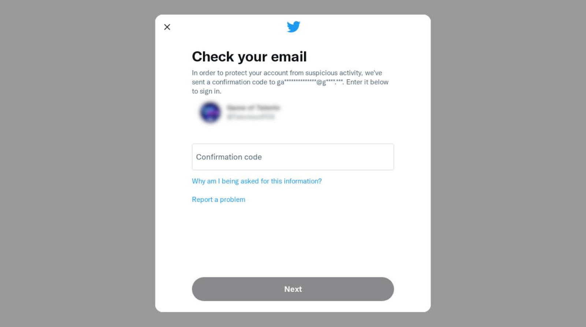

# Troubleshooting: Common issues with X (Twitter)

This article helps you fix the most common issues with accessing and managing your X (Twitter) account through Cerby.

The following are the most common issues:

* [New login location](troubleshooting-common-issues-with-x-twitter.md#id-new-login-location)
* [Turning on MFA manually](troubleshooting-common-issues-with-x-twitter.md#id-turning-on-mfa-manually)
* [Cerby mobile app behavior](troubleshooting-common-issues-with-x-twitter.md#id-cerby-mobile-app-behavior)
* [Cerby-managed phone number support](troubleshooting-common-issues-with-x-twitter.md#id-cerby-managed-phone-number-support)
* [Email Swap](troubleshooting-common-issues-with-x-twitter.md#id-email-swap)
* [Invalid MFA verification code](troubleshooting-common-issues-with-x-twitter.md#id-invalid-mfa-verification-code)

The following sections describe each issue and, if applicable, the proposed solution.

* * *

## New login location

When an X account added to Cerby doesn’t have multi-factor authentication (MFA) turned on, X displays a dialog box that prompts you to enter a verification code when you try to log in automatically from Cerby, as shown in **Figure 1**.

**Figure 1. X Verification Dialog Box**

With this dialog box, X validates the login attempt by sending a verification code to the registered email address and verifying the location of the login attempt.

When Cerby does not manage the email address, we cannot enter the verification code automatically, and the automation workflow is interrupted. Therefore, you cannot log in unless you retrieve the verification code from the registered email address.

### Solution

To solve the login attempt prompt, Cerby recommends using a Cerby-managed email address so that we can enter the verification code automatically.

For instructions on configuring a Cerby-managed email address, read the article [Set up and associate a Cerby-managed email address for your account](https://cerby-test.gitbook.io/cerby-test/updates-and-releases/release-notes/release-notes-march-30-2021).

* * *

## Turning on MFA manually

X is one of the apps supported by Cerby with an automated task to turn on MFA, so you must simply click a button in the account details page. The automation will be executed in the background; when it’s complete, Cerby will be configured as an authenticator app.

To execute the workflow successfully, you must create and configure a Cerby-managed email address in your X account to receive verification codes. If your business needs prevent you from using a Cerby-managed email address, you can turn on MFA manually.

You can use this manual configuration with your web browser or the X mobile app. However, Cerby recommends using your web browser on a computer so you can scan the QR code displayed on the screen with your Cerby mobile app.



**NOTE:** To turn on MFA manually, follow the instructions in the video [How to turn on MFA manually for your accounts](https://cerby-test.gitbook.io/cerby-test/how-to-use-cerby/cerby-web-app/accounts/protecting-your-account/video-how-to-turn-on-mfa-for-an-account-manually) or the article [How to use two-factor authentication](https://help.x.com/en/managing-your-account/two-factor-authentication) in the X Help Center.



After turning on MFA and configuring Cerby as an authenticator app, your login experience improves. Verification codes are automatically distributed to all account members and auto-filled when they log in to X from Cerby as follows:

  * When logging in from the Cerby web app, the Cerby browser extension enters the verification code as part of the automated task.
  * When logging in through the X mobile app, the verification code is copied to the clipboard by using the autofill feature. For more information, see the [Cerby mobile app behavior](troubleshooting-common-issues-with-x-twitter.md#id-cerby-mobile-app-behavior) section.
* * *

## Cerby mobile app behavior

The Cerby mobile app helps you easily log in to your apps by autofilling the login credentials of the X account you added to Cerby. Just open the login screen of the X app on your mobile phone and use autofill on every input field according to your operating system (iOS or Android).

When MFA is on, you may have to enter a verification code on an additional screen after autofilling your credentials. Perform the following actions to retrieve the code according to your verification method:

  * **Cerby as an authenticator app:** The verification code is automatically copied to the clipboard when autofill is enabled on your mobile phone. Tap the **Paste** button to fill in the verification code field.

  **NOTE:** If autofill is not enabled or the verification code is not automatically copied to the clipboard, copy it manually from the **Verification Codes** section in the account details screen of the Cerby mobile app.

  * **Cerby-managed phone number:** The verification code is sent to Cerby, and you can retrieve it through the Cerby web app. For more information, read the article [View the messages sent to a Cerby-managed email address or phone number](https://cerby-test.gitbook.io/cerby-test/how-to-use-cerby/cerby-web-app/accounts/protecting-your-account/view-the-messages-sent-to-a-cerby-managed-email-address-or-phone-number).

For more information on the logging-in process, see the video [How to log in to your accounts with username and password using the Cerby mobile app](https://cerby-test.gitbook.io/cerby-test/how-to-use-cerby/cerby-mobile-app/accounts/video-how-to-log-in-to-your-accounts-with-username-and-password-using-the-cerby-mobile-app).

* * *

## Cerby-managed phone number support

Cerby provides and manages securely generated phone numbers you can use for your X accounts and across your organization.

When Cerby manages this service and MFA is on and configured with this verification method, Cerby streamlines the login experience by automatically filling in your codes during login. You can retrieve these codes manually from your **Shared Inbox** in the Cerby web app.

However, X recently changed its MFA processes. In some cases, instead of sending the verification code to the associated phone number, X asks users to send them an SMS to a number they provide.

### What this change means for you

Currently, Cerby doesn't support the new verification process in which you must send an SMS. However, many X accounts (especially premium or legacy accounts) keep using the original MFA flow, which works with Cerby-managed phones.

You can still create and use Cerby-managed phones for your X accounts. If you encounter the new verification process during login, you will be unable to complete the verification step within Cerby at the moment.

Our Product team is already aware of this change, and if this functionality is important for your organization, we'd really appreciate it if you could share your feedback through a request in the [Cerby Enhancement Portal](https://wemakecerby.atlassian.net/servicedesk/customer/portal/1/group/1/create/7). It helps us prioritize future improvements.

* * *

## Email swap

When you automatically swap the email address of your X account, X can take up to 24 hours to propagate the change. This situation occurs whether you change it automatically by creating a Cerby-managed email address or manually from your account settings on X.

X displays the email address field as empty in your account settings during this time. Cerby recommends waiting until X updates the information. Then, you can continue making other configuration changes.

* * *

## Invalid MFA verification code

Sometimes, when you log in automatically to your X account from Cerby and have MFA on, X shows an error indicating that the verification code is incorrect, even when it is correct.

### Solution

If you encounter the invalid MFA verification code error, Cerby recommends you to enter the verification code manually. Depending on the verification method you have configured in Cerby, retrieve the code from the Cerby extension, the Cerby mobile app, or the **Shared Inbox** in the Cerby web app.
