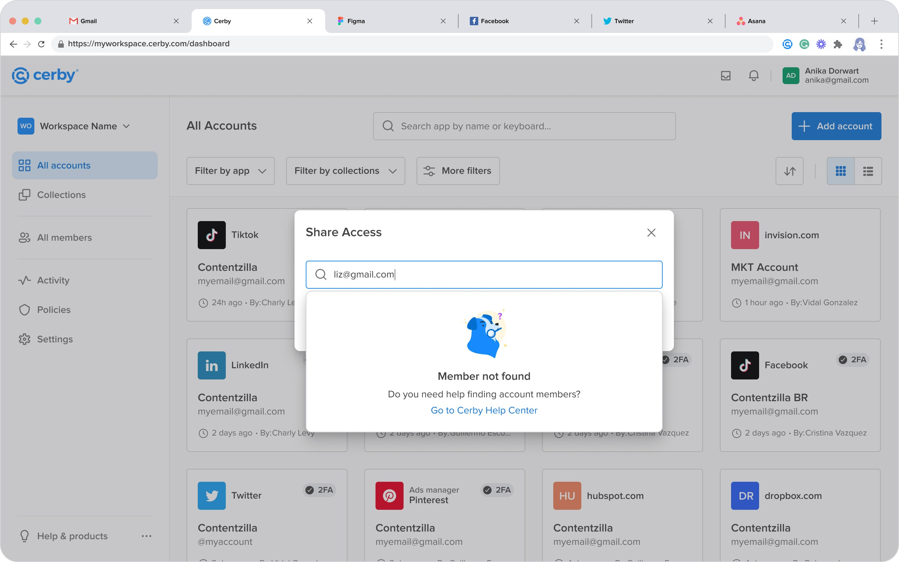
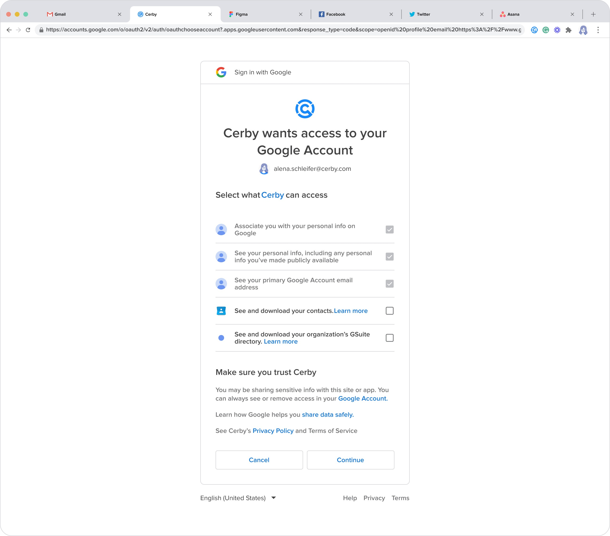
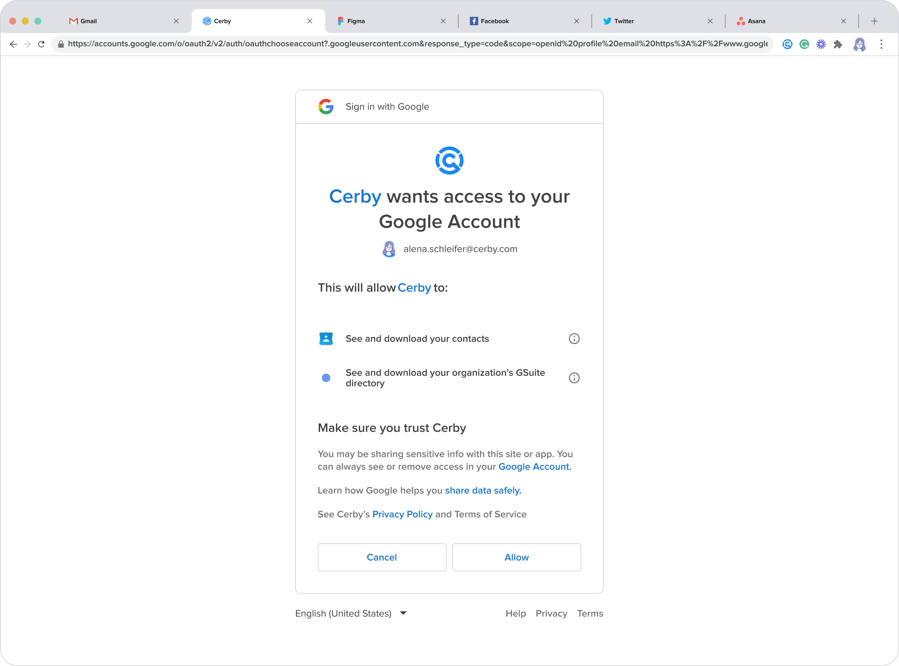

# Troubleshooting: “Member not found” Message When Sharing Access to Members of Your Google Directory

This article helps you fix the “Member not found” message displayed when you want to share access to an account with members of your Google directory.

## Cause of the Problem

When you log in to your Cerby workspace using Google as your identity provider, you must grant Cerby access to your Google account. The goal is to leverage your contacts and your organization’s GSuite to share accounts in Cerby.

The “Member not found” message is displayed in the **Share Account** dialog box of the Cerby dashboard, as shown in **Figure 1**. This dialog box is displayed when you click the **Share Account** button of the corresponding account card from the **All accounts** view.

**Figure 1. Share Account Dialog Box with the “Member not Found” Message**

The problem occurs when you enter the user name of the member of your Google directory in the search bar, but one of the following conditions is met:

* Access to your Google account was not successfully granted to Cerby.
* The member of your Google directory does not exist.

## Solution

To solve the sharing account problem, you must complete the following main steps:

1. [Log out from your Cerby workspace](troubleshooting-member-not-found-message-when-sharing-access-to-members-of-your-google-directory.md#id-1.-log-out-from-your-cerby-workspace)
2. [Log in to your Cerby workspace allowing access to your Google account](troubleshooting-member-not-found-message-when-sharing-access-to-members-of-your-google-directory.md#id-2.-log-in-to-your-cerby-workspace-allowing-access-to-your-google-account)

The following sections describe each step.

* * *

### 1\. Log Out from Your Cerby Workspace

To log out from your Cerby workspace, complete the following steps:

  1. Click the **Hi there <user name>!** button located at the bottom of the left navigation drawer. A drop-down list is displayed.
  2. Select the **Log out** option from the list. The dashboard closes and the Cerby signing-in page is displayed.

* * *

### 2\. Log In to Your Cerby Workspace Allowing Access to Your Google Account

To log in to your Cerby workspace allowing access to your Google account, complete the following steps:

  1. Log in to your corresponding [Cerby](https://app.cerby.com/) workspace. The **Sign in with Google** dialog box is displayed.

  **IMPORTANT:** Google can alternately display one of two versions of the **Sign in with Google** dialog box. Depending on the dialog box, you must perform different actions in step 2.

  2. Allow Cerby access to your Google account depending on the dialog box version:

     * Dialog box with checkboxes:

       1. Select the **See and download your contacts** and **See and download your organization’s GSuite directory** options, as shown in **Figure 2**.

**Figure 2. Sign In with Google Dialog Box with Checkboxes**

       2. Click the **Continue** button. The Cerby dashboard is displayed.

     * Dialog box without checkboxes:

       1. Click the **Allow** button. The Cerby dashboard is displayed.

       **NOTE:** In this dialog box version, the **See and download your contacts** and **See and download your organization’s GSuite directory** options are enabled by default, as shown in **Figure 3**.

**Figure 3. Sign In with Google Dialog Box without Checkboxes**

Now, try to share an account again.

**IMPORTANT:** If you still encounter the “Member not found” message, you must contact your GSuite administrator to verify if the user exists in the directory.
